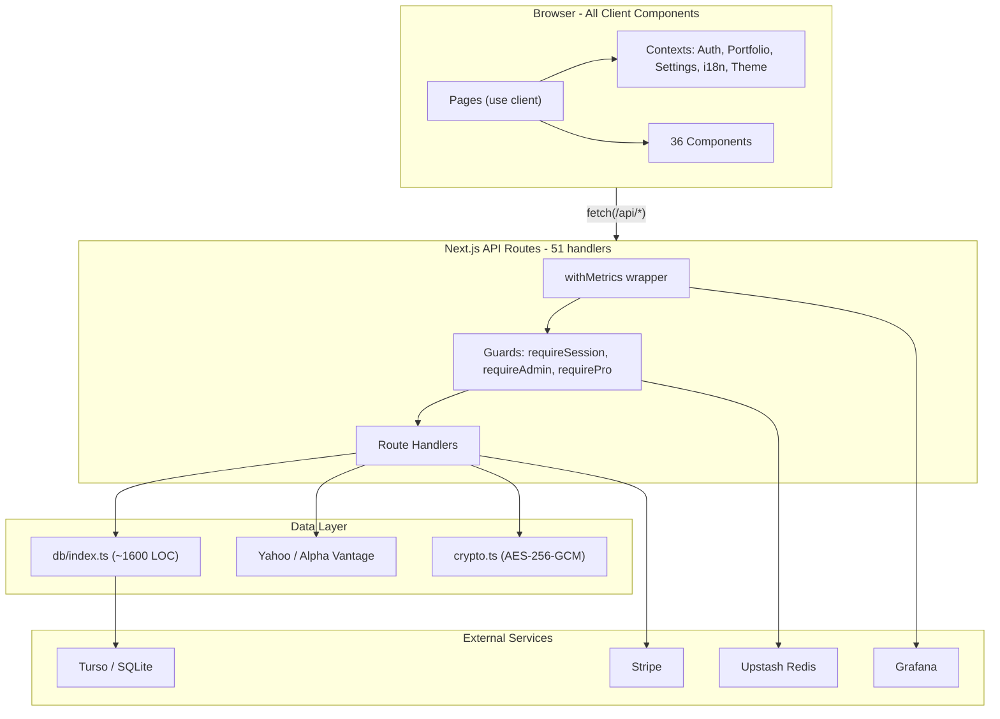

# StockTracker Architecture Review

## Current Stack Summary

- **Framework**: Next.js 14 (App Router), TypeScript 5, Tailwind CSS 3.4
- **Database**: SQLite via @libsql/client (local) / Turso (production)
- **Auth**: Custom JWT (jose + bcryptjs), httpOnly cookies
- **State**: React Context (5 providers), no external state library
- **Market Data**: Yahoo Finance + Alpha Vantage (provider abstraction)
- **Payments**: Stripe
- **Observability**: Prometheus metrics, Grafana push
- **Testing**: Vitest (unit), Playwright (E2E)
- **Hosting**: Vercel

---

## Architecture Strengths

The project has several solid architectural decisions in place:

- **Parameterized SQL everywhere** -- zero string concatenation in queries, very low SQL injection risk
- **Clean auth guard pattern** -- `requireSession`, `requireAdmin`, `requirePro`, `requireFeatureAccess` are consistent and composable
- **Provider abstraction** for market data -- `StockDataProvider` interface with Yahoo and Alpha Vantage implementations makes swapping providers easy
- **Pure business logic** in `portfolio-summary.ts` -- no DB or fetch dependencies, easily testable
- **Code splitting** with `dynamic()` for modals and charts -- good initial bundle control
- **Observability layer** -- `withMetrics` wrapper on all API routes, Grafana push, Prometheus counters
- **AES-256-GCM encryption** for sensitive API keys stored in DB
- **Dark mode and i18n** built-in from the start

---

## Critical Issues (Priority 1 -- Address Soon)

### 1. Monolithic Database Module (~1,600 lines)

`[src/lib/db/index.ts](src/lib/db/index.ts)` contains ALL database logic: users, holdings, transactions, analytics, feedback, alerts, watchlist, accounts, settings, migrations, and seeding. This is the single biggest maintainability risk.

**Recommendation**: Split into domain modules:

```
src/lib/db/
  client.ts          # Connection singleton + ensureInitialized
  migrations.ts      # Schema migrations with version tracking
  users.ts           # User CRUD, auth queries
  holdings.ts        # Holdings CRUD
  transactions.ts    # Transaction CRUD
  analytics.ts       # Events, landing analytics
  settings.ts        # User settings, platform settings
  accounts.ts        # Broker accounts
  alerts.ts          # Price alerts
  helpers.ts         # Row mapping: str(), num(), rowToDbUser()
```

### 2. No Request Validation Library

All 51 API routes use manual `if (!body?.ticker)` checks. This leads to inconsistent validation, no type narrowing after validation, and risk of missing edge cases.

**Recommendation**: Adopt **Zod** for request validation. Create shared schemas:

```typescript
// src/lib/schemas/holdings.ts
export const createHoldingSchema = z.object({
  ticker: z.string().min(1).max(20),
  shares: z.number().positive(),
  avgCost: z.number().nonneg(),
  currency: z.string().length(3),
  // ...
});
```

Pair with a `parseBody(req, schema)` helper to DRY up all routes.

### 3. Inline Migrations Without Versioning

Migrations run on every cold start with no version tracking. Every `PRAGMA table_info` check runs each time. There is no way to roll back or audit schema history.

**Recommendation**: Add a `schema_version` table. Each migration gets a numeric version and only runs once:

```sql
CREATE TABLE IF NOT EXISTS schema_version (version INTEGER PRIMARY KEY, applied_at TEXT);
```

### 4. Silent Decrypt Fallback

In `[src/lib/crypto.ts](src/lib/crypto.ts)`, `decrypt()` returns plaintext on failure. This hides key rotation issues and can mask data corruption.

**Recommendation**: Make decrypt throw on failure. Add an explicit `tryDecryptOrPlaintext()` for the migration path, with logging when fallback is used.

---

## Significant Issues (Priority 2 -- Plan for Next Quarter)

### 5. No Server Components Used

Every page is `"use client"`. The root layout is the only Server Component. This means:

- The entire app ships as a client bundle
- No streaming or progressive rendering
- No server-side data fetching (everything goes client -> API -> DB)

**Recommendation**: Convert data-heavy pages to Server Components where possible. The main dashboard (`src/app/(app)/page.tsx`) could fetch holdings server-side and pass them as props, eliminating the initial loading spinner.

### 6. API Route Code Duplication

Several patterns are copy-pasted across 8+ market data routes:

- Alpha Vantage rate limit + usage recording boilerplate
- `isRateLimitError()` helper (duplicated in 3 files)
- German exchange fallback logic (duplicated in 2 files)
- JSON body parsing try/catch blocks

**Recommendation**: Extract shared middleware-like wrappers:

```typescript
// withMarketDataAuth(handler) -- handles provider selection, AV rate limit, usage recording
// withJsonBody<T>(req, schema) -- parse + validate body
// germanFallback(fn, ticker) -- retry with .F/.DU/.MU suffixes
```

### 7. Full Page Reloads After Mutations

After trades and imports, the app calls `window.location.reload()`. This destroys all client state, re-fetches everything, and creates a poor UX.

**Recommendation**: After mutations, invalidate the relevant context data (e.g., `refreshHoldings()` in PortfolioContext) instead of full reloads.

### 8. No Data Fetching Cache Layer

Components use raw `fetch()` in `useEffect` with no caching, deduplication, or stale-while-revalidate. Multiple components can fire the same request simultaneously.

**Recommendation**: Adopt **SWR** or **TanStack Query** for client-side data fetching. This gives automatic caching, deduplication, background revalidation, and optimistic updates with less code.

### 9. Mixed Response Patterns

API routes use both `Response.json()` and `NextResponse.json()` interchangeably, and error shapes vary (`{ error: "..." }` vs `{ error, reason, ... }`).

**Recommendation**: Standardize on a single response helper:

```typescript
// src/lib/api-response.ts
export function ok<T>(data: T) { return Response.json(data); }
export function err(message: string, status: number) { return Response.json({ error: message }, { status }); }
```

---

## Moderate Issues (Priority 3 -- Improve Over Time)

### 10. Large Components

`StockRow.tsx` is ~520 lines with edit mode, trade dialog, fundamentals panel, chart, and delete confirmation all inline. This makes it hard to test and reason about.

**Recommendation**: Extract sub-components: `StockRowEditForm`, `StockRowFundamentals`, `StockRowTradeDialog`. Keep `StockRow` as an orchestrator.

### 11. Flat Component Directory

All 36 components live in a single `src/components/` folder with no grouping.

**Recommendation**: Group by feature domain:

```
src/components/
  portfolio/     # PortfolioTable, StockRow, PortfolioSummary, AddStockModal
  tools/         # PerformanceMetrics, RebalancingView, PortfolioProjection
  stock/         # StockDetail, StockChart, StockIntelligence
  shared/        # AppNav, MobileTabBar, UserDropdown, FeedbackModal
```

### 12. i18n Scalability

All ~440 translation keys live in a single flat object in `[src/lib/i18n.tsx](src/lib/i18n.tsx)`. As the app grows, this file becomes unwieldy and blocks code splitting.

**Recommendation**: Namespace translations by feature and consider lazy-loading translation bundles per route.

### 13. Test Coverage Gaps

No tests exist for:

- Database layer (CRUD operations, row mapping, migrations)
- Utility functions (`convertToEUR`, `formatCurrency`, etc.)
- API route handlers
- Task runner and with-metrics

**Recommendation**: Add unit tests for the DB layer (using an in-memory SQLite), utility functions, and at least the most critical API routes.

### 14. Hardcoded Admin Credentials

Default admin username/password are in source code in `db/index.ts`.

**Recommendation**: Move to environment variables, require them in production, and force password change on first login.

---

## Architecture Diagram (Current)




---

## Recommended Priority Order


| Priority | Item                                | Effort | Impact                               |
| -------- | ----------------------------------- | ------ | ------------------------------------ |
| P1       | Split monolithic DB module          | Medium | High -- maintainability, testability |
| P1       | Add Zod validation                  | Medium | High -- safety, consistency, DX      |
| P1       | Migration versioning                | Low    | Medium -- operational safety         |
| P1       | Fix silent decrypt fallback         | Low    | Medium -- security                   |
| P2       | Server Components for data pages    | High   | High -- performance, UX              |
| P2       | Extract API route helpers (DRY)     | Medium | Medium -- maintainability            |
| P2       | Replace reload with context refresh | Low    | Medium -- UX                         |
| P2       | Adopt SWR / TanStack Query          | Medium | High -- performance, DX              |
| P2       | Standardize API responses           | Low    | Medium -- consistency                |
| P3       | Break up large components           | Medium | Medium -- maintainability            |
| P3       | Feature-based folder structure      | Medium | Medium -- organization               |
| P3       | i18n namespacing                    | Low    | Low -- scalability                   |
| P3       | Expand test coverage                | High   | High -- confidence                   |
| P3       | Move admin creds to env             | Low    | Medium -- security                   |


