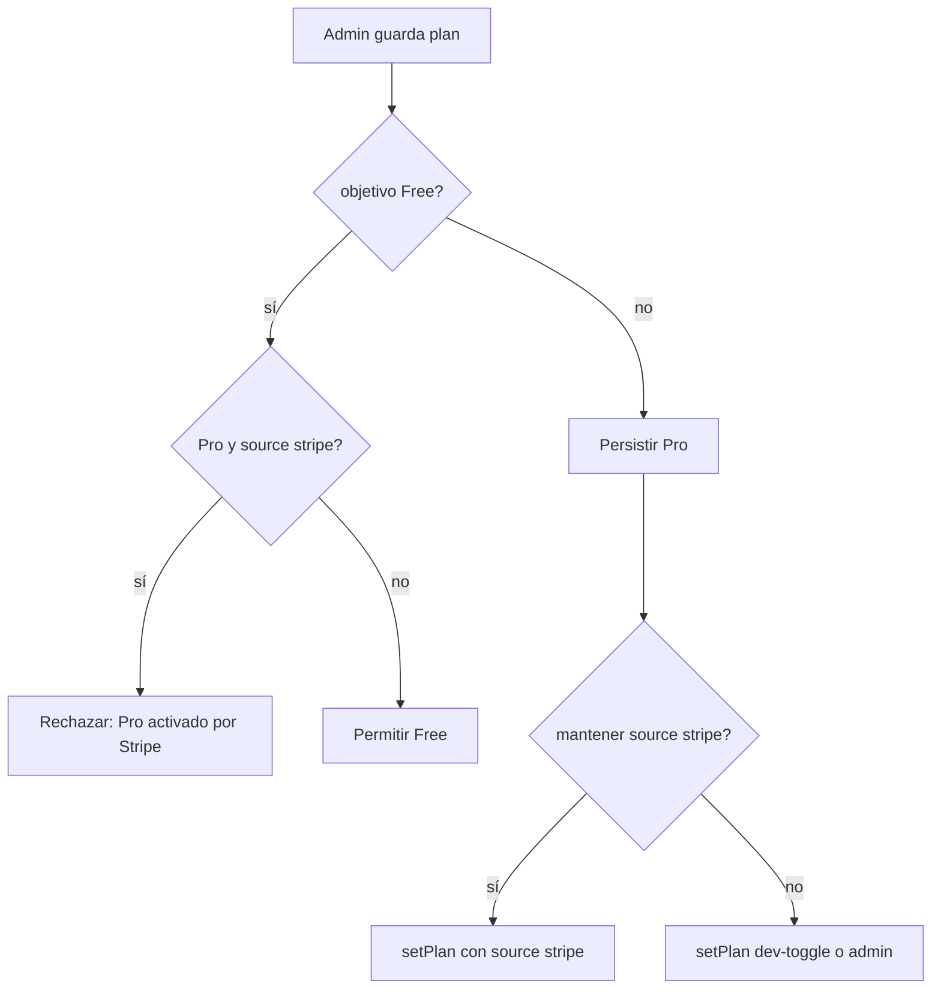

# Admin IdP — sin downgrade si Pro fue activado por Stripe

## Regla de producto (definitiva)

**No permitir downgrade** (pasar a **Free**) cuando el usuario está en **Pro** y ese estado fue **activado o mantenido por Stripe**.

En la implementación actual del IdP, eso se corresponde con:

- `entitlements.plan === "pro"` **y**
- `entitlements.source === "stripe"` (lo escriben los webhooks en `[external/accounts/src/lib/apply-stripe-event.ts](external/accounts/src/lib/apply-stripe-event.ts)`).

No se llama a la API de Stripe en esta fase; la BD refleja “activado por Stripe” vía `source`.

**Casos permitidos:** upgrade manual Free→Pro, cambiar `pro_until` manteniendo Pro, y cualquier cambio cuando el Pro **no** viene de Stripe (`source` distinto o sin fila de entitlements coherente).

**Tras** un webhook que deje al usuario en Free con `source` aún `stripe`, el admin **sí** puede volver a otorgar Pro manual (no es downgrade desde Pro Stripe).

## Cambios técnicos

1. `**[external/accounts/src/app/admin/users/[sub]/page.tsx](external/accounts/src/app/admin/users/[sub]/page.tsx)`** — `setPlanAction`: antes de `setPlan(..., "free", ...)`, leer `getEntitlement(sub)`; si `plan === "pro"` y `source === "stripe"`, abortar y comunicar error (p. ej. searchParam). Al guardar **Pro**, si `source === "stripe"`, llamar `setPlan(sub, "pro", iso, "stripe")` para no pisar el origen con `"dev-toggle"`.
2. **UI**: si la regla aplica, deshabilitar u ocultar la opción Free y texto breve para operadores (gestionar cancelación en Stripe / dashboard).
3. `**[external/accounts/src/app/api/v1/admin/users/import/route.ts](external/accounts/src/app/api/v1/admin/users/import/route.ts)`**: misma condición; si el merge resolvería **downgrade** con Pro+Stripe, responder **409** con código estable (`stripe_managed_pro`).
4. `**[knowledge/product-specs/unified-accounts-admin.md](knowledge/product-specs/unified-accounts-admin.md)`**: documentar la regla en la tabla de acciones.

## Diagrama

## Fuera de alcance

- Warren/trefolio billing principal; solo IdP admin + import API.

