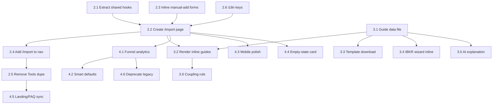

# Import Friction Reduction — Phases 2, 3, 4

Phase 1 (quick wins) is already complete. This plan covers the remaining three phases that bring the import experience into full compliance with the [pm-import skill](.cursor/skills/pm-import/SKILL.md).

## Current State (after Phase 1)

- Import modal (`ImportPortfolioModal.tsx`) now has 6 format options including AI Import.
- Image upload accept bug is fixed.
- Broker instructions are i18n-ized (EN + ES + all locales).
- Error recovery suggests trying AI Import.
- **Still fragmented**: modal vs Tools tab vs Add Stock modal are separate entry points.
- **No `/import` route** exists.
- **No inline guides** — instructions are small info boxes inside modals.
- **No import analytics** — no funnel tracking.

---

## Phase 2 — Unified Import Page

**Goal**: Create a dedicated `/import` route that satisfies the single-page principle from the pm-import skill.

### 2.1 Extract shared import hooks

**Why**: `ImportPortfolioModal.tsx` (1080 lines) and `BrokerImport.tsx` (650 lines) duplicate parse/preview/import logic. The new page needs the same logic without copy-pasting it a third time.

**New files**:

- `src/hooks/useImportBrokerCSV.ts` — broker CSV parse + import flow (extracts from `ImportPortfolioModal.tsx` lines 224-304 and `BrokerImport.tsx` lines 73-200)
- `src/hooks/useImportAI.ts` — AI file upload + extraction (extracts from `ImportPortfolioModal.tsx` lines 306-344)
- `src/hooks/useIbkrApi.ts` — IBKR Flex API connection/fetch/import (extracts from `ImportPortfolioModal.tsx` lines 123-200)

Each hook returns: `{ state, parse, import, reset, error }` pattern. The existing modal and BrokerImport should be refactored to use these hooks.

### 2.2 Create `/import` page

**New file**: `src/app/(app)/import/page.tsx`

Layout:

```
/import
├── Page header: "Import Your Portfolio" + subtitle
├── Section: Broker CSV
│   ├── Broker selector (6 cards: DEGIRO, IBKR, T212, Revolut, Simple, AI)
│   ├── Inline guide for selected broker (from import-guides.ts, Phase 3)
│   └── Drag-and-drop upload zone
├── Section: IBKR API (Pro)
│   ├── Connection status or setup wizard
│   └── Re-sync button
├── Section: Manual Add
│   ├── Add Stock form (ticker search + fields)
│   └── Add Transaction form (type + fields)
├── Preview panel (shown after parse)
│   ├── Tab toggles: Holdings / Transactions
│   ├── Data table with remove buttons
│   └── Import All button
└── Footer: Template download link
```

**Key decisions**:

- Full page, not a modal — allows more space for guides and preview.
- Preview panel replaces the modal's step-based flow; it appears below the upload section.
- The page uses the shared hooks from 2.1.

### 2.3 Embed manual-add forms inline

Refactor from [src/components/AddStockModal.tsx](src/components/AddStockModal.tsx):

- Extract the search + form UI into a `AddStockInline` component.
- Keep the modal wrapper for backward compatibility during transition.

Refactor from [src/components/TransactionHistory.tsx](src/components/TransactionHistory.tsx):

- Extract the "Add Transaction" form into an `AddTransactionInline` component.
- The import page renders both forms in a "Manual Add" section.

### 2.4 Add `/import` to navigation

**[src/components/AppNav.tsx](src/components/AppNav.tsx)** — add to `NAV_LINKS` array (after Portfolio, before Tools):

```typescript
{
  href: "/import",
  labelKey: "importNav" as const,
  match: (p: string) => p === "/import",
}
```

**[src/components/MobileTabBar.tsx](src/components/MobileTabBar.tsx)** — add to `TABS` array with an upload icon SVG path.

**[src/components/DashboardToolbar.tsx](src/components/DashboardToolbar.tsx)** — change `onImportPortfolio` callback to navigate to `/import` using `useRouter().push("/import")` instead of opening the modal.

**[src/components/Dashboard.tsx](src/components/Dashboard.tsx)** — update `onImportPortfolio` prop to navigate instead of `setShowImport(true)`.

### 2.5 Remove BrokerImport from Tools

**[src/components/PortfolioTools.tsx](src/components/PortfolioTools.tsx)**:

- Remove `"brokerImport"` from the `Tab` type and `ALL_TABS` array (lines 19-28).
- Add a small info card in the Tools page that says "Looking for import? Go to /import" with a link.

**Do NOT delete** [src/components/BrokerImport.tsx](src/components/BrokerImport.tsx) yet — that happens in Phase 4 after analytics confirm the new page is adopted.

### 2.6 i18n

New keys needed (EN + ES + all locales):

- `importNav` — "Import" / "Importar"
- `importPageTitle` — "Import Your Portfolio" / "Importa tu Portafolio"
- `importPageSubtitle` — "All import methods in one place" / "Todos los metodos de importacion en un solo lugar"
- `importSectionBrokerCsv` — "Broker CSV" / "CSV de Broker"
- `importSectionBrokerApi` — "Broker API (Pro)" / "API de Broker (Pro)"
- `importSectionAi` — "AI Import" / "Importacion IA"
- `importSectionManual` — "Manual Add" / "Agregar Manual"
- `importToolsRedirect` — "Looking for import? It moved to its own page." / "Buscas importar? Se movio a su propia pagina."

---

## Phase 3 — Explain-First Guides + Guide-Code Coupling

**Goal**: Every import method on the `/import` page shows its how-to guide inline and upfront, with a coupling rule so guides never go stale.

### 3.1 Structured guide data file

**New file**: `src/lib/import-guides.ts`

Structure:

```typescript
interface ImportGuide {
  id: string;
  titleEn: string;
  titleEs: string;
  stepsEn: string[];
  stepsEs: string[];
  noteEn?: string;
  noteEs?: string;
}

export const IMPORT_GUIDES: ImportGuide[] = [
  { id: "degiro", titleEn: "DEGIRO — Account.csv", ... },
  { id: "interactive_brokers_csv", ... },
  { id: "interactive_brokers_api", ... },
  { id: "trading_212", ... },
  { id: "revolut", ... },
  { id: "simple_csv", ... },
  { id: "ai_import", ... },
];
```

Content comes from the per-broker templates in [.cursor/skills/pm-import/reference.md](.cursor/skills/pm-import/reference.md).

### 3.2 Render inline guides on `/import` page

Each broker section renders its `ImportGuide` as a numbered step list, visible by default (no collapse). The guide appears **above** the upload zone so the user reads it first.

A small `<ImportGuide guideId="degiro" />` component renders the guide for the selected broker using the current locale.

### 3.3 Template download inline

For Simple CSV: show the column spec and a one-click template download button (reuses `downloadImportTemplate()` from [src/lib/download-import-template.ts](src/lib/download-import-template.ts)) right in the guide section, not hidden behind the upload zone.

### 3.4 IBKR API wizard inline

The 3-step setup wizard (currently in `ImportPortfolioModal.tsx` lines 630-710) renders inline in the IBKR API section of the `/import` page. The IBKR Client Portal link is prominent. The `useIbkrApi` hook from Phase 2 powers the state.

### 3.5 AI import explanation

The AI Import section includes:

- Supported formats: "Screenshots (PNG, JPG, WebP) and any CSV file"
- How it works: "AI extracts holdings and transactions automatically"
- Limits: "Daily usage limits apply"
- Review reminder: "Always review extracted data before importing"

### 3.6 Guide-code coupling enforcement

Option A (lightweight): Add a section to `.github/pull_request_template.md`:

```markdown
## Import Guide Sync
If this PR touches import code, were the corresponding guides updated?
- [ ] Not applicable — no import changes
- [ ] Yes — guide updated in src/lib/import-guides.ts
```

Option B (CI): A script that checks if files in the guide-code file pairs table were modified without `import-guides.ts` also being modified, and warns.

Start with Option A; Option B is a follow-up if needed.

---

## Phase 4 — Polish + Analytics

**Goal**: Measure adoption, refine UX for returning users, polish mobile, sync external pages, and deprecate legacy components.

### 4.1 Import funnel analytics

Instrument events via `trackEvent()` in [src/lib/db/index.ts](src/lib/db/index.ts):


| Event                    | Properties                           | When                          |
| ------------------------ | ------------------------------------ | ----------------------------- |
| `import_page_viewed`     | —                                    | Page mount                    |
| `import_method_selected` | `method`, `broker`                   | User selects a format card    |
| `import_guide_viewed`    | `broker`                             | Guide section enters viewport |
| `import_file_uploaded`   | `method`, `fileType`, `fileSize`     | File dropped/selected         |
| `import_preview_shown`   | `method`, `holdingsCount`, `txCount` | Preview renders               |
| `import_completed`       | `method`, `holdingsCount`, `txCount` | Import finishes successfully  |
| `import_error`           | `method`, `errorType`                | Error step shown              |


### 4.2 Smart defaults for returning users

On page load:

1. Check if user has an IBKR API connection (`/api/ibkr-flex` → `get-connection`). If yes, show "Re-sync IBKR" prominently at the top.
2. Check the user's last import method from analytics events or a localStorage key. Pre-select that broker.

### 4.3 Mobile polish

- All sections stack vertically with full-width cards.
- Drag-and-drop zones have min-height 44px tap targets.
- Guide text wraps cleanly; no horizontal scroll on any section.
- Preview tables scroll horizontally inside their container but the page itself does not.
- Test at 375px width (iPhone SE) and 390px (iPhone 14).

### 4.4 Empty-state dashboard card

**[src/components/Dashboard.tsx](src/components/Dashboard.tsx)**: When `holdings.length === 0`, show a prominent card:

```
"Get started by importing your portfolio"
[Import Now] → navigates to /import
```

This replaces the current empty dashboard experience and gives new users a clear first action.

### 4.5 Landing page + FAQ sync

**[src/app/landing/page.tsx](src/app/landing/page.tsx)**:

- `HERO_FEATURES` Import entry: update description to mention the unified import page and all 7 methods.
- `FEATURE_CARDS` Broker Import entry: update copy.
- `FAQ_ITEMS`: update "How do I import my portfolio?" to reference `/import` page.
- `FAQ_ITEMS`: update "What CSV formats are supported?" to mention AI Import.
- `PRICING` tiers: ensure IBKR API is listed under Pro.

**[src/app/landing/layout.tsx](src/app/landing/layout.tsx)**:

- `FAQ_SCHEMA`: must match the visible FAQ answers word-for-word.

### 4.6 Deprecate legacy components

**Prerequisites**: Phase 4.1 analytics show that >90% of imports happen via `/import` page for 2+ weeks.

Then:

1. Remove `ImportPortfolioModal.tsx` and its state from `Dashboard.tsx`.
2. Remove `BrokerImport.tsx`.
3. Remove the `showImport` state and `onImportPortfolio` modal callback from `DashboardToolbar.tsx`.
4. Update the shared hooks if they had any modal-specific code paths.
5. Update the pm-import skill's "Current import entry points" section to reflect the single entry point.

---

## Dependency Graph




---

## Friction Checklist Compliance

After all phases, the import experience meets every item in the pm-import skill's checklist:


| Checklist item                     | How it's met                                                            |
| ---------------------------------- | ----------------------------------------------------------------------- |
| Clicks <= 4                        | Nav click to /import (1) + select broker (2) + upload (3) + confirm (4) |
| Pages/modals = 1                   | Everything on /import, no modals                                        |
| Guide visible without interaction  | Inline guides rendered by default from import-guides.ts                 |
| New broker instructions included   | Guide-code coupling rule enforces this                                  |
| Guide text updated if flow changed | PR template checkbox + file-pairs mapping                               |
| EN + ES text                       | All keys in en.ts and es.ts, propagated to all locales                  |
| Mobile-friendly                    | Phase 4.3 polish pass                                                   |
| Preview before commit              | Preview panel on /import page                                           |
| Error states suggest next action   | Phase 1 already done; /import page inherits via shared hooks            |
| Duplicate detection visible        | Inherited from existing preview logic                                   |


