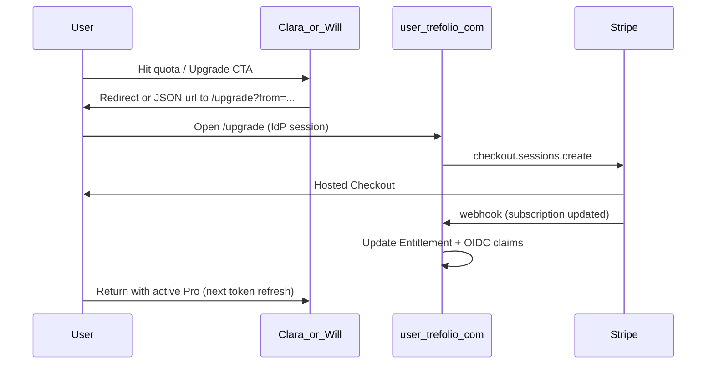

# Gestión de suscripción en **user** y checkout accesible desde Clara y Will

## Alcance de esta fase (y qué queda fuera)

| En alcance                                                              | Fuera de alcance (futuro)                                                                                                      |
| ----------------------------------------------------------------------- | ------------------------------------------------------------------------------------------------------------------------------ |
| `external/accounts`: `/upgrade`, checkout Stripe, webhook, entitlements | Cambios en **stocktracker** (Warren/trefolio) para `BILLING_REDIRECT_TO_IDP`, desactivar webhook local, o cutover de billing   |
| Clara y Will: enlaces y flujo hacia `user.trefolio.com/upgrade`         | Unificar el **runtime** de suscripción de Warren con el IdP (redirect desde `/api/billing/checkout`, cache `users.plan`, etc.) |

**Unificación futura con trefolio:** cuando se aborde Warren, reutilizar el mismo checkout del IdP (`from=trefolio`), un solo webhook como fuente de verdad, y el plan descrito en `[unified-accounts-and-billing.md](knowledge/design-docs/unified-accounts-and-billing.md)`. Hasta entonces Warren puede seguir con su flujo Stripe local si hace falta.

---

## Decisión de ownership

| Responsabilidad                                                                          | Dónde vive                                                                                                                                                                                                      |
| ---------------------------------------------------------------------------------------- | --------------------------------------------------------------------------------------------------------------------------------------------------------------------------------------------------------------- |
| Stripe Customer, Checkout Session, Billing Portal, webhook que actualiza **Entitlement** | **Solo** `[user.trefolio.com](https://user.trefolio.com)` — repo `[external/accounts/](external/accounts/)` (trefolio-accounts)                                                                                 |
| Cuánto puede usar el usuario en cada app (límites diarios / cuotas)                      | Cada app **aplica** el límite localmente; el **valor** viene de OIDC claims / sync desde IdP (`[knowledge/design-docs/unified-accounts-and-billing.md](knowledge/design-docs/unified-accounts-and-billing.md)`) |
| CTAs “Mejorar plan” en Clara y Will                                                      | Enlaces al **mismo sitio user**, no checkout Stripe embebido en clara/will                                                                                                                                      |

Will y Clara **no** son fuentes de verdad de facturación; solo redirigen o muestran URL al IdP.

---

## Página de checkout en **user**: `/upgrade`

Documentación largo plazo: CTAs pueden usar `from=trefolio|clara|will` (`[unified-accounts-and-billing.md](knowledge/design-docs/unified-accounts-and-billing.md)` § Cross-product). **En esta fase** priorizar `from=clara` y `from=will` en la UI y query params; `from=trefolio` puede existir en la página por compatibilidad futura sin integrar Warren.

### Qué debe hacer (producto)

1. **Sesión en el IdP:** el usuario debe poder iniciar sesión OIDC en `user.trefolio.com` (o ya tener cookie de sesión del accounts) para asociar el pago al `sub` correcto.
2. **UI `/upgrade`:** comparativa de beneficios (misma línea comercial que Warren si aplica copy), selector **mensual / anual**, CTA que dispara checkout.
3. **Checkout:** sesión Stripe **creada por el IdP** (`mode: subscription`), con `success_url` / `cancel_url` que pueden volver al producto de origen vía query `from=` + opcional `return_to=` (a definir en implementación).

### Misma cuenta Stripe y mismos precios que Warren (trefolio.com)

**Un solo Stripe Dashboard** — los mismos `price_…` y secret key que ya usa el producto Warren en producción. En Vercel (`user.trefolio.com` / `external/accounts`) configurar **los mismos valores** (copiados del proyecto Warren / Dashboard, no un segundo producto Pro):

| Variable                   | Uso                               | Notas                                                                                                                                      |
| -------------------------- | --------------------------------- | ------------------------------------------------------------------------------------------------------------------------------------------ |
| `STRIPE_SECRET_KEY`        | API server-side                   | Misma cuenta que Warren (producción).                                                                                                      |
| `STRIPE_PRICE_PRO_MONTHLY` | `line_items` checkout Pro mensual | Mismo `price_…` que Warren (env o `platform_settings`; ver `[getStripePriceConfig](src/lib/db/settings.ts)` → `STRIPE_PRICE_PRO_MONTHLY`). |
| `STRIPE_PRICE_PRO_ANNUAL`  | `line_items` checkout Pro anual   | Igual (`STRIPE_PRICE_PRO_ANNUAL`).                                                                                                         |

Precios de producto documentados: €7.99/mes y €59.99/año (`[unified-accounts-and-billing.md](knowledge/design-docs/unified-accounts-and-billing.md)`); **no** crear nuevos Prices en Stripe solo para el IdP.

**Webhook:** `STRIPE_WEBHOOK_SECRET` en el IdP = signing secret del endpoint `https://user.trefolio.com/api/billing/webhook`. No tiene por qué coincidir con el secret del webhook del proyecto Warren (cada URL en Stripe tiene el suyo). Misma cuenta y mismos tipos de eventos (p. ej. eventos de suscripción y `checkout.session.completed`).

**Opcional:** `STRIPE_COUPON_DEVICE_FREE_YEAR` — mismo ID si el IdP replica promos device (`[StripePriceKey](src/lib/db/settings.ts)`).

**Fase Warren (posterior):** dejar de duplicar checkout en stocktracker cuando se active `BILLING_REDIRECT_TO_IDP` — ver `[checkout/route.ts](src/app/api/billing/checkout/route.ts)`; **no** forma parte de esta entrega.

### Referencia de implementación (Warren / stocktracker — solo lectura)

`[src/app/api/billing/checkout/route.ts](src/app/api/billing/checkout/route.ts)` sirve de modelo para la forma de la sesión Stripe (`customer`, `line_items`, `metadata`, URLs). El redirect JSON al IdP (`billingRedirectToIdp`, ~líneas 32–39) es lo que **eventualmente** usará Warren; **no** implementarlo en esta fase.

**Clara y Will (esta fase):**

- **Opción A (mínima):** enlaces a `/upgrade?from=clara|will&sub=…` — Clara: `[buildIdpUpgradeUrlForClara](external/etracker/src/lib/idp-base.ts)`.
- **Opción B:** `POST` en Clara/Will que devuelva `{ url }` hacia el IdP (mismo shape que el redirect Warren), **sin** modificar rutas billing en stocktracker.

Para cuando se unifique Warren: `[src/lib/idp/config.ts](src/lib/idp/config.ts)` (`billingRedirectToIdp`, `getIdpIssuer`). Clara hoy: `[idp-base.ts](external/etracker/src/lib/idp-base.ts)`.

---

## Diagrama de flujo (alto nivel)

---

## Estado actual en código

| Componente                                        | Estado                                                                                     |
| ------------------------------------------------- | ------------------------------------------------------------------------------------------ |
| Warren → IdP redirect (`BILLING_REDIRECT_TO_IDP`) | Código en stocktracker; **fuera de alcance** activarlo o cortar billing local en esta fase |
| Clara → URL IdP upgrade                           | `[buildIdpUpgradeUrlForClara](external/etracker/src/lib/idp-base.ts)`                      |
| Will → URL IdP upgrade                            | Pendiente (helper `from=will`)                                                             |
| Página `/upgrade` en `external/accounts`          | Pendiente — prioridad IdP esta fase                                                        |

---

## Legal / compliance

Cambios en flujo de pago y sitio **user** disparan revisión con `[.cursor/skills/legal-advisor/SKILL.md](.cursor/skills/legal-advisor/SKILL.md)` (términos, privacidad, un solo procesador de pagos).