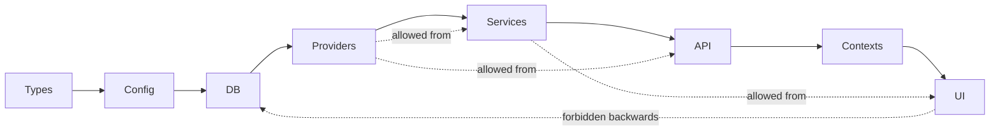

# ARCHITECTURE.md — top-level map

This document describes how the trefolio codebase is organized, the product
domains, the layers inside each domain, and the permitted vs forbidden edges
between them. It follows the
[matklad architecture.md pattern](https://matklad.github.io/2021/02/06/ARCHITECTURE.md.html).

Depth: **domain + layer map.** For a specific feature, start at
[`knowledge/product-specs/index.md`](knowledge/product-specs/index.md).

## Domains

Every feature belongs to exactly one domain. Domains are listed in roughly the
order a new user encounters them.

| Domain | What lives here | Primary skill |
|--------|-----------------|----------------|
| **Auth & Identity** | login/signup, verify email, passkeys, sessions, guards, impersonation | [`engineer-user-auth`](.cursor/skills/engineer-user-auth/SKILL.md) |
| **Portfolio Core** | holdings, transactions, cash, accounts, multi-portfolio, manual assets | [`engineer-data`](.cursor/skills/engineer-data/SKILL.md), [`engineer-dashboard`](.cursor/skills/engineer-dashboard/SKILL.md) |
| **Market Data** | quotes, FX, history, fundamentals, calendars, economic indicators | [`engineer-integrations`](.cursor/skills/engineer-integrations/SKILL.md) |
| **Dashboard & Charts** | Dashboard shell, tabs, portfolio value chart, benchmarks, tooltip, spike attribution | [`engineer-charts`](.cursor/skills/engineer-charts/SKILL.md), [`engineer-dashboard`](.cursor/skills/engineer-dashboard/SKILL.md) |
| **Crypto** | crypto portfolio, discovery, quotes via CoinLore | [`engineer-data`](.cursor/skills/engineer-data/SKILL.md) |
| **Import & Brokers** | 14 CSV parsers, IBKR Flex, AI import, broker-integration-requests | [`pm-import`](.cursor/skills/pm-import/SKILL.md), [`engineer-integrations`](.cursor/skills/engineer-integrations/SKILL.md) |
| **SnapTrade** | OAuth broker sync, hourly refresh, logs | [`engineer-integrations`](.cursor/skills/engineer-integrations/SKILL.md) |
| **AI Intelligence** | analysis, portfolio review, stock evaluation, moat reports/screener, AI import | [`engineer-integrations`](.cursor/skills/engineer-integrations/SKILL.md) |
| **Tools** | rebalance, tax reports, backtest/what-if, planning, net worth, strategies | [`engineer-tools`](.cursor/skills/engineer-tools/SKILL.md) |
| **Screener & Search** | stock screener cache, explore search, global search | [`engineer-integrations`](.cursor/skills/engineer-integrations/SKILL.md) |
| **Alerts & Goals** | price alerts, goals, watchlist, alert dispatcher cron | [`engineer-data`](.cursor/skills/engineer-data/SKILL.md) |
| **Notifications** | in-app, push (web-push), device, email fan-out | [`engineer-data`](.cursor/skills/engineer-data/SKILL.md), [`automated-user-comms`](.cursor/skills/automated-user-comms/SKILL.md) |
| **Email & Digests** | Resend integration, i18n templates, weekly/daily digests, unsubscribes | [`automated-user-comms`](.cursor/skills/automated-user-comms/SKILL.md), [`ux-writer`](.cursor/skills/ux-writer/SKILL.md) |
| **Social** | public profiles (/u), posts (/p), connections, network feed | [`engineer-social`](.cursor/skills/engineer-social/SKILL.md) |
| **Private Chat** | rooms, messages, typing/presence/reads, share cards, 24h TTL | [`engineer-chat`](.cursor/skills/engineer-chat/SKILL.md) |
| **Sharing & Widgets** | /p/[slug] public portfolio, embeddable widget, dev API keys | [`engineer-data`](.cursor/skills/engineer-data/SKILL.md) |
| **Billing & Tiers** | Stripe checkout, portal, webhook, paywalls, refunds | [`engineer-payments-subscriptions`](.cursor/skills/engineer-payments-subscriptions/SKILL.md) |
| **Feature Flags** | per-user overrides, polling, admin UI | [`engineer-feature-flags`](.cursor/skills/engineer-feature-flags/SKILL.md) |
| **Admin** | users, flags, AI logs, cron stats, emails, digests, settings, reset | [`engineer-user-auth`](.cursor/skills/engineer-user-auth/SKILL.md) |
| **Analytics & Ads** | GA, Meta Pixel, conversion events, UTM, AdSense, promo banners | [`analytics-instrumentation`](.cursor/skills/analytics-instrumentation/SKILL.md) |
| **Landing & Marketing** | landing page, blog (10 locales), demo, onboarding, pricing, SEO | [`seo-specialist`](.cursor/skills/seo-specialist/SKILL.md), [`sales`](.cursor/skills/sales/SKILL.md) |
| **Snapshots & Math** | portfolio snapshots, TTWROR/XIRR, materialization, backfill | [`engineer-tools`](.cursor/skills/engineer-tools/SKILL.md), [`financial-calculations`](.cursor/skills/financial-calculations/SKILL.md) |
| **Data Layer** | Turso/libSQL, schema, migrations | [`engineer-data`](.cursor/skills/engineer-data/SKILL.md) |
| **Cron & Reliability** | 15 scheduled jobs, cron_executions logging, Grafana push | [`analytics-instrumentation`](.cursor/skills/analytics-instrumentation/SKILL.md) |
| **Device (trefolio Leaf)** | ESP32-S3 firmware, LVGL UI, OTA, pairing, interest waitlist | [`engineer-device`](.cursor/skills/engineer-device/SKILL.md), [`firmware-release`](.cursor/skills/firmware-release/SKILL.md) |
| **Mobile** | Capacitor hosted mode, iOS/Android shells, PWA | [`engineer-mobile`](.cursor/skills/engineer-mobile/SKILL.md) |
| **Platform** | i18n, theming, legal pages, release process | [`theme-parity`](.cursor/skills/theme-parity/SKILL.md), [`release-manager`](.cursor/skills/release-manager/SKILL.md) |

## Layers inside a domain

Every domain follows this layering. Code can only depend **forward** through
layers. Cross-cutting concerns enter through **Providers**. Anything else is
disallowed.

| Layer | Where it lives | Examples |
|-------|----------------|----------|
| **Types** | [`src/lib/types.ts`](src/lib/types.ts), `src/types/` | `Holding`, `CashEntry`, `PriceAlert`, `SubscriptionFeature` |
| **Config / env** | [`src/lib/env.ts`](src/lib/env.ts) (if present), `.env.local.example` | DB URL, secret keys, feature toggles |
| **DB (data access)** | [`src/lib/db/`](src/lib/db) (one file per table/feature) | `holdings.ts`, `portfolios.ts`, `alerts.ts` |
| **Providers** | [`src/lib/api-providers/`](src/lib/api-providers), [`src/lib/auth/`](src/lib/auth), [`src/lib/email.ts`](src/lib/email.ts) | Yahoo, FMP, Resend, Stripe, SnapTrade SDK |
| **Services** | Loose in `src/lib/*.ts` | `alert-dispatcher.ts`, `derive-holdings.ts`, `digest-generation.ts` |
| **API routes** | [`src/app/api/**/route.ts`](src/app/api) | `/api/holdings`, `/api/quote`, `/api/cron/*` |
| **Contexts** | [`src/contexts/`](src/contexts), [`src/lib/portfolio-context.tsx`](src/lib/portfolio-context.tsx) | `PortfolioProvider`, `PortfolioCommandProvider`, `FeatureFlagProvider` |
| **UI** | [`src/components/`](src/components), [`src/app/(app)/`](src/app/(app)) | `Dashboard`, `PortfolioValueChart`, `AddStockModal` |

## Cross-cutting concerns (single entry point each)

| Concern | Entry point |
|---------|-------------|
| **Auth** | [`src/middleware.ts`](src/middleware.ts) + [`src/lib/auth/guards.ts`](src/lib/auth/guards.ts) |
| **Feature flags** | [`src/lib/feature-flag-context.tsx`](src/lib/feature-flag-context.tsx) + `/api/feature-flags` |
| **i18n** | [`src/locales/`](src/locales) + [`src/lib/email-i18n/`](src/lib/email-i18n) |
| **Currency / FX** | [`src/lib/exchange-rates.ts`](src/lib/exchange-rates.ts) + `/api/exchange-rates` |
| **Telemetry** | `src/lib/analytics.ts`, `conversion-events.ts`, `ad-tracking.ts`, `attribution.ts` |
| **Rate limiting** | [`src/lib/db/rate-limits.ts`](src/lib/db/rate-limits.ts) + Upstash |
| **Email** | [`src/lib/email.ts`](src/lib/email.ts) |
| **Payments** | Stripe in [`src/app/api/billing/**`](src/app/api/billing) + [`src/app/api/webhooks/`](src/app/api/webhooks) |

## Permitted vs forbidden edges

**Permitted:**

- Any layer may import from Types.
- Services may call Providers and DB (same or any domain).
- API routes may call Services, DB, and Providers.
- UI may call the API layer via `fetch` or SWR. UI must never import from `src/lib/db/*`.
- Cron routes are a special case of API routes — they depend on Services and DB.

**Forbidden:**

- UI importing DB functions (would ship Turso client to browser).
- DB importing Services (creates cycles).
- Domain A's DB importing domain B's DB (use a Service to compose).
- New cron jobs outside `src/app/api/cron/*` or missing from
  [`src/lib/cron-registry.ts`](src/lib/cron-registry.ts) / `vercel.json`.
- Components reaching outside their domain without going through a context or
  an API route.

## Boundary validation (parse don't validate)

- Every API route parses input with Zod schemas at the top. See
  [`src/lib/api-response.ts`](src/lib/api-response.ts).
- Every external provider response is normalized through
  [`src/lib/api-providers/response.ts`](src/lib/api-providers/response.ts).
- Every CSV broker row goes through [`src/lib/broker-parsers/types.ts`](src/lib/broker-parsers/types.ts) normalization.

## Quality grades by domain

See [`knowledge/QUALITY_SCORE.md`](knowledge/QUALITY_SCORE.md) for per-domain
grades (test coverage, churn, known gaps).

## Where to read next

- Per-feature: [`knowledge/product-specs/index.md`](knowledge/product-specs/index.md)
- Design principles: [`knowledge/DESIGN.md`](knowledge/DESIGN.md)
- UI principles: [`knowledge/FRONTEND.md`](knowledge/FRONTEND.md)
- Reliability: [`knowledge/RELIABILITY.md`](knowledge/RELIABILITY.md)
- Security: [`knowledge/SECURITY.md`](knowledge/SECURITY.md)
