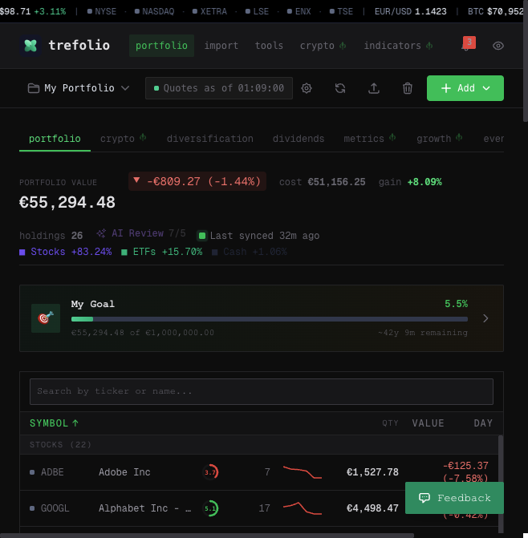
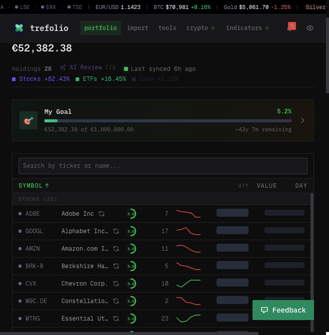
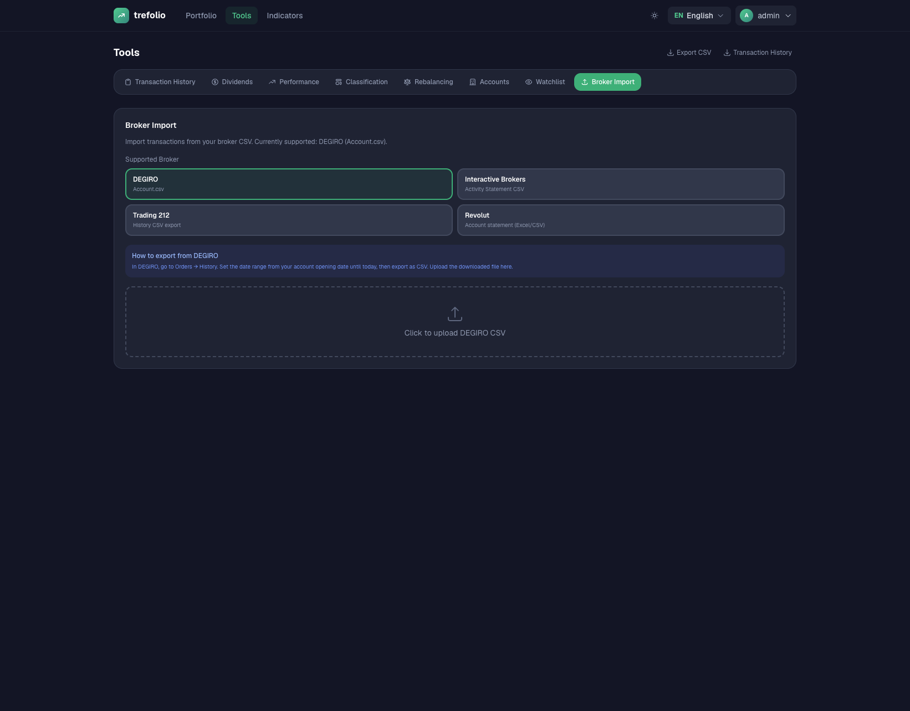
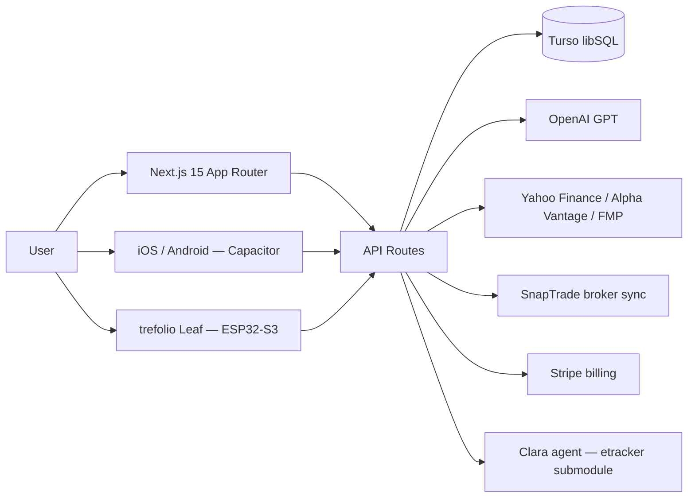

<div align="center">


# trefolio

### Your portfolio. Understood.

**Open-source, AI-powered portfolio tracker built for European investors.** Track holdings across 20+ exchanges and 21 currencies, get EU tax reports, analyze stocks with AI, and sync brokers automatically — in 35 languages.

[](#-license)
[](https://github.com/kyberis/stocktracker/stargazers)
[](https://nextjs.org)
[](https://www.typescriptlang.org)
[](https://turso.tech)
[](https://tailwindcss.com)
[](/.github/workflows/ci.yml)
[](#-contributing)

**[Live app](https://trefolio.com) · [Demo](https://trefolio.com/demo) · [Quick start](#-quick-start) · [Features](#-features) · [Contributing](#-contributing)**

</div>

---

## 📸 Screenshots

<table>
<tr>
<td width="33%" align="center">

<br/><strong>Dashboard</strong> — full portfolio at a glance, 4 themes
</td>
<td width="33%" align="center">

<br/><strong>Holdings</strong> — 21 currencies, live quotes, P&L
</td>
<td width="33%" align="center">

<br/><strong>Tools</strong> — EU tax reports, projections, dividends
</td>
</tr>
</table>

---

## ✨ Features

| | |
|---|---|
| 📊 **Real-time portfolio** | Live quotes from Yahoo Finance across NYSE, NASDAQ, XETRA, LSE and 20+ exchanges |
| 💱 **21-currency support** | Automatic FX conversion with impact tracking. EUR as base — display in any currency |
| 🤖 **AI analysis** | Plain-language company analysis, market intelligence, and tax optimization. In your language |
| 🧾 **EU tax reports** | Germany, France, Spain, Netherlands, Italy — with AI Tax Assistant |
| 🔗 **Broker sync** | 20+ brokerages via SnapTrade + 14 CSV import formats + AI-powered PDF import |
| 📱 **Mobile** | PWA + native iOS & Android via Capacitor |
| 🌿 **trefolio Leaf** | ESP32-S3 AMOLED hardware device — your portfolio on your desk |
| 📅 **Calendars** | Earnings calendar for your holdings, economic events, IPO calendar |
| 🔔 **Alerts** | Price alerts via in-app, email, and push notifications |
| 🌍 **35 languages** | Full UI localization across European languages |
| 💰 **Net worth** | Manual assets + holdings in one view |
| 🔍 **Stock screener** | 600+ stocks, 6 filters, 5 preset strategies |

---

## 🏗️ Architecture



Data access is purely through `src/lib/db/` — no ORM, parameterized libSQL queries. EUR is the base currency in all storage; display conversion happens at render time. See [`ARCHITECTURE.md`](ARCHITECTURE.md).

---

## 🧱 Tech stack

| Layer | Technology |
|---|---|
| Framework | Next.js 15 (App Router, Server Components) |
| Language | TypeScript 5 (strict) |
| Database | [Turso](https://turso.tech) (libSQL / SQLite-compatible) |
| Styling | Tailwind CSS 4 · 4 dashboard themes · dark/light mode |
| Charts | Recharts |
| Auth | bcrypt + jose (JWT) · Google/Apple OAuth · Passkeys |
| AI | OpenAI GPT — analysis, tax assistant, PDF import |
| Market data | Yahoo Finance · Alpha Vantage · FMP · Finnhub · CoinLore |
| Broker sync | SnapTrade (20+ brokerages) |
| Payments | Stripe |
| Email | Resend |
| Mobile | PWA + Capacitor (iOS, Android) |
| Firmware | PlatformIO + LVGL (ESP32-S3 AMOLED) |
| Hosting | Vercel (serverless) |
| Testing | Vitest (unit) · Playwright (E2E) |

---

## 🚀 Quick start

### Prerequisites

- **Node.js ≥ 22** (`node -v` to check)
- **npm ≥ 10**
- A [Turso](https://turso.tech) database (free tier is enough)

### Setup

```bash
# 1. Clone and install
git clone https://github.com/kyberis/stocktracker.git
cd stocktracker
npm install

# 2. Configure environment
cp .env.local.example .env.local
# Fill in STOCKTRACKER_TURSO_DATABASE_URL, STOCKTRACKER_TURSO_AUTH_TOKEN, APP_SESSION_SECRET
# Everything else is optional for local dev

# 3. Run migrations
npm run db:migrate

# 4. Start
npm run dev
```

Open [http://localhost:3000](http://localhost:3000). Log in with `admin` / `admin` and change the password on first run.

> 💡 **No Turso account?** Set `STOCKTRACKER_TURSO_DATABASE_URL=file:local.db` to use a local SQLite file with zero setup.

---

## ⚙️ Environment variables

Full reference in [`.env.local.example`](.env.local.example). Minimum to run locally:

<details>
<summary><strong>Core</strong> (required)</summary>

| Variable | Description |
|---|---|
| `STOCKTRACKER_TURSO_DATABASE_URL` | Turso DB URL (`libsql://...`) or `file:local.db` for local SQLite |
| `STOCKTRACKER_TURSO_AUTH_TOKEN` | Turso auth token (leave empty for `file:` URL) |
| `APP_SESSION_SECRET` | 64-char hex for JWTs — `openssl rand -hex 32` |
| `APP_BASE_URL` | Public URL e.g. `http://localhost:3000` |

</details>

<details>
<summary><strong>AI features</strong></summary>

| Variable | Description |
|---|---|
| `STOCKTRACKER_OPENAI_API_KEY` | OpenAI API key — required for AI analysis, PDF import, tax assistant |

</details>

<details>
<summary><strong>Optional integrations</strong></summary>

| Group | Variables |
|---|---|
| Market data (Pro) | `STOCKTRACKER_ALPHAVANTAGE_API_KEY` |
| Broker sync | SnapTrade credentials (see `.env.local.example`) |
| Payments | `STRIPE_SECRET_KEY`, `STRIPE_WEBHOOK_SECRET`, Stripe price IDs |
| Email | `RESEND_API_KEY`, `RESEND_FROM_ADDRESS` |
| Auth | `GOOGLE_CLIENT_ID/SECRET`, `APPLE_CLIENT_ID/TEAM_ID/KEY_ID/PRIVATE_KEY` |
| Rate limiting | `UPSTASH_REDIS_REST_URL`, `UPSTASH_REDIS_REST_TOKEN` |
| Observability | `GRAFANA_CLOUD_OTLP_URL`, `GRAFANA_CLOUD_API_TOKEN` |

</details>

---

## ☁️ Deploy to Vercel

```bash
# 1. Create a Turso database
brew install tursodatabase/tap/turso
turso auth signup
turso db create trefolio
turso db show trefolio --url    # → STOCKTRACKER_TURSO_DATABASE_URL
turso db tokens create trefolio  # → STOCKTRACKER_TURSO_AUTH_TOKEN

# 2. Import repo in Vercel dashboard and set env vars
# 3. Push to main — migrations run automatically on deploy
```

For self-hosting on any Node 22+ server: clone, set env vars, `npm run build && npm start`. The app is a standard Next.js app with no Vercel-specific requirements.

---

## 📁 Repo structure

```
src/
  app/
    (app)/          Authenticated dashboard (portfolio, tools, alerts…)
    (marketing)/    Public landing, pricing, demo
    api/            REST API routes
  components/       Shared React components
  hooks/            Reusable hooks
  lib/
    api-providers/  Yahoo, Alpha Vantage, FMP, Finnhub, CoinLore, OpenFIGI
    auth/           Sessions, guards, bcrypt, passkeys
    broker-parsers/ 14 CSV broker formats
    db/             Data access layer (one file per feature)
    locales/        35-language i18n
scripts/            Build and maintenance scripts
lilygo-t4s3/        trefolio Leaf firmware (PlatformIO + LVGL) and SDL simulator
ios/ android/       Capacitor native shells
data/               Seed + demo static JSON
knowledge/          Agent knowledge base (specs, design docs, architecture)
external/etracker/  Clara — AI financial-agents submodule (read-only context)
```

---

## 🧪 Scripts

| Script | Description |
|---|---|
| `npm run dev` | Start Next.js dev server |
| `npm run build` | Production build |
| `npm run lint` | ESLint |
| `npm run typecheck` | `tsc --noEmit` |
| `npm test` | Vitest unit tests |
| `npm run db:migrate` | Run DB migrations locally |
| `npm run knowledge:gen` | Regenerate `knowledge/generated/` from schema/crons |
| `npm run knowledge:lint` | Lint the knowledge base for consistency |

---

## 🗺️ Roadmap

- [x] 35-language UI
- [x] EU tax reports (DE, FR, ES, NL, IT)
- [x] SnapTrade broker sync (20+ brokerages)
- [x] Native iOS & Android (Capacitor)
- [x] trefolio Leaf hardware device (ESP32-S3 AMOLED)
- [x] Stock screener
- [x] Net worth tracking
- [ ] More broker sync providers
- [ ] Additional EU tax jurisdictions
- [ ] trefolio Leaf v2 (e-ink variant)

Have an idea? [Open an issue](https://github.com/kyberis/stocktracker/issues/new) — half-formed ideas are welcome too.

---

## 🤝 Contributing

Contributions are welcome — read [CONTRIBUTING.md](./CONTRIBUTING.md) and the [Code of Conduct](./CODE_OF_CONDUCT.md).

Good first contributions:
- 🌍 **New broker CSV parsers** — see `src/lib/broker-parsers/` for examples
- 🐛 **Bug reports** with reproduction steps via [Issues](https://github.com/kyberis/stocktracker/issues)
- 🌐 **Locale improvements** — `src/lib/locales/`
- ⭐ **A star** if this saves you time

Before opening a PR, run:

```bash
npm run lint && npm run typecheck && npm test && npm run build
```

CI enforces the same gates on every PR.

---

## 🙏 Credits

Built on the shoulders of:

- [Next.js](https://nextjs.org) · [React](https://react.dev) · [Vercel](https://vercel.com)
- [Turso](https://turso.tech) · [libSQL](https://github.com/tursodatabase/libsql)
- [Tailwind CSS](https://tailwindcss.com) · [shadcn/ui](https://ui.shadcn.com) · [Lucide](https://lucide.dev)
- [Recharts](https://recharts.org) · [Zod](https://zod.dev) · [Vitest](https://vitest.dev)
- [SnapTrade](https://snaptrade.com) · [Stripe](https://stripe.com) · [Resend](https://resend.com) · [OpenAI](https://openai.com)

---

## 📄 License

[MIT](./LICENSE) — free to use, fork, and self-host.

---

<div align="center">

**[⭐ Star on GitHub](https://github.com/kyberis/stocktracker)** · **[🐛 Report a bug](https://github.com/kyberis/stocktracker/issues/new)** · **[🌐 trefolio.com](https://trefolio.com)**

_Made in Europe 🇪🇺_

</div>
