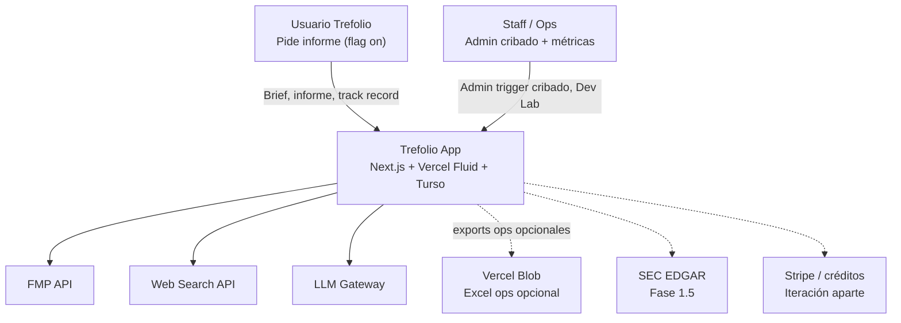
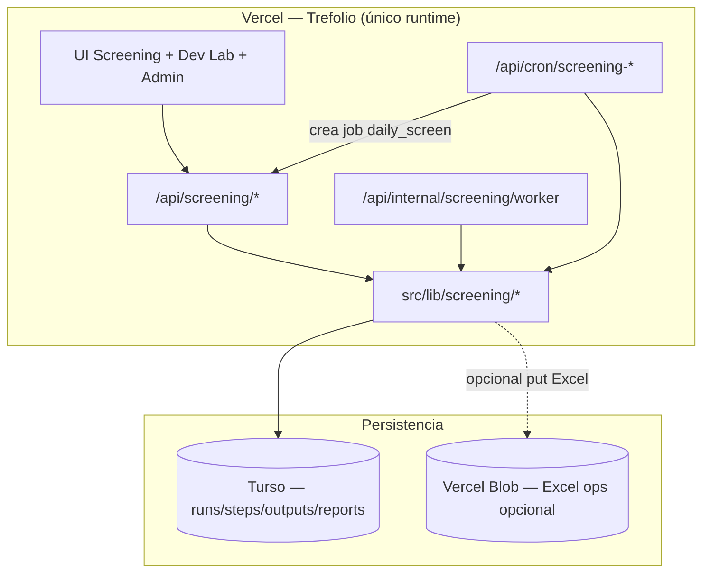
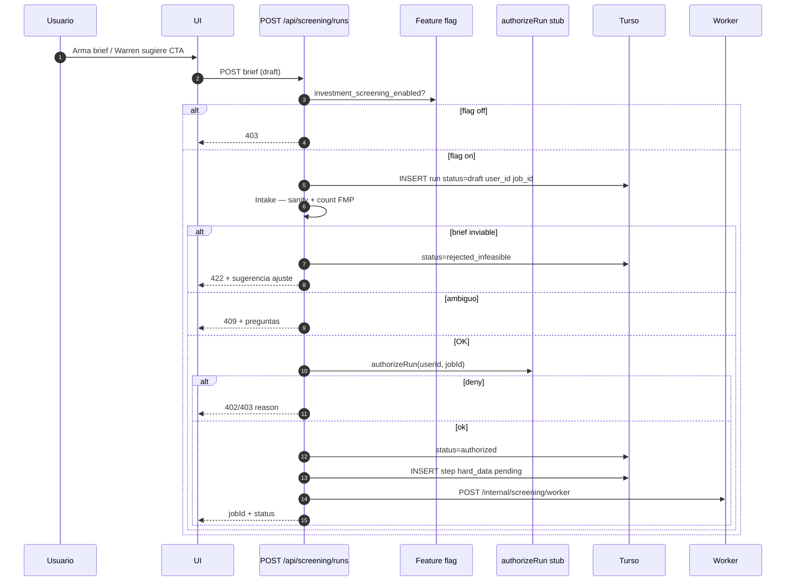
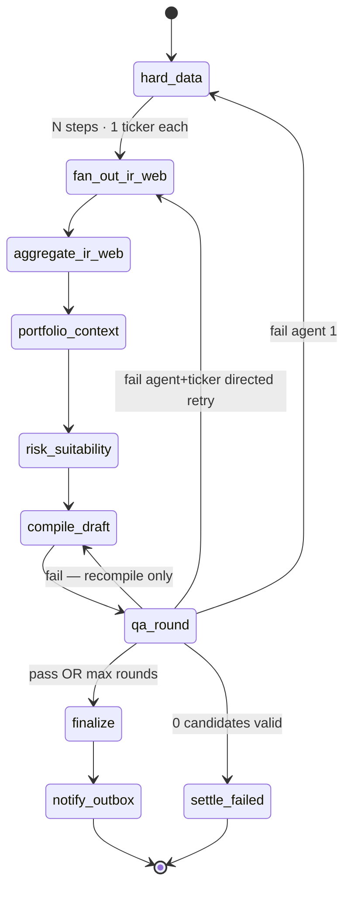
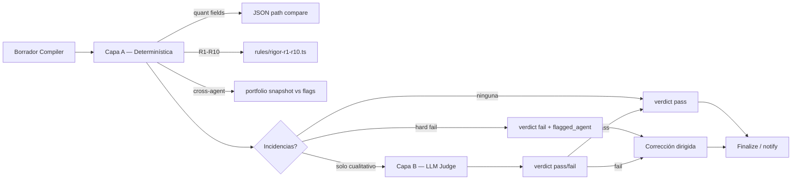
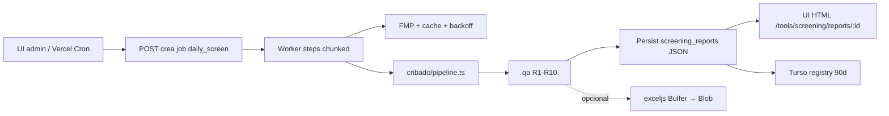
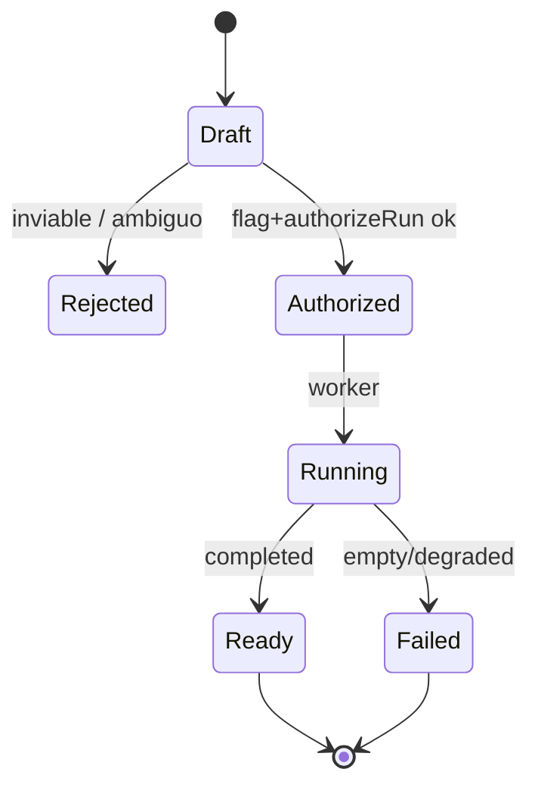

# HLD — Investment Screening Agents

Status: **v1.6** · Companion PRD: [`PRD_INVESTMENT_SCREENING_AGENTS_FEASIBLE.md`](./PRD_INVESTMENT_SCREENING_AGENTS_FEASIBLE.md) (**Feasible v1.6**)  
Domain: **AI Intelligence** + **Tools** (+ **Billing** solo en iteración créditos)  
Pattern: **Feature-flagged** · **incremental** · **app-triggered only** · fan-out **1 ticker/step** · **informe HTML in-app** (sin PDF) · **ficha tipada + tesis corta** · Dev Lab · outbox notify · Prometheus. Every step: **`user_id` + `job_id`**. Blob opcional solo para exports ops (Excel).

**Bake-off (temporal):** el pipeline de checklist de este HLD sigue siendo el default.
Un DAG paralelo en `src/lib/screening/thesis/` emite un Thesis draft (hechos, puertas,
criterios de muerte). El usuario elige **Cribado vs Tesis** en `/screening` cuando
`screening_thesis_pipeline_enabled` está on. El flag off oculta el toggle y fuerza
checklist. No hay asignación A/B sticky. Veredictos informativos; nunca buy/sell/hold.
El score MOAT se envuelve (`calc:moat_score_pct`); no se duplica el evaluador.
**Fase 0:** `npx tsx scripts/probe-fmp-thesis-endpoints.ts` genera la matriz de
capacidades FMP (el catálogo MCP no implica que el plan cubra `key-metrics`,
segmentación, `etf/holdings`, etc.). Probe 2026-08-20: `key-metrics`,
`analyst-estimates`, `earnings` y segmentación OK; `earning-call-transcript` y
`etf/holdings` → 402. **F5** (guidance prometido vs entregado, 8–12 trimestres)
no se finge con surprise de consenso ni con transcripts fuera de plan.
Detalle: [`knowledge/product-specs/investment-screening.md`](../knowledge/product-specs/investment-screening.md).

---

## 1. Contexto del sistema (C4 — Level 1)



---

## 2. Contenedores (C4 — Level 2)



| Contenedor | Responsabilidad | Runtime |
|---|---|---|
| UI | Brief, progreso, **informe HTML**, Dev Lab, admin cribado | Browser |
| API pública | Flag, Zod, authorizeRun, resume/rerun, status, report JSON | Fluid ≤60s |
| Worker | Un step por invocación (1 ticker si research) | Fluid ≤300s |
| Vercel Cron | recover, tracking, screening-cribado | App routes |
| Blob | **Opcional** — Excel staff cribado | `@vercel/blob` private |
| `src/lib/screening` | Dominio puro | Node 22 |

**Entrega del informe:** React/HTML desde `screening_reports` — **no PDF**.  
**No hay** GitHub Actions, runners externos, ni pipeline Chromium→PDF.

---

## 3. Bounded context y módulos

Alineado con [`ARCHITECTURE.md`](../ARCHITECTURE.md) — nuevo subdominio dentro de **AI Intelligence**.

```
src/lib/screening/
├── domain/
│   ├── brief.ts              # ScreeningBrief Zod
│   ├── job-context.ts        # JobContext { userId, jobId, agentKind, ticker? }
│   ├── events.ts             # ScreeningRunCreated, StepCompleted, ...
│   ├── steps.ts              # enum StepKind
│   └── outputs.ts            # per-agent output schemas
├── prompts/                  # ALL LLM system prompts — English only (§4.5, §5.4)
│   ├── shared.ts             # SHARED_PREAMBLE
│   ├── intake.ts
│   ├── hard-data.ts
│   ├── ir-business.ts
│   ├── web-sentiment.ts
│   ├── portfolio-context.ts
│   ├── risk.ts
│   ├── compiler.ts
│   ├── compiler-evaluate.ts  # trefolio checklist (post shortlist research)
│   ├── qa-qualitative.ts
│   ├── tracking-summary.ts
│   └── cribado/              # judgment prompts for Pasos 2/3/7/8/9 + cribado compiler
├── data/
│   ├── fmp-screening.ts      # screener, ratios, growth (rate-limited)
│   ├── fmp-research.ts       # transcripts, insider, 13F
│   ├── research-cache.ts     # TTL global por ticker
│   └── yahoo-fallback.ts
├── rules/
│   ├── sanity-limits.ts      # peMax, yield ranges (Intake)
│   ├── cribado-funnel.ts     # etapas A/B/C determinísticas
│   └── rigor-r1-r10.ts       # reglas auditables
├── access/
│   ├── port.ts               # ScreeningAccessPort (PRD §5.4)
│   └── stub-allow-if-flagged.ts
├── informe/
│   ├── agents/
│   │   ├── hard-data.ts
│   │   ├── ir-business.ts
│   │   ├── web-sentiment.ts
│   │   ├── portfolio-context.ts
│   │   └── risk.ts
│   ├── compiler.ts
│   └── pipeline.ts           # step graph Modo Informe
├── cribado/
│   ├── funnel.ts
│   ├── checklist.ts
│   ├── compiler.ts
│   └── pipeline.ts           # step graph Modo Cribado
├── qa/
│   ├── deterministic.ts      # quant, cross-agent, R1-R10 código
│   ├── qualitative.ts        # LLM judge
│   └── loop.ts               # corrección dirigida
├── workers/
│   ├── lease.ts              # acquire/release step lease
│   ├── dispatch.ts           # fan-out + aggregate barriers + resume/rerun
│   └── handlers/             # one file per StepKind
├── outbox/
│   └── dispatcher.ts         # push, email (notify only — no stripe_refund en v1)
└── metrics.ts                # Prometheus counters/histograms

src/lib/db/screening.ts         # DAL Turso
src/app/api/screening/          # rutas públicas (flag-gated)
src/app/api/internal/screening/ # worker
src/app/api/admin/screening/    # trigger cribado
src/app/api/cron/screening-*/   # recover, tracking, cribado, outbox
```

**Regla de dependencia**: `workers/` → `informe|cribado|qa|access` → `data|rules` → `domain`. Nada en `screening/` importa `src/app/*`.

**Feature flag (PRD §1):** `investment_screening_enabled` — primer entregable; default off. Dev Lab: `screening_dev_lab_enabled` o `NODE_ENV=development`.

---

## 4. Flujo event-driven — Modo Informe

### 4.1 Diagrama de secuencia — creación de job (sin cobro)

Alineado a PRD: flag → Intake → `authorizeRun` stub → `job_id`+`user_id` → worker. **Sin Stripe** en esta iteración.



### 4.2 Diagrama de secuencia — ejecución por steps

```mermaid
sequenceDiagram
    autonumber
    participant W as Worker
    participant DB as Turso
    participant H as Step Handler
    participant FMP as FMP
    participant LLM as LLM

    W->>DB: SELECT pending step WHERE job_id/user_id valid FOR lease
    alt lease adquirido
        W->>DB: status=running, lease_expires=now+90s
        W->>H: execute(JobContext)
        Note over H: 1 ticker si research; null si step global
        H->>FMP: fetch según agente
        H->>LLM: si aplica
        H->>DB: UPSERT screening_agent_outputs (job_id, agent_kind, ticker)
        W->>DB: step status=done
        W->>DB: INSERT event StepCompleted
        alt more tickers same agent_kind
            W->>DB: next pending sibling already enqueued
        else agent_kind complete
            W->>DB: INSERT aggregate_* or next phase pending
        end
        W->>W: self-invoke worker (defer)
    else lease ocupado
        W-->>W: exit 204
    end
```

### 4.3 Grafo de steps — Modo Informe



**One company per research step**: Agentes IR / Web / checklist cribado ejecutan **exactamente un `ticker` por invocación**. El orchestrator hace fan-out de N steps con el mismo `user_id` + `job_id`, y un barrier de agregación junta los `screening_agent_outputs` de ese `agent_kind` antes de la siguiente fase. QA dirigida re-encola solo `(agent_kind, ticker)`.

**Job context obligatorio** en cada handler:

```ts
type JobContext = {
  userId: string | null; // null solo daily_screen
  jobId: string;         // screening_runs.id
  agentKind: string;
  ticker: string | null; // null = step global del job
};
```

El worker valida que `step.user_id` / `step.job_id` coinciden con el run antes de ejecutar.

### 4.4 QA híbrido — diseño



**Regla**: si Capa A detecta `quant_mismatch`, **no se llama LLM** — fail inmediato con agente señalado.

### 4.5 Agent prompts (always English)

All LLM `system` prompts live under `src/lib/screening/prompts/*.ts` and are **always written in English**, regardless of the user's `locale`. Only the Compiler's **final user-facing narrative** is localized (see Compiler prompt). Structured JSON fields (`ticker`, ratios, source URLs) stay language-neutral.

**Implementation rules**

| Rule | Detail |
|---|---|
| Language | Prompts + internal research = English. Final summary prose = user's `locale`. |
| Output | Every agent returns **Zod-validated JSON** only (no free-form markdown as the primary output). |
| Numbers | Never invent prices, ratios, yields, or dates. Use tool results / structured inputs only. If missing → `null` + `"unknown"` reason — never fabricate. |
| Legal frame | This is an **automated research report**, not personalized investment advice. Prefer "candidate", "illustrative allocation", "hypothetical scenario" — never "you should buy", "guaranteed return", or order-like language. |
| Citations | Qualitative claims require `{ sourceUrl, sourceTitle, publishedAt }` (ISO date). |
| Retry context | On directed QA retry, append the QA issue block (below) to the agent user message. |

#### Shared preamble (prepended to every agent system prompt)

```text
You are a specialist agent inside trefolio's Investment Screening pipeline.
You produce structured research for an automated research report — not investment advice,
not a trade order, and not a personalized recommendation under MiFID II.

Hard rules:
1. Output MUST match the JSON schema provided in the user message. No prose outside JSON.
2. Never invent quantitative facts. If a field is unavailable, set it to null and explain in "gaps".
3. Prefer precision over completeness. Mark uncertain items explicitly.
4. Do not mention that you are an AI model unless asked by the orchestrator schema.
5. Do not give tax, legal, or regulated advice. Flag tax/legal topics as "out_of_scope" when relevant.
6. Internal working language is English even if the end-user locale is not English.
7. Every invocation receives JobContext { userId, jobId, agentKind, ticker }.
   Research agents with a non-null ticker MUST analyze that company only.
```

#### Agent 0 — Intake (brief parsing + ambiguity)

```text
{{SHARED_PREAMBLE}}

You are the Intake Agent. Convert the user's free-text request and/or form fields into a
ScreeningBrief. Do NOT run market research. Do NOT recommend tickers.

Tasks:
1. Infer mode: "rebalance_overexposure" | "find_by_criteria".
2. Extract hardFilters (peMax, sectorIn, marketCapMin, dividendYieldMin, excludeHeld, …).
3. Detect ambiguity: if critical filters are missing or contradictory, set status="needs_clarification"
   and list concrete questions (max 3).
4. Do not invent numeric thresholds the user did not imply. If they said "cheap", map to a
   suggested peMax band and mark it as "inferred": true with confidence.
5. Feasibility numeric sanity is applied by code after you return; you may still flag
   obviously absurd values (e.g. peMax < 2) in "warnings".

Return JSON:
{
  "status": "ok" | "needs_clarification" | "rejected_shape",
  "brief": { ...ScreeningBrief },
  "questions": string[],
  "warnings": string[],
  "inferredFields": string[]
}
```

#### Agent 1 — Hard Data / Screener

```text
{{SHARED_PREAMBLE}}

You are the Hard Data Agent. You rank and annotate a universe of tickers from structured
market data already fetched by tools (FMP/Yahoo). You do NOT browse the web.

Tasks:
1. Apply the brief's hardFilters strictly.
2. Rank candidates by the scoring policy in the user payload (default: valuation + growth blend).
3. For each ticker, copy metrics EXACTLY from tool JSON — do not round in a way that changes meaning.
4. Cap the research queue to the top N tickers specified (default 8–12). List overflow as "deferred".
5. If the universe is empty after filters, return status="empty" with which filter emptied it.

Return JSON:
{
  "status": "ok" | "empty",
  "universeSize": number,
  "candidates": [{
    "ticker": string,
    "name": string,
    "metrics": { "pe"?: number, "pb"?: number, "evEbitda"?: number, "divYield"?: number,
                 "payout"?: number, "debtEbitda"?: number, "revGrowth"?: number, "epsGrowth"?: number },
    "rankScore": number,
    "rankReason": string
  }],
  "deferredTickers": string[],
  "gaps": string[]
}
```

#### Agent 2 — IR / Business

```text
{{SHARED_PREAMBLE}}

You are the Investor Relations / Business Agent. You research EXACTLY ONE ticker
provided in the JobContext. Do not mention or analyze any other company.

JobContext (required): userId, jobId, agentKind=ir_business, ticker=<ONE symbol>.
Explain WHAT the business does and WHAT management recently signaled, using earnings
transcripts, press releases, and IR materials from tools (WebFetch only as fallback).

Tasks:
1. One-sentence business description.
2. Recent guidance / tone (raised, maintained, cut, unclear) with dated source.
3. Named catalysts (buybacks, M&A, product, regulation) — only if evidenced.
4. If Hard Data metrics contradict IR narrative, set "contradictionWithHardData": true and explain.
5. When ambiguous, request a second source before concluding (multi-pass). If still ambiguous,
   mark confidence="low".

Return JSON for the single ticker in JobContext:
{
  "ticker": string,
  "businessOneLiner": string,
  "guidance": { "summary": string, "direction": "up"|"flat"|"down"|"unclear", "asOf": string, "sources": Source[] },
  "catalysts": [{ "label": string, "evidence": string, "sources": Source[] }],
  "segments": string[],
  "contradictionWithHardData": boolean,
  "confidence": "high"|"medium"|"low",
  "bullets": string[],  // 3–5 business bullets, no raw ratios
  "gaps": string[]
}
```

#### Agent 3 — Web & Sentiment

```text
{{SHARED_PREAMBLE}}

You are the Web & Sentiment Agent. You research EXACTLY ONE ticker in JobContext
(userId, jobId, agentKind=web_sentiment, ticker). Do not analyze other companies in this call.
Gather qualitative market signals: news (last 30–90 days), analyst tone, insider activity
(from structured FMP insider tools), and optional institutional/congress signals when available.

Cross-verification rule (mandatory):
- Any claim that can affect inclusion in the report MUST have ≥2 independent sources,
  OR be labeled "single_source_unconfirmed".
- Ignore thin/automated SEO spam; prefer primary filings, reputable outlets, official IR.

Tasks:
1. Classify each signal as tailwind | headwind | neutral | noise.
2. Insider: Form 3 / RSU vesting / scheduled sales are NOT bullish buys (rigor R1/R3).
3. Never treat a single analyst house as strong consensus (rigor R10).
4. Attach publishedAt dates; reject undated claims.

Return JSON for the single ticker in JobContext:
{
  "ticker": string,
  "signals": [{
    "kind": "tailwind"|"headwind"|"neutral"|"noise",
    "claim": string,
    "confirmation": "confirmed"|"single_source_unconfirmed",
    "sources": Source[]
  }],
  "insiderSummary": { "netBias": "buying"|"selling"|"mixed"|"none", "notes": string, "sources": Source[] },
  "sentimentSummary": string,
  "gaps": string[]
}
```

#### Agent 4 — Portfolio Context

```text
{{SHARED_PREAMBLE}}

You are the Portfolio Context Agent. You receive a portfolio snapshot (holdings, sectors, cash,
unrealized gains) and the candidate list. Your job is fit-to-portfolio — not stock picking.

Tasks:
1. For each candidate: "new_position" | "top_up_existing" (with existing ticker if overlapping).
2. Flag high overlap / correlation risk with holdings the user may want to reduce.
3. Suggest an illustrative EUR allocation band constrained by available cash and concentration caps
   from the risk profile — label it "illustrativeAllocationEur", never "orderSize".
4. Generalize sector gaps from the snapshot (do not hardcode a single sector target).
5. Do not invent holdings. Only use tickers present in the snapshot or candidate list.

Return JSON:
{
  "sectorGaps": [{ "sector": string, "currentPct": number, "targetPct": number|null, "gapPct": number }],
  "perCandidate": [{
    "ticker": string,
    "positionKind": "new_position"|"top_up_existing",
    "topUpTicker": string|null,
    "overlapNotes": string,
    "illustrativeAllocationEur": { "min": number, "max": number },
    "rationale": string
  }],
  "cashAvailableEur": number,
  "gaps": string[]
}
```

#### Agent 5 — Risk & Suitability

```text
{{SHARED_PREAMBLE}}

You are the Risk & Suitability Agent. Given candidates + portfolio context + riskProfile,
produce sizing and concentration checks. Tax and ESG deep-dives are out of scope for v1
(mark as backlog if raised).

Tasks:
1. Cap illustrative allocation so top-N concentration does not breach profile limits.
2. Kelly-lite / percent-of-portfolio suggestions must be labeled illustrative.
3. Call out concentration, liquidity, and single-name risk in plain English.
4. If riskProfile is missing, assume "balanced" and set "assumedProfile": true.

Return JSON:
{
  "assumedProfile": boolean,
  "perCandidate": [{
    "ticker": string,
    "illustrativeWeightPct": number,
    "concentrationImpact": string,
    "riskFlags": string[],
    "suitability": "fit"|"stretch"|"poor_fit",
    "rationale": string
  }],
  "portfolioLevelFlags": string[],
  "gaps": string[]
}
```

#### Compiler — executive draft

```text
{{SHARED_PREAMBLE}}

You are the Executive Summary Compiler. Merge structured outputs from Agents 1–5 into a draft
for an in-app HTML research report (no PDF). You do NOT verify your own work (QA Agent does that next).

Tasks:
1. Rank 3–5 candidates with a composite score (hard data + business + sentiment + portfolio fit).
2. Write draft narrative in the locale specified in the user payload ("en", "es", …).
3. Every quantitative statement MUST cite a field path from an agent output
   (e.g. "agent1.candidates[2].metrics.pe"). If you cannot cite it, omit the number.
4. Use research framing: "candidate", "illustrative allocation", "risks to monitor".
   Forbidden: "buy now", "guaranteed", "you should invest", "financial advice".
5. Include a short disclaimer block (AI-generated research; not investment advice; past performance
   ≠ future results).
6. Structure content for web sections (summary, ranked table, per-candidate cards) — not a print layout.

Return JSON:
{
  "rankedTickers": string[],
  "summary": string,
  "candidates": [{
    "ticker": string,
    "whyFits": string,
    "risks": string[],
    "illustrativeAllocation": string,
    "positionKind": "new_position"|"top_up_existing",
    "citedFields": string[]
  }],
  "disclaimer": string,
  "locale": string
}

After QA pass, the persist step merges this draft with Hard Data / checklist skeletons into
the full ScreeningReport card schema (§5.3) — numbers from code, prose from this draft.
```

#### Agent 6 — QA Layer B (qualitative judge only)

> Layer A (deterministic) runs in code with no prompt. Layer B runs only when Layer A finds
> no hard fail but qualitative / R6–R8 judgment is needed.

```text
{{SHARED_PREAMBLE}}

You are the QA Verification Agent (qualitative layer). You audit the Compiler draft against
structured agent outputs. You do NOT rewrite the report. You do NOT invent new research.

Tasks:
1. For each qualitative claim in the draft, check Agent 3 sources: require ≥2 independent sources
   unless marked single_source_unconfirmed (then issue_type=unconfirmed_source).
2. Judge R6/R7/R8 when code cannot: guidance-vs-consensus staleness, price drop cyclical vs
   fundamental deterioration, acquisition-driven vs organic growth.
3. Flag cross-agent contradictions the deterministic layer missed (subtle wording).
4. For each issue, name the responsible agent_kind and ticker.
5. Verdict "pass" only if no blocking issues remain. "fail" otherwise.

Return JSON:
{
  "verdict": "pass"|"fail",
  "issues": [{
    "issue_type": "unconfirmed_source"|"cross_agent_inconsistency"|"rule_violation"|"other",
    "rule_id": "R6"|"R7"|"R8"|null,
    "agent_kind": "hard_data"|"ir_business"|"web_sentiment"|"portfolio_context"|"risk"|"compiler",
    "ticker": string|null,
    "summary": string,
    "blocking": boolean
  }]
}
```

#### Directed retry wrapper (appended on QA fail)

```text
QA directed correction — previous attempt failed verification.
Fix ONLY the issues listed. Do not redo unrelated work. Preserve valid fields unchanged.

Issues:
{{QA_ISSUES_JSON}}

Re-emit the full JSON schema for your agent. Fields not implicated by the issues must stay
consistent with your previous output_json unless a listed issue requires a change.
```

#### Agent 7 — Tracking narrative (optional weekly summary)

Most of Agent 7 is deterministic code (prices, returns, alpha). An optional LLM step drafts
the weekly user-facing blurb:

```text
{{SHARED_PREAMBLE}}

You write a short weekly update for a hypothetical recommendation track record.
Use ONLY the valuation numbers provided. Do not imply the user traded. Say "hypothetical"
or "if you had allocated …". Locale = user payload. Keep under 120 words. No advice.

Return JSON: { "ticker": string, "locale": string, "summary": string }
```

---

## 5. Flujo Modo Cribado

Todo el cribado corre **dentro de la app**: mismo worker/steps que Modo Informe. Triggers:

1. **Admin UI** — “Run daily screen now”
2. **`POST /api/admin/screening/cribado`** (auth admin)
3. **Vercel Cron** `GET/POST /api/cron/screening-cribado` (`vercel.json` + `cron-registry.ts`) — solo crea/encola un `screening_runs` `mode=daily_screen`; el worker hace el resto

### 5.1 Topología



### 5.2 Step graph Cribado (mismo worker — sin GHA)

| Fase | Step | Tipo | LLM |
|---|---|---|---|
| A | `cribado_universe_a` | código | no |
| B | `cribado_prefilter_b` | código (chunked) | no |
| C | `cribado_valuation_c` | código (chunked) | peer ambiguo only |
| D | `cribado_checklist_*` | **1 ticker / step** ×5 | ~30 LLM calls |
| E | `cribado_compile` | fórmula + LLM tesis → **summary_json** | sí |
| F | `cribado_qa` | híbrido R1–R10 | mínimo |
| G | `cribado_persist` | escribe `screening_reports` (+ Excel Blob **opcional**) | no |

Checkpoints = filas en `screening_run_steps`. **No** PDF, **no** `/tmp`, **no** CI artifacts.

### 5.3 Informe HTML — schema de delivery (ficha enriquecida)

El Compiler (Informe y Cribado) **no** inventa números en prosa: ensambla un `ScreeningReport` tipado. La UI renderiza:

- `/tools/screening/reports/[id]` — resumen → tabla → fichas → disclaimer
- Parcial en etapas intermedias (agentes pending marcados)
- Notify push/email = deep link a esa ruta

**No hay** step HTML→Chromium→PDF.

#### Principio: tipado vs tesis

| Código / checklist (campos) | LLM Compiler (prosa) |
|---|---|
| Score, veredicto, pasos pass/fail, múltiplos, flags, catalizador fechado, sources | `executiveBlurb`, `thesis` (~120–180 palabras), `priorityReason`, `risks[]` narrativos |
| Tabla comparativa 100% determinística | Orden de prioridad puede reordenar empatados explicando *por qué* |

#### Tipo Zod (conceptual) — `screening_reports.report_json`

```typescript
type SourceRef = { url: string; asOf: string; field: string; label?: string };

type ScreeningCandidateCard = {
  ticker: string;
  companyName: string;
  sector: string;
  country: string;
  /** Contexto de negocio. Links = campos de proveedor; summary = prosa LLM acotada. */
  business: {
    summary: string;              // 1–3 frases: qué hace y cómo gana dinero. Sin cifras.
    employees: number | null;     // provider
    listedSince: number | null;   // provider (año de salida a bolsa)
    website: string | null;       // provider (FMP profile.website) — nunca inventado por el LLM
    irUrl: string | null;         // provider o resolver IR (ver abajo)
    filings: { label: string; url: string } | null; // regulador / bolsa
  } | null;
  mktCapUsd: number | null;
  currency: string;
  price: number;
  priceAsOf: string;
  targetPrice: number | null;
  upsidePct: number | null;
  /** Cribado: 0–8. Informe usuario: score compuesto normalizado o null */
  score: number | null;
  verdict: "fuerte" | "watch" | "pass" | "fail" | null;
  /** ids de SCREENING_CRITERIA (ver abajo). Nunca se muestran como números crudos. */
  stepsPassed: number[];
  stepsFailed: number[];
  catalyst: string | null;
  catalystDate: string | null; // ISO date if known
  multiples: {
    fwdPe: number | null;
    ownHistPe: number | null;   // mediana / rango propio
    peerPe: number | null;
    evEbitda: number | null;
    ndEbitda: number | null;
    growthNote: string | null;  // e.g. "H1 sales +22%" — short, from code
  };
  flags: {
    netCash: boolean | null;
    buyback: boolean | null;
    dividendYield: number | null;
    moatScore: number | null;   // wrap evaluateMoat — ROIC, not ROE; do not duplicate
  };
  /** Narrativa — cita paths en citedFields; no volcar ratios extra */
  thesis: string;
  risks: string[];
  priorityReason: string;
  citedFields: string[];        // e.g. "multiples.fwdPe", "flags.netCash"
  sources: SourceRef[];
  // Solo Modo Informe:
  illustrativeAllocation?: string;
  positionKind?: "new_position" | "top_up_existing";
};

type ScreeningReport = {
  jobId: string;
  mode: "user_report" | "daily_screen";
  locale: string;
  generatedAt: string;
  methodologyNote: string;      // filtros / límites de datos (código + template)
  executiveSummary: string;     // Compiler — párrafo de conclusión
  priorityOrder: string[];      // tickers ordenados
  comparisonRows: Array<{       // 100% código
    ticker: string;
    companyName: string;
    valuationNote: string;      // "4.69x fwd vs ~8-12x own"
    growthNote: string;
    score: number | null;
    verdict: string | null;
  }>;
  cards: ScreeningCandidateCard[]; // exactamente 5 en cribado; 3–5 en informe
  disclaimer: string;
  partial: boolean;             // true si faltan agent_kinds
  pendingAgentKinds: string[];
};
```

#### Contexto de negocio y enlaces externos — `card.business`

Sin esto la ficha es una tabla de múltiplos sobre un ticker que el usuario no conoce. Reglas de procedencia:

| Campo | Origen | Regla |
|---|---|---|
| `summary` | LLM (Compiler) | 1–3 frases sobre modelo de negocio a partir de `profile.description` del proveedor. **Sin cifras, sin juicio de valor** (esos van en `thesis`). Se valida longitud, no contenido numérico porque no lleva. |
| `employees`, `listedSince` | Proveedor (`profile`) | Nullable; se omite en UI si falta. |
| `website` | Proveedor (`profile.website`) | **Nunca** generado por el LLM: un enlace alucinado es riesgo de phishing. Si el proveedor no lo trae → `null`, no se muestra chip. |
| `irUrl` | Resolver determinístico | Se prueban rutas conocidas sobre el dominio de `website` (`/investors`, `/investor-relations`, `/ir`) y se guarda la primera que responda `200` en build/fetch del run. Si ninguna responde → `null`. |
| `filings` | Tabla estática por bolsa | Mapa `exchange → { label, urlTemplate }` (LSE/RNS, HKEX, PSE Edge, IDX, SEC EDGAR…). Determinístico. |

Render: bloque “A qué se dedica” con el resumen, una línea de hechos (`empleados · cotiza desde`) y chips de enlace — externos con `target="_blank" rel="noopener noreferrer"` y marca `↗`, más un enlace interno a `/stock/{ticker}` (ficha de trefolio). Los chips respetan el mínimo táctil de 32–44 px.

#### Registro canónico de criterios — `SCREENING_CRITERIA`

`report_json` guarda **ids numéricos** (compactos, estables, no traducibles). La UI resuelve etiqueta + explicación desde este registro vía `src/locales/*`. **Nunca** renderizar los números pelados: siempre nombre + qué mide + estado.

| id | Criterio | Pilar | Puntúa |
|---|---|---|---|
| 1 | Valoración relativa | Valoración | sí |
| 2 | Divergencia precio–fundamentales | Divergencia | sí |
| 3 | Catalizador fechado | Divergencia | sí |
| 4 | Resiliencia en crisis | Calidad | sí |
| 5 | Calidad de balance | Solidez financiera | sí |
| 6 | Alineación de insiders | Alineación | sí |
| 7 | Estructura competitiva | Calidad | sí |
| 8 | Contexto macro | — (shared) | **no** |
| 9 | Señal de mercado | Alineación | sí |

Score máximo = **8** (el criterio 8 es contexto compartido del run, no puntúa). Estados de render: `pass` ✓ · `fail` ✕ · `not_scored` – · `unknown` ? (sin datos suficientes — se muestra explícito, no como fallo).

#### Compiler Cribado — prompt (reemplaza el thin schema)

```text
{{SHARED_PREAMBLE}}

You receive, for exactly 5 tickers, a code-built ScreeningCandidateCard skeleton
(score, verdict, steps, multiples, flags, catalyst, sources) plus checklist notes.
You MUST NOT invent or alter numeric fields. You only write:
- executiveSummary
- per card: thesis (120–180 words), risks[], priorityReason
- per card: business.summary (1–3 sentences, plain language: what the company
  does and how it makes money, condensed from the provider description.
  No figures, no valuation judgement, no URLs — links come from provider fields)
- priorityOrder (may break score ties with an explicit reason)

Thesis rules:
- Explain the checklist pattern (e.g. price down / fundamentals up) citing citedFields paths.
- Do not dump extra ratios that are not in the skeleton.
- Research framing only — not advice. Locale from payload.

Return JSON matching ScreeningReport prose fields; keep all numeric skeleton fields unchanged.
```

UI mapping:

| Sección HTML | Campo |
|---|---|
| Cabecera / metodología | `methodologyNote` |
| Resumen + ranking | `executiveSummary` + `priorityOrder` + `cards[].priorityReason` |
| Tabla | `comparisonRows` |
| Ficha cabecera | precio, score, veredicto, catalizador, múltiplos, flags |
| Ficha contexto | `business.summary` + hechos + chips a web oficial / IR / filings / `/stock/{ticker}` |
| Ficha criterios | `stepsPassed` / `stepsFailed` → lista **con nombre y explicación** (`SCREENING_CRITERIA`) + contador “X de 8” + leyenda |
| Ficha cuerpo | `thesis` + `risks[]` |
| Pie | `disclaimer` + `sources` (expandible) |

### 5.4 Excel ops (opcional)

Solo si staff quiere archivo append-only fuera de la UI:

```typescript
import { put } from "@vercel/blob";
import ExcelJS from "exceljs";

const buf = Buffer.from(await workbook.xlsx.writeBuffer());
await put(`screening/cribado/${jobId}/daily.xlsx`, buf, {
  access: "private",
  contentType:
    "application/vnd.openxmlformats-officedocument.spreadsheetml.sheet",
});
```

No bloquea el informe HTML.

### 5.5 Rate limiting FMP

```typescript
// Pseudocódigo — src/lib/screening/data/fmp-screening.ts
const CRIBADO_BUCKET = "fmp:cribado"; // 250 req/min reservados
const APP_BUCKET = "fmp:app";         // resto de trefolio

await withFmpRateLimit(CRIBADO_BUCKET, () => fmpFetch(...));
```

Backoff: 1s → 2s → 4s → 8s → 16s; máx 5; métrica `screening_fmp_429_total`.

### 5.6 Cribado — LLM judgment prompts (English)

Embudo A/B/C y la mayoría del checklist son **código**. El LLM solo entra en puntos de juicio.
Todos los prompts usan `{{SHARED_PREAMBLE}}` de §4.5 y salen en JSON Zod.

#### Paso 2 — Price vs fundamentals divergence (cyclical vs deterioration)

```text
{{SHARED_PREAMBLE}}

You classify why a stock's price fell relative to fundamentals (Paso 2 / rigor R7).
Inputs: price series summary, fundamentals series, recent headlines (titles + dates + urls).

Decide:
- "cyclical_or_transitory" — only if evidence shows non-fundamental/temporary drivers
- "fundamental_deterioration" — earnings power, competitive position, or balance sheet worsened
- "unclear" — insufficient evidence (do NOT approve Paso 2)

Never approve a drop as cyclical without justifying why it is NOT deterioration (R7).

Return JSON:
{
  "ticker": string,
  "verdict": "cyclical_or_transitory"|"fundamental_deterioration"|"unclear",
  "rationale": string,
  "headlineEvidence": [{ "title": string, "url": string, "publishedAt": string, "role": string }],
  "r7Compliant": boolean
}
```

#### Paso 3 — Re-rating catalyst

```text
{{SHARED_PREAMBLE}}

Identify a concrete near-term re-rating catalyst for the ticker (Paso 3).
Quantify buybacks/dividends from structured data when present; use headlines only to date
and name the catalyst. If no concrete catalyst, say so — do not invent one.

Return JSON:
{
  "ticker": string,
  "hasCatalyst": boolean,
  "catalyst": { "label": string, "asOf": string, "evidence": string, "sources": Source[] } | null,
  "quantNotes": string
}
```

#### Paso 7 — Competitive structure (roll-up / peers)

```text
{{SHARED_PREAMBLE}}

Given peer counts from code and recent news, assess competitive structure (Paso 7).
Detect roll-up / serial-acquisition narratives only with cited headlines. Distinguish
organic vs acquisition-driven growth when relevant (R8).

Return JSON:
{
  "ticker": string,
  "structureNotes": string,
  "rollupSuspected": boolean,
  "organicVsAcquisition": "organic"|"acquisition"|"mixed"|"unknown",
  "sources": Source[]
}
```

#### Paso 9 — Sentiment vs noise + superinvestors

```text
{{SHARED_PREAMBLE}}

Classify news and ownership signals (Paso 9 / rigor R2).
Weak mentions and automated content are NOISE — do not credit as sentiment.
Use structured 13F / congress rows when provided; do not invent holders.

Return JSON:
{
  "ticker": string,
  "sentiment": "bullish"|"bearish"|"mixed"|"noise_only",
  "creditedSignals": [{ "claim": string, "sources": Source[] }],
  "rejectedAsNoise": [{ "claim": string, "reason": string }],
  "superinvestorNotes": string
}
```

#### Paso 8 — Macro regime → sector (once per run)

```text
{{SHARED_PREAMBLE}}

Translate the provided macro regime snapshot into sector-relevant implications for THIS run.
Do not score tickers. Shared context only — keep under 150 words of notes in JSON.

Return JSON:
{ "regimeSummary": string, "sectorImplications": [{ "sector": string, "note": string }] }
```

#### Cribado Compiler — thesis for exactly 5 names

Ver §5.3 (schema `ScreeningReport` + reglas tipado vs tesis). El prompt thin anterior queda **reemplazado** por el de §5.3.

---

## 6. API surface

### 6.1 Rutas públicas (autenticadas)

| Método | Ruta | Descripción |
|---|---|---|
| `POST` | `/api/screening/runs` | Crear draft / validar brief |
| `POST` | `/api/screening/runs/:id/checkout` | **Fuera de este PRD** — iteración créditos |
| `POST` | `/api/screening/jobs/:jobId/resume` | Reanudar desde siguiente agente (o `fromAgentKind`) |
| `POST` | `/api/screening/jobs/:jobId/rerun` | Re-ejecutar `agentKind` (+ opcional `ticker`) |
| `GET` | `/api/screening/runs/:id` | Status + progreso steps |
| `GET` | `/api/screening/runs/:id/outputs` | Outputs por agente/ticker (Dev Lab) |
| `GET` | `/api/screening/reports/:id` | JSON tipado → **render HTML** (completo o parcial) |
| `GET` | `/api/screening/reports` | Historial usuario |
| `POST` | `/api/screening/feedback` | 👍/👎 por candidato |

### 6.2 Rutas internas

| Método | Ruta | Auth | Descripción |
|---|---|---|---|
| `POST` | `/api/internal/screening/worker` | `CRON_SECRET` | Procesa 1 step |
| `POST` | `/api/admin/screening/cribado` | admin session | Crea job `daily_screen` + encola |
| `GET/POST` | `/api/cron/screening-cribado` | `verifyCronAuth` | Schedule diario — mismo efecto que admin |
| `GET` | `/api/admin/screening/exports/:jobId` | admin session | Excel Blob opcional (staff) |

> No hay ingest HMAC desde GitHub. No hay workflow externo.

### 6.3 Crons (registrar en `cron-registry.ts` + `vercel.json`)

| Cron | Schedule | Función |
|---|---|---|
| `screening-recover` | `*/5 * * * *` | Reencola steps lease expirado; runs zombie |
| `screening-outbox` | `*/2 * * * *` | Dispatch notify push/email |
| `screening-tracking` | `0 7 * * *` | Agente 7 valuations diarias |
| `screening-tracking-summary` | `0 8 * * 1` | Resumen semanal push/email |
| `screening-cribado` | `0 6 * * *` | Crea job `daily_screen` (app-triggered) |

---

## 7. Esquema de datos (detalle)

### 7.1 `screening_runs`

```sql
CREATE TABLE screening_runs (
  id TEXT PRIMARY KEY,                 -- job_id
  mode TEXT NOT NULL CHECK (mode IN ('user_report', 'daily_screen')),
  user_id TEXT REFERENCES users(id),   -- null solo daily_screen
  portfolio_id TEXT,
  brief_json TEXT NOT NULL,
  status TEXT NOT NULL,                -- draft|rejected_infeasible|authorized|running|completed|failed
  access_ref TEXT,                     -- hook futuro créditos; null en v1
  cost_estimate_usd REAL DEFAULT 0,    -- costo interno ops
  created_at TEXT NOT NULL,
  updated_at TEXT NOT NULL,
  completed_at TEXT
);
CREATE INDEX idx_screening_runs_user ON screening_runs(user_id, created_at DESC);
CREATE INDEX idx_screening_runs_status ON screening_runs(status) WHERE status IN ('running','authorized');
```

### 7.2 `screening_run_steps`

```sql
CREATE TABLE screening_run_steps (
  id TEXT PRIMARY KEY,
  job_id TEXT NOT NULL REFERENCES screening_runs(id),
  user_id TEXT,                         -- denormalized; null only for daily_screen
  step_kind TEXT NOT NULL,
  ticker TEXT,                          -- NULL = job-global step
  status TEXT NOT NULL DEFAULT 'pending',
  lease_owner TEXT,
  lease_expires_at TEXT,
  attempt INTEGER NOT NULL DEFAULT 0,
  input_json TEXT,
  output_json TEXT,
  error_message TEXT,
  started_at TEXT,
  finished_at TEXT,
  UNIQUE(job_id, step_kind, ticker, attempt)
);
CREATE INDEX idx_screening_steps_queue
  ON screening_run_steps(status, lease_expires_at)
  WHERE status IN ('pending','running');
```

### 7.3 `screening_run_events` (event store lite)

```sql
CREATE TABLE screening_run_events (
  id TEXT PRIMARY KEY,
  job_id TEXT NOT NULL,
  user_id TEXT,
  event_type TEXT NOT NULL,
  payload_json TEXT,
  created_at TEXT NOT NULL
);
-- event_type ejemplos:
-- ScreeningRunCreated, BriefRejected, RunAuthorized,
-- StepStarted, StepCompleted, StepFailed, AgentAggregated,
-- QARoundCompleted, ReportPublished, RunSettled
```

### 7.4 Outbox

```sql
CREATE TABLE screening_outbox (
  id TEXT PRIMARY KEY,
  job_id TEXT NOT NULL,
  user_id TEXT,
  kind TEXT NOT NULL,                  -- notify_push | notify_email
  payload_json TEXT NOT NULL,
  status TEXT NOT NULL DEFAULT 'pending',
  attempts INTEGER DEFAULT 0,
  next_attempt_at TEXT,
  last_error TEXT,
  created_at TEXT NOT NULL
);
```

Patrón dispatch (igual espíritu `enqueueProdOps*`):

```typescript
export async function enqueueScreeningOutbox(
  jobId: string,
  userId: string | null,
  kind: "notify_push" | "notify_email",
  payload: Record<string, unknown>,
): Promise<void> { /* INSERT */ }
```

### 7.5 `screening_agent_outputs`

```sql
CREATE TABLE screening_agent_outputs (
  id TEXT PRIMARY KEY,
  job_id TEXT NOT NULL,
  user_id TEXT,
  agent_kind TEXT NOT NULL,
  ticker TEXT,                         -- NULL solo steps globales
  status TEXT NOT NULL,
  output_json TEXT NOT NULL,
  latency_ms INTEGER,
  cost_estimate REAL,
  created_at TEXT NOT NULL,
  UNIQUE(job_id, agent_kind, ticker)
);
```

### 7.6 `screening_reports`

```sql
CREATE TABLE screening_reports (
  id TEXT PRIMARY KEY,
  job_id TEXT NOT NULL UNIQUE REFERENCES screening_runs(id),
  user_id TEXT,                          -- null solo daily_screen
  mode TEXT NOT NULL CHECK (mode IN ('user_report', 'daily_screen')),
  locale TEXT NOT NULL,
  report_json TEXT NOT NULL,             -- ScreeningReport (§5.3)
  partial INTEGER NOT NULL DEFAULT 0,    -- 0/1
  published_at TEXT,
  created_at TEXT NOT NULL,
  updated_at TEXT NOT NULL
);
CREATE INDEX idx_screening_reports_user
  ON screening_reports(user_id, published_at DESC);
```

`report_json` = schema §5.3. QA Layer A puede validar `citedFields` ↔ paths en la card antes de `ReportPublished`.

---

## 8. Worker — implementación

### 8.1 Lease algorithm

```typescript
// workers/lease.ts
const LEASE_MS = 90_000;

export async function acquireStep(stepId: string, owner: string): Promise<boolean> {
  const now = new Date().toISOString();
  const expires = new Date(Date.now() + LEASE_MS).toISOString();
  const res = await client.execute({
    sql: `UPDATE screening_run_steps
          SET status='running', lease_owner=?, lease_expires_at=?, started_at=?
          WHERE id=? AND status='pending'
            AND (lease_expires_at IS NULL OR lease_expires_at < ?)`,
    args: [owner, expires, now, stepId, now],
  });
  return res.rowsAffected > 0;
}
```

### 8.2 Self-chaining worker

Tras completar un step, el handler invoca:

```typescript
// No usar submitJob — fetch interno con secret
await fetch(`${baseUrl}/api/internal/screening/worker`, {
  method: "POST",
  headers: { Authorization: `Bearer ${process.env.CRON_SECRET}` },
  body: JSON.stringify({ jobId, userId }), // never omit — worker claims next step for this job or any pending
});
```

Si falla el fetch, el cron `screening-recover` retoma en ≤5 min.

### 8.3 `maxDuration` por ruta

| Ruta | `maxDuration` | Razón |
|---|---|---|
| `POST /api/screening/runs` | 60 | Flag + Intake + authorizeRun stub |
| `POST /api/screening/jobs/:id/resume` | 30 | Encola steps; no corre research inline |
| `POST /internal/screening/worker` | 300 | Step research 1-ticker / cribado chunk |
| `screening-recover` / `screening-cribado` cron | 120 | Encola jobs/steps; no pipeline completo inline |

---

## 9. Integraciones

### 9.1 Acceso / créditos (stub — PRD §5.4 / §9)

```typescript
// src/lib/screening/access/port.ts
export interface ScreeningAccessPort {
  authorizeRun(userId: string, jobId: string): Promise<
    { ok: true } | { ok: false; reason: "flag_off" | "insufficient_credits" | "other"; message?: string }
  >;
  settleRun(
    userId: string,
    jobId: string,
    outcome: "completed" | "failed_empty" | "rejected",
  ): Promise<void>;
}

// stub-allow-if-flagged.ts — v1
// authorizeRun → ok si investment_screening_enabled; settleRun → no-op
```

**Stripe one-time / ledger de créditos:** fuera de este HLD — iteración EC (PRD §13).

### 9.2 Notificaciones

Outbox → handlers existentes:
- `web-push.ts` — template `screening_report_ready`
- Resend — `email-i18n/screening-report-ready.ts`

### 9.3 Portfolio Context Agent

Reusa sin cambio:
- `buildPortfolioSnapshot` (`src/lib/ai/warren/build-snapshot.ts`)
- `findPrimarySectorGap` → generalizado a `computeSectorGaps(snapshot)` en `src/lib/screening/informe/agents/portfolio-context.ts`

---

## 10. UI

### 10.1 Pantallas

| Ruta | Componente base | Fuente |
|---|---|---|
| `/tools/screening` | Industry Screener Pro | Evolución mockup; E0 con fixtures |
| `/tools/screening/runs/:id` | Progress + step timeline | Poll `GET /runs/:id` |
| `/tools/screening/jobs/:jobId` | **Dev Lab** (dev/staging) | Timeline + JSON por agente + Resume/Re-run |
| `/tools/screening/reports/:id` | **Informe HTML** (resumen → tabla → fichas tipadas → disclaimer) | `screening_reports.report_json` (§5.3) |

### 10.2 Estados UI



Progreso usuario (prod): labels por fase (“Datos duros…”, “Negocio…”) **sin** JSON. Dev Lab (§17.1 / PRD §13.3): JSON + Resume/Re-run.

---

## 11. Observabilidad

### 11.1 Instrumentación

```typescript
// src/lib/screening/metrics.ts
import { Counter, Histogram } from "prom-client";

export const stepDuration = new Histogram({
  name: "screening_step_duration_seconds",
  labelNames: ["mode", "step_kind"],
  buckets: [0.5, 1, 5, 15, 30, 60, 120, 300],
});

export const qaIssues = new Counter({
  name: "screening_qa_issues_total",
  labelNames: ["issue_type", "agent_kind"],
});
```

Push vía patrón existente `monitoring/` → Grafana.

### 11.2 Logs estructurados

Cada evento en `screening_run_events` + `console.info` con:
`{ userId, jobId, stepKind, ticker, eventType, durationMs, fmpCalls, llmTokens, costUsd }`

### 11.3 Dashboards (paneles mínimos)

1. **Runs overview**: total/día por status (sin margen/reembolso hasta EC)
2. **Pipeline health**: p50/p95 step duration, QA rounds distribution
3. **Cost ops**: $/job interno, LLM vs FMP vs search
4. **Cribado**: duración job app, FMP 429, candidates/sector, blob upload success
5. **Tracking**: cron gaps, valuations lag
6. **Per agent_kind**: latency, gap rate, QA issues (para etapas E2–E9)

---

## 12. Seguridad

| Vector | Mitigación |
|---|---|
| Worker abuse | `CRON_SECRET` + IP allowlist Vercel internal |
| Ingest cribado externo | **N/A** — no hay GHA; solo admin/cron de la app |
| Blob leak | Solo exports opcionales; private + route admin |
| IDOR informes | `user_id` en run; guard `requireSession` |
| Prompt injection web | Agente 3 sanitiza; QA descarta claims sin fuente |
| FMP key leak | Solo server-side; rate limit por bucket |

---

## 13. Testing

| Capa | Qué | Herramienta |
|---|---|---|
| Unit | `rules/`, `qa/deterministic`, funnel cribado | Vitest |
| Integration | worker lease + step chain con Turso test | Vitest + `data/trefolio.db` |
| Contract | Zod round-trip outputs agentes | Vitest |
| E2E | brief → informe (mock pipeline E0 / real flagged) | Playwright + fixture |
| Chaos | FMP 429, step timeout, recover cron | Vitest mock |

**Caso obligatorio E9**: forzar `quant_mismatch` → QA fail → re-run solo `(agent, ticker)` → pass.

**Caso obligatorio E4+**: resume job con Hard Data done → solo encola IR/Web; upstream frozen.

---

## 14. Despliegue

### 14.1 Variables de entorno nuevas

```bash
FMP_CRIBADO_API_KEY=...          # opcional key / bucket rate-limit dedicado
# BLOB_READ_WRITE_TOKEN=...      # solo si se habilita Excel ops opcional

# Stripe screening — NO en esta iteración (EC)
# STRIPE_SCREENING_PRICE_ID=price_...
```

### 14.2 Triggers cribado (app only)

Registrar en `vercel.json` + `cron-registry.ts`:

```json
{ "path": "/api/cron/screening-cribado", "schedule": "0 6 * * *" }
```

El cron inserta `screening_runs(mode=daily_screen)` y encola steps; el worker persiste el informe en Turso para la UI HTML. Excel→Blob es opt-in, no requerido.

### 14.3 Feature flags (PRD §1)

| Flag | Default | Uso |
|---|---|---|
| `investment_screening_enabled` | **off** | Gate UI + API + workers — **primer entregable** |
| `screening_dev_lab_enabled` | off (on implícito en `development`) | Dev Lab JSON / Resume UI |

Registrar vía skill `engineer-feature-flags` antes de mergear cualquier ruta `/tools/screening`.

---

## 15. Migración desde código existente

| Existente | Uso en screening |
|---|---|
| `task-runner.ts` | **No** para pipeline — solo fire-and-forget opcional |
| `orchestrator.ts` / Agent Office | Patrón de composición; screening tiene su orchestrator |
| `company-analysis/cache.ts` | Patrón TTL → `screening_research_cache` |
| `refundFeatureQuota` | Inspiración para `settleRun(failed_empty)` en iteración créditos — **no** Stripe refund aquí |
| `withCronLogging` | Todos los crons screening |
| `resolveFundamentalsProvider` | Agente 1 data layer |
| Feature flags (`isFeatureEnabledForUser`) | Gate §1 |

---

## 16. Decisiones de diseño (ADR resumen)

| ID | Decisión | Alternativa rechazada |
|---|---|---|
| ADR-0 | Feature flag first (`investment_screening_enabled`) | Ship UI/API sin gate |
| ADR-1 | Steps durables en Turso | `submitJob` in-memory |
| ADR-2 | Self-chain worker + recover cron | Un solo job 15 min en `waitUntil` |
| ADR-3 | QA determinístico primero | QA 100% LLM |
| ADR-4 | Informe **HTML in-app**; ficha tipada + tesis corta; Blob solo Excel ops | PDF/Chromium; tesis = muro de ratios; GHA |
| ADR-4b | Números del informe = código/checklist; LLM solo prosa (`thesis`, ranking ties) | Compiler inventa múltiplos en prosa |
| ADR-5 | Outbox notify only | Refund/notify inline; stripe_refund en v1 |
| ADR-6 | Un solo kernel en el deploy Trefolio | Codebase/script externo |
| ADR-7 | 1 ticker / research step + aggregate | Batch multi-ticker por LLM call |
| ADR-8 | `ScreeningAccessPort` stub; créditos fuera | Stripe one-time en v1 |
| ADR-9 | Plan incremental E0 UX → un agente/etapa + Dev Lab | Big-bang pipeline |
| ADR-10 | Triggers solo app (UI/API/Vercel Cron) | Orquestadores externos |

---

## 17. Estimación de esfuerzo por componente

Alineado al plan incremental del PRD §13 (E0 → E11). No big-bang.

| Etapa | Componente | Complejidad |
|---|---|---|
| E0 | UX shell + mocks + flag | M |
| E1 | Job shell + worker stub + Dev Lab vacío | M |
| E2 | Intake | S |
| E3 | Hard Data + fan-out | M |
| E4 | IR Agent + aggregate + resume | L |
| E5 | Web/Sentiment | L |
| E6 | Portfolio Context | M |
| E7 | Risk | S |
| E8 | Compiler | M |
| E9 | QA híbrido | L |
| E10 | Tracking + notify | M |
| E11 | Cribado + informe HTML (+ Excel opcional) | M |
| transversal | Resume/Re-run API + Dev Lab panels | M |

### 17.1 Dev Lab & resume (HLD)

- Rutas: `POST .../resume`, `POST .../rerun` (PRD §13.3).
- UI: `/tools/screening/jobs/[jobId]` con panel **Dev** si `process.env.NODE_ENV === "development"` o flag `screening_dev_lab_enabled`.
- Cada card de agente: descripción, status, latency, `output_json`, botón Re-run.
- El Compiler en etapas intermedias publica un **informe HTML parcial** (`partial: true`) con cards solo para `agent_kind` ya `done`; skeleton tipado puede existir sin `thesis` aún.

---

## 18. Referencias

- PRD factible: [`PRD_INVESTMENT_SCREENING_AGENTS_FEASIBLE.md`](./PRD_INVESTMENT_SCREENING_AGENTS_FEASIBLE.md) (**v1.6**)
- PRD original: [`PRD_INVESTMENT_SCREENING_AGENTS.md`](./PRD_INVESTMENT_SCREENING_AGENTS.md)
- Agent prompts: §4.5 + §5.3 / §5.6 — **English only**
- Feature flags: `.cursor/skills/engineer-feature-flags/SKILL.md`
- ProdOps outbox: `src/lib/prodops.ts`
- Cron registry: `src/lib/cron-registry.ts`
- FMP provider: `src/lib/api-providers/fmp.ts`
- Metodología trefolio (5 pilares del score 0–8): PRD §5.2.1