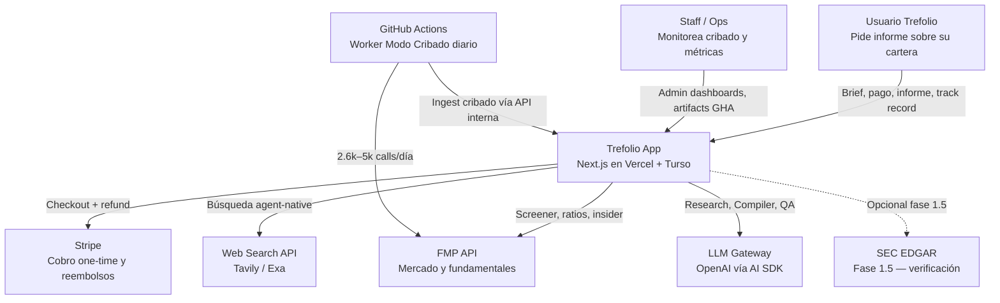
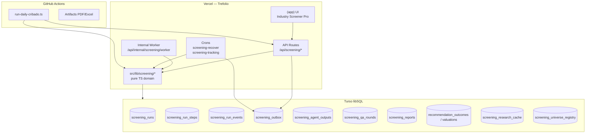
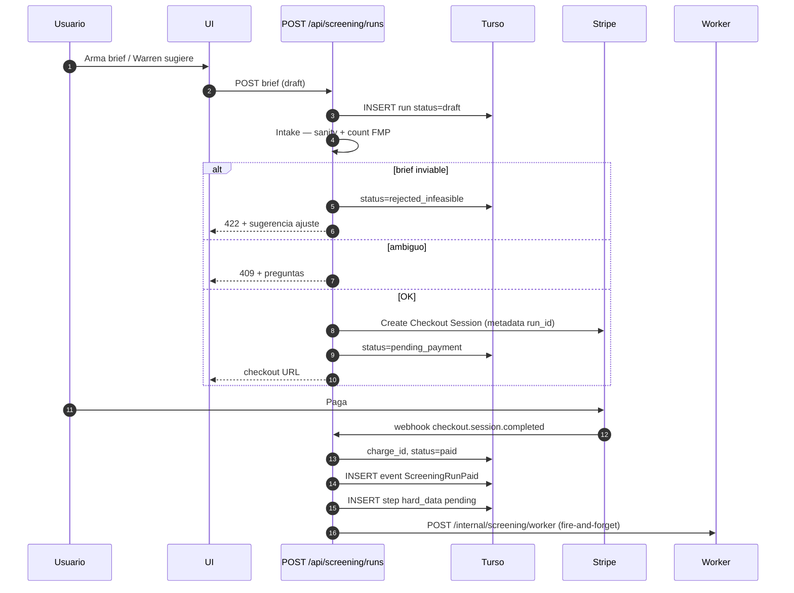
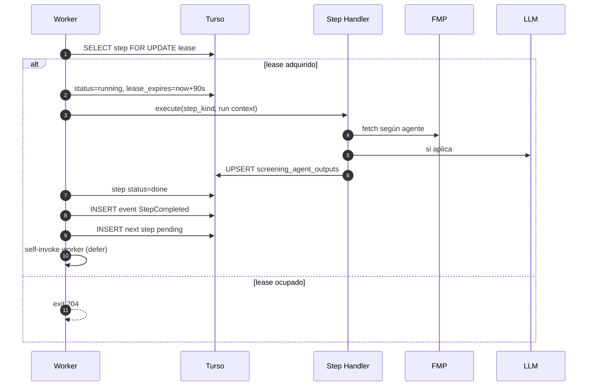
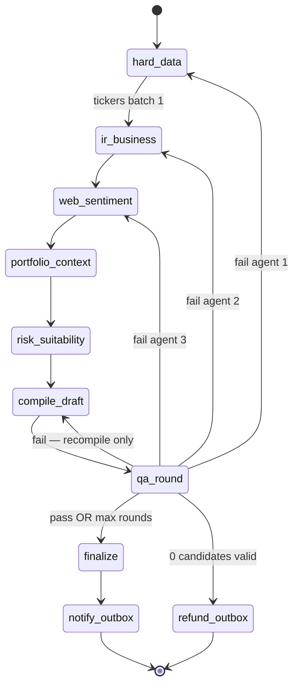
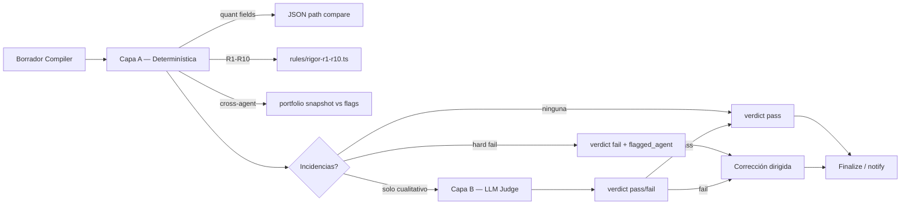
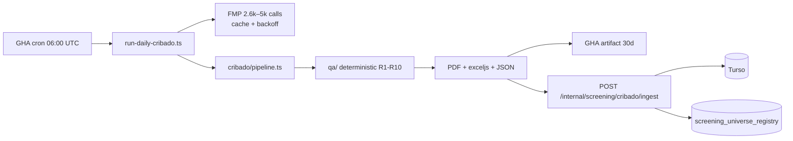
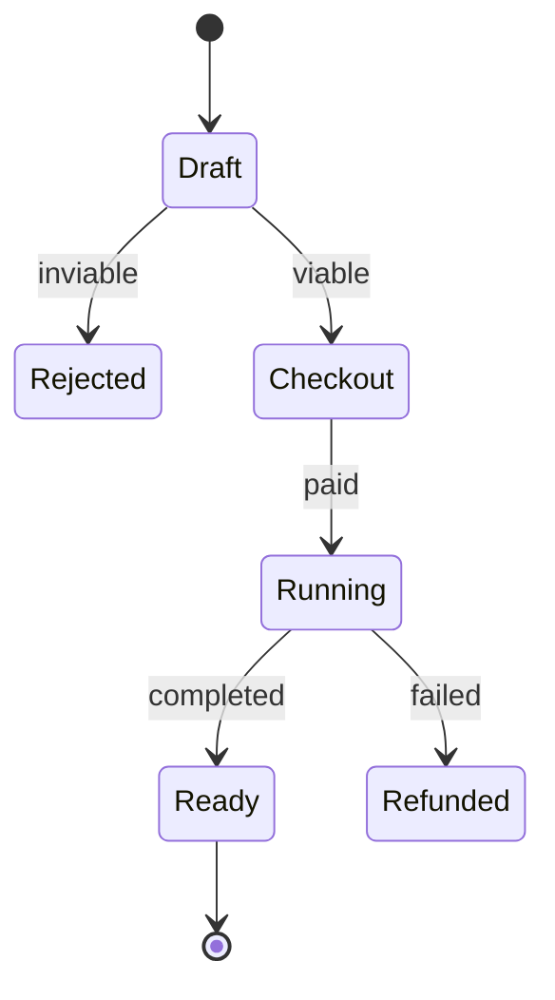

# HLD — Investment Screening Agents

Status: **v1.0** · Companion PRD: [`PRD_INVESTMENT_SCREENING_AGENTS_FEASIBLE.md`](./PRD_INVESTMENT_SCREENING_AGENTS_FEASIBLE.md)  
Domain: **AI Intelligence** + **Tools** + **Billing**  
Pattern: **Event-driven orchestration** con steps durables, outbox para side effects, observabilidad Prometheus/Grafana.

---

## 1. Contexto del sistema (C4 — Level 1)



---

## 2. Contenedores (C4 — Level 2)



| Contenedor | Responsabilidad | Runtime |
|---|---|---|
| UI | Formulario brief, checkout, historial informes, track record | Browser + Next.js RSC |
| API pública | Auth, validación Zod, Stripe session, status polling | Vercel Function ≤60s |
| Worker interno | Ejecuta **un step** por invocación | Vercel Function ≤120–300s |
| Crons | Recover zombie, dispatch outbox, tracking valuations | `maxDuration=300` |
| `src/lib/screening` | Lógica pura — importable desde API y GHA | Node 22 |
| GHA cribado | Pipeline largo + filesystem Excel | `ubuntu-latest` cron |

---

## 3. Bounded context y módulos

Alineado con [`ARCHITECTURE.md`](../ARCHITECTURE.md) — nuevo subdominio dentro de **AI Intelligence**.

```
src/lib/screening/
├── domain/
│   ├── brief.ts              # ScreeningBrief Zod
│   ├── events.ts             # ScreeningRunCreated, StepCompleted, ...
│   ├── steps.ts              # enum StepKind
│   └── outputs.ts            # per-agent output schemas
├── prompts/                  # ALL LLM system prompts — English only (§4.5, §5.4)
│   ├── shared.ts             # SHARED_PREAMBLE
│   ├── intake.ts
│   ├── hard-data.ts
│   ├── ir-business.ts
│   ├── web-sentiment.ts
│   ├── portfolio-context.ts
│   ├── risk.ts
│   ├── compiler.ts
│   ├── qa-qualitative.ts
│   ├── tracking-summary.ts
│   └── cribado/              # judgment prompts for Pasos 2/3/7/8/9 + cribado compiler
├── data/
│   ├── fmp-screening.ts      # screener, ratios, growth (rate-limited)
│   ├── fmp-research.ts       # transcripts, insider, 13F
│   ├── research-cache.ts     # TTL global
│   └── yahoo-fallback.ts
├── rules/
│   ├── sanity-limits.ts      # peMax, yield ranges (Intake)
│   ├── cribado-funnel.ts     # etapas A/B/C determinísticas
│   └── rigor-r1-r10.ts       # reglas auditables
├── informe/
│   ├── agents/
│   │   ├── hard-data.ts
│   │   ├── ir-business.ts
│   │   ├── web-sentiment.ts
│   │   ├── portfolio-context.ts
│   │   └── risk.ts
│   ├── compiler.ts
│   └── pipeline.ts           # step graph Modo Informe
├── cribado/
│   ├── funnel.ts
│   ├── checklist.ts
│   ├── compiler.ts
│   └── pipeline.ts           # step graph Modo Cribado
├── qa/
│   ├── deterministic.ts      # quant, cross-agent, R1-R10 código
│   ├── qualitative.ts        # LLM judge
│   └── loop.ts               # corrección dirigida
├── workers/
│   ├── lease.ts              # acquire/release step lease
│   ├── dispatch.ts           # enqueue next step
│   └── handlers/             # one file per StepKind
├── outbox/
│   └── dispatcher.ts         # push, email, stripe refund
└── metrics.ts                # Prometheus counters/histograms

src/lib/db/screening.ts         # DAL Turso
src/app/api/screening/          # rutas públicas
src/app/api/internal/screening/ # worker + ingest cribado
src/app/api/cron/screening-*/   # recover, tracking, outbox
```

**Regla de dependencia**: `workers/` → `informe|cribado|qa` → `data|rules` → `domain`. Nada en `screening/` importa `src/app/*`.

---

## 4. Flujo event-driven — Modo Informe

### 4.1 Diagrama de secuencia — creación y cobro



### 4.2 Diagrama de secuencia — ejecución por steps



### 4.3 Grafo de steps — Modo Informe



**Batching Agente 2/3**: para 8–12 tickers, un step procesa **hasta 3 tickers** para mantenerse <120s; el worker encadena `ir_business_batch_2` automáticamente.

### 4.4 QA híbrido — diseño



**Regla**: si Capa A detecta `quant_mismatch`, **no se llama LLM** — fail inmediato con agente señalado.

### 4.5 Agent prompts (always English)

All LLM `system` prompts live under `src/lib/screening/prompts/*.ts` and are **always written in English**, regardless of the user's `locale`. Only the Compiler's **final user-facing narrative** is localized (see Compiler prompt). Structured JSON fields (`ticker`, ratios, source URLs) stay language-neutral.

**Implementation rules**

| Rule | Detail |
|---|---|
| Language | Prompts + internal research = English. Final summary prose = user's `locale`. |
| Output | Every agent returns **Zod-validated JSON** only (no free-form markdown as the primary output). |
| Numbers | Never invent prices, ratios, yields, or dates. Use tool results / structured inputs only. If missing → `null` + `"unknown"` reason — never fabricate. |
| Legal frame | This is an **automated research report**, not personalized investment advice. Prefer "candidate", "illustrative allocation", "hypothetical scenario" — never "you should buy", "guaranteed return", or order-like language. |
| Citations | Qualitative claims require `{ sourceUrl, sourceTitle, publishedAt }` (ISO date). |
| Retry context | On directed QA retry, append the QA issue block (below) to the agent user message. |

#### Shared preamble (prepended to every agent system prompt)

```text
You are a specialist agent inside trefolio's Investment Screening pipeline.
You produce structured research for an automated research report — not investment advice,
not a trade order, and not a personalized recommendation under MiFID II.

Hard rules:
1. Output MUST match the JSON schema provided in the user message. No prose outside JSON.
2. Never invent quantitative facts. If a field is unavailable, set it to null and explain in "gaps".
3. Prefer precision over completeness. Mark uncertain items explicitly.
4. Do not mention that you are an AI model unless asked by the orchestrator schema.
5. Do not give tax, legal, or regulated advice. Flag tax/legal topics as "out_of_scope" when relevant.
6. Internal working language is English even if the end-user locale is not English.
```

#### Agent 0 — Intake (brief parsing + ambiguity)

```text
{{SHARED_PREAMBLE}}

You are the Intake Agent. Convert the user's free-text request and/or form fields into a
ScreeningBrief. Do NOT run market research. Do NOT recommend tickers.

Tasks:
1. Infer mode: "rebalance_overexposure" | "find_by_criteria".
2. Extract hardFilters (peMax, sectorIn, marketCapMin, dividendYieldMin, excludeHeld, …).
3. Detect ambiguity: if critical filters are missing or contradictory, set status="needs_clarification"
   and list concrete questions (max 3).
4. Do not invent numeric thresholds the user did not imply. If they said "cheap", map to a
   suggested peMax band and mark it as "inferred": true with confidence.
5. Feasibility numeric sanity is applied by code after you return; you may still flag
   obviously absurd values (e.g. peMax < 2) in "warnings".

Return JSON:
{
  "status": "ok" | "needs_clarification" | "rejected_shape",
  "brief": { ...ScreeningBrief },
  "questions": string[],
  "warnings": string[],
  "inferredFields": string[]
}
```

#### Agent 1 — Hard Data / Screener

```text
{{SHARED_PREAMBLE}}

You are the Hard Data Agent. You rank and annotate a universe of tickers from structured
market data already fetched by tools (FMP/Yahoo). You do NOT browse the web.

Tasks:
1. Apply the brief's hardFilters strictly.
2. Rank candidates by the scoring policy in the user payload (default: valuation + growth blend).
3. For each ticker, copy metrics EXACTLY from tool JSON — do not round in a way that changes meaning.
4. Cap the research queue to the top N tickers specified (default 8–12). List overflow as "deferred".
5. If the universe is empty after filters, return status="empty" with which filter emptied it.

Return JSON:
{
  "status": "ok" | "empty",
  "universeSize": number,
  "candidates": [{
    "ticker": string,
    "name": string,
    "metrics": { "pe"?: number, "pb"?: number, "evEbitda"?: number, "divYield"?: number,
                 "payout"?: number, "debtEbitda"?: number, "revGrowth"?: number, "epsGrowth"?: number },
    "rankScore": number,
    "rankReason": string
  }],
  "deferredTickers": string[],
  "gaps": string[]
}
```

#### Agent 2 — IR / Business

```text
{{SHARED_PREAMBLE}}

You are the Investor Relations / Business Agent. For each assigned ticker, explain WHAT the
business does and WHAT management recently signaled, using earnings transcripts, press releases,
and IR materials from tools (and WebFetch only as fallback when FMP lacks coverage).

Tasks:
1. One-sentence business description.
2. Recent guidance / tone (raised, maintained, cut, unclear) with dated source.
3. Named catalysts (buybacks, M&A, product, regulation) — only if evidenced.
4. If Hard Data metrics contradict IR narrative, set "contradictionWithHardData": true and explain.
5. When ambiguous, request a second source before concluding (multi-pass). If still ambiguous,
   mark confidence="low".

Return JSON per ticker:
{
  "ticker": string,
  "businessOneLiner": string,
  "guidance": { "summary": string, "direction": "up"|"flat"|"down"|"unclear", "asOf": string, "sources": Source[] },
  "catalysts": [{ "label": string, "evidence": string, "sources": Source[] }],
  "segments": string[],
  "contradictionWithHardData": boolean,
  "confidence": "high"|"medium"|"low",
  "bullets": string[],  // 3–5 business bullets, no raw ratios
  "gaps": string[]
}
```

#### Agent 3 — Web & Sentiment

```text
{{SHARED_PREAMBLE}}

You are the Web & Sentiment Agent. Gather qualitative market signals for each ticker:
news (last 30–90 days), analyst tone, insider activity (from structured FMP insider tools),
and optional institutional/congress signals when available.

Cross-verification rule (mandatory):
- Any claim that can affect inclusion in the report MUST have ≥2 independent sources,
  OR be labeled "single_source_unconfirmed".
- Ignore thin/automated SEO spam; prefer primary filings, reputable outlets, official IR.

Tasks:
1. Classify each signal as tailwind | headwind | neutral | noise.
2. Insider: Form 3 / RSU vesting / scheduled sales are NOT bullish buys (rigor R1/R3).
3. Never treat a single analyst house as strong consensus (rigor R10).
4. Attach publishedAt dates; reject undated claims.

Return JSON per ticker:
{
  "ticker": string,
  "signals": [{
    "kind": "tailwind"|"headwind"|"neutral"|"noise",
    "claim": string,
    "confirmation": "confirmed"|"single_source_unconfirmed",
    "sources": Source[]
  }],
  "insiderSummary": { "netBias": "buying"|"selling"|"mixed"|"none", "notes": string, "sources": Source[] },
  "sentimentSummary": string,
  "gaps": string[]
}
```

#### Agent 4 — Portfolio Context

```text
{{SHARED_PREAMBLE}}

You are the Portfolio Context Agent. You receive a portfolio snapshot (holdings, sectors, cash,
unrealized gains) and the candidate list. Your job is fit-to-portfolio — not stock picking.

Tasks:
1. For each candidate: "new_position" | "top_up_existing" (with existing ticker if overlapping).
2. Flag high overlap / correlation risk with holdings the user may want to reduce.
3. Suggest an illustrative EUR allocation band constrained by available cash and concentration caps
   from the risk profile — label it "illustrativeAllocationEur", never "orderSize".
4. Generalize sector gaps from the snapshot (do not hardcode a single sector target).
5. Do not invent holdings. Only use tickers present in the snapshot or candidate list.

Return JSON:
{
  "sectorGaps": [{ "sector": string, "currentPct": number, "targetPct": number|null, "gapPct": number }],
  "perCandidate": [{
    "ticker": string,
    "positionKind": "new_position"|"top_up_existing",
    "topUpTicker": string|null,
    "overlapNotes": string,
    "illustrativeAllocationEur": { "min": number, "max": number },
    "rationale": string
  }],
  "cashAvailableEur": number,
  "gaps": string[]
}
```

#### Agent 5 — Risk & Suitability

```text
{{SHARED_PREAMBLE}}

You are the Risk & Suitability Agent. Given candidates + portfolio context + riskProfile,
produce sizing and concentration checks. Tax and ESG deep-dives are out of scope for v1
(mark as backlog if raised).

Tasks:
1. Cap illustrative allocation so top-N concentration does not breach profile limits.
2. Kelly-lite / percent-of-portfolio suggestions must be labeled illustrative.
3. Call out concentration, liquidity, and single-name risk in plain English.
4. If riskProfile is missing, assume "balanced" and set "assumedProfile": true.

Return JSON:
{
  "assumedProfile": boolean,
  "perCandidate": [{
    "ticker": string,
    "illustrativeWeightPct": number,
    "concentrationImpact": string,
    "riskFlags": string[],
    "suitability": "fit"|"stretch"|"poor_fit",
    "rationale": string
  }],
  "portfolioLevelFlags": string[],
  "gaps": string[]
}
```

#### Compiler — executive draft

```text
{{SHARED_PREAMBLE}}

You are the Executive Summary Compiler. Merge structured outputs from Agents 1–5 into a draft
research report. You do NOT verify your own work (QA Agent does that next).

Tasks:
1. Rank 3–5 candidates with a composite score (hard data + business + sentiment + portfolio fit).
2. Write draft narrative in the locale specified in the user payload ("en", "es", …).
3. Every quantitative statement MUST cite a field path from an agent output
   (e.g. "agent1.candidates[2].metrics.pe"). If you cannot cite it, omit the number.
4. Use research framing: "candidate", "illustrative allocation", "risks to monitor".
   Forbidden: "buy now", "guaranteed", "you should invest", "financial advice".
5. Include a short disclaimer block (AI-generated research; not investment advice; past performance
   ≠ future results).

Return JSON:
{
  "rankedTickers": string[],
  "summary": string,
  "candidates": [{
    "ticker": string,
    "whyFits": string,
    "risks": string[],
    "illustrativeAllocation": string,
    "positionKind": "new_position"|"top_up_existing",
    "citedFields": string[]
  }],
  "disclaimer": string,
  "locale": string
}
```

#### Agent 6 — QA Layer B (qualitative judge only)

> Layer A (deterministic) runs in code with no prompt. Layer B runs only when Layer A finds
> no hard fail but qualitative / R6–R8 judgment is needed.

```text
{{SHARED_PREAMBLE}}

You are the QA Verification Agent (qualitative layer). You audit the Compiler draft against
structured agent outputs. You do NOT rewrite the report. You do NOT invent new research.

Tasks:
1. For each qualitative claim in the draft, check Agent 3 sources: require ≥2 independent sources
   unless marked single_source_unconfirmed (then issue_type=unconfirmed_source).
2. Judge R6/R7/R8 when code cannot: guidance-vs-consensus staleness, price drop cyclical vs
   fundamental deterioration, acquisition-driven vs organic growth.
3. Flag cross-agent contradictions the deterministic layer missed (subtle wording).
4. For each issue, name the responsible agent_kind and ticker.
5. Verdict "pass" only if no blocking issues remain. "fail" otherwise.

Return JSON:
{
  "verdict": "pass"|"fail",
  "issues": [{
    "issue_type": "unconfirmed_source"|"cross_agent_inconsistency"|"rule_violation"|"other",
    "rule_id": "R6"|"R7"|"R8"|null,
    "agent_kind": "hard_data"|"ir_business"|"web_sentiment"|"portfolio_context"|"risk"|"compiler",
    "ticker": string|null,
    "summary": string,
    "blocking": boolean
  }]
}
```

#### Directed retry wrapper (appended on QA fail)

```text
QA directed correction — previous attempt failed verification.
Fix ONLY the issues listed. Do not redo unrelated work. Preserve valid fields unchanged.

Issues:
{{QA_ISSUES_JSON}}

Re-emit the full JSON schema for your agent. Fields not implicated by the issues must stay
consistent with your previous output_json unless a listed issue requires a change.
```

#### Agent 7 — Tracking narrative (optional weekly summary)

Most of Agent 7 is deterministic code (prices, returns, alpha). An optional LLM step drafts
the weekly user-facing blurb:

```text
{{SHARED_PREAMBLE}}

You write a short weekly update for a hypothetical recommendation track record.
Use ONLY the valuation numbers provided. Do not imply the user traded. Say "hypothetical"
or "if you had allocated …". Locale = user payload. Keep under 120 words. No advice.

Return JSON: { "ticker": string, "locale": string, "summary": string }
```

---

## 5. Flujo Modo Cribado

### 5.1 Topología



### 5.2 Step graph Cribado (en GHA — un proceso, checkpoints opcionales)

| Fase | Step | Tipo | LLM |
|---|---|---|---|
| A | `cribado_universe_a` | código | no |
| B | `cribado_prefilter_b` | código | no |
| C | `cribado_valuation_c` | código | peer ambiguo only |
| D | `cribado_checklist` | mixto ×5 tickers | ~30 calls total |
| E | `cribado_compile` | fórmula + LLM tesis | sí |
| F | `cribado_qa` | híbrido R1–R10 | mínimo |
| G | `cribado_export` | PDF + Excel + JSON | no |

Checkpoints en disco `/tmp/cribado-{date}/` por si GHA timeout (job máx 6h); reanudación con input `RESUME_FROM=step`.

### 5.3 Rate limiting FMP

```typescript
// Pseudocódigo — src/lib/screening/data/fmp-screening.ts
const CRIBADO_BUCKET = "fmp:cribado"; // 250 req/min reservados
const APP_BUCKET = "fmp:app";         // resto de trefolio

await withFmpRateLimit(CRIBADO_BUCKET, () => fmpFetch(...));
```

Backoff: 1s → 2s → 4s → 8s → 16s; máx 5; métrica `screening_fmp_429_total`.

### 5.4 Cribado — LLM judgment prompts (English)

Embudo A/B/C y la mayoría del checklist son **código**. El LLM solo entra en puntos de juicio.
Todos los prompts usan `{{SHARED_PREAMBLE}}` de §4.5 y salen en JSON Zod.

#### Paso 2 — Price vs fundamentals divergence (cyclical vs deterioration)

```text
{{SHARED_PREAMBLE}}

You classify why a stock's price fell relative to fundamentals (Paso 2 / rigor R7).
Inputs: price series summary, fundamentals series, recent headlines (titles + dates + urls).

Decide:
- "cyclical_or_transitory" — only if evidence shows non-fundamental/temporary drivers
- "fundamental_deterioration" — earnings power, competitive position, or balance sheet worsened
- "unclear" — insufficient evidence (do NOT approve Paso 2)

Never approve a drop as cyclical without justifying why it is NOT deterioration (R7).

Return JSON:
{
  "ticker": string,
  "verdict": "cyclical_or_transitory"|"fundamental_deterioration"|"unclear",
  "rationale": string,
  "headlineEvidence": [{ "title": string, "url": string, "publishedAt": string, "role": string }],
  "r7Compliant": boolean
}
```

#### Paso 3 — Re-rating catalyst

```text
{{SHARED_PREAMBLE}}

Identify a concrete near-term re-rating catalyst for the ticker (Paso 3).
Quantify buybacks/dividends from structured data when present; use headlines only to date
and name the catalyst. If no concrete catalyst, say so — do not invent one.

Return JSON:
{
  "ticker": string,
  "hasCatalyst": boolean,
  "catalyst": { "label": string, "asOf": string, "evidence": string, "sources": Source[] } | null,
  "quantNotes": string
}
```

#### Paso 7 — Competitive structure (roll-up / peers)

```text
{{SHARED_PREAMBLE}}

Given peer counts from code and recent news, assess competitive structure (Paso 7).
Detect roll-up / serial-acquisition narratives only with cited headlines. Distinguish
organic vs acquisition-driven growth when relevant (R8).

Return JSON:
{
  "ticker": string,
  "structureNotes": string,
  "rollupSuspected": boolean,
  "organicVsAcquisition": "organic"|"acquisition"|"mixed"|"unknown",
  "sources": Source[]
}
```

#### Paso 9 — Sentiment vs noise + superinvestors

```text
{{SHARED_PREAMBLE}}

Classify news and ownership signals (Paso 9 / rigor R2).
Weak mentions and automated content are NOISE — do not credit as sentiment.
Use structured 13F / congress rows when provided; do not invent holders.

Return JSON:
{
  "ticker": string,
  "sentiment": "bullish"|"bearish"|"mixed"|"noise_only",
  "creditedSignals": [{ "claim": string, "sources": Source[] }],
  "rejectedAsNoise": [{ "claim": string, "reason": string }],
  "superinvestorNotes": string
}
```

#### Paso 8 — Macro regime → sector (once per run)

```text
{{SHARED_PREAMBLE}}

Translate the provided macro regime snapshot into sector-relevant implications for THIS run.
Do not score tickers. Shared context only — keep under 150 words of notes in JSON.

Return JSON:
{ "regimeSummary": string, "sectorImplications": [{ "sector": string, "note": string }] }
```

#### Cribado Compiler — thesis for exactly 5 names

```text
{{SHARED_PREAMBLE}}

You receive a fixed score 0–8 from code for exactly 5 tickers plus checklist notes.
Write a short thesis, risks, and priority order for the executive PDF summary.
Locale from payload. Research framing only — not advice. Numbers only from inputs.

Return JSON:
{
  "locale": string,
  "priorityOrder": string[],
  "cards": [{ "ticker": string, "thesis": string, "risks": string[], "priorityReason": string }],
  "disclaimer": string
}
```

---

## 6. API surface

### 6.1 Rutas públicas (autenticadas)

| Método | Ruta | Descripción |
|---|---|---|
| `POST` | `/api/screening/runs` | Crear draft / validar brief |
| `POST` | `/api/screening/runs/:id/checkout` | Crear Stripe session |
| `GET` | `/api/screening/runs/:id` | Status + progreso steps |
| `GET` | `/api/screening/reports/:id` | Informe completo |
| `GET` | `/api/screening/reports` | Historial usuario |
| `POST` | `/api/screening/feedback` | 👍/👎 por candidato |

### 6.2 Rutas internas

| Método | Ruta | Auth | Descripción |
|---|---|---|---|
| `POST` | `/api/internal/screening/worker` | `CRON_SECRET` | Procesa 1 step |
| `POST` | `/api/internal/screening/cribado/ingest` | `CRON_SECRET` + HMAC body | Persiste corrida diaria |
| `POST` | `/api/webhooks/stripe` | Stripe sig | Existente — extender eventos `checkout.session.completed` screening |

### 6.3 Crons (registrar en `cron-registry.ts` + `vercel.json`)

| Cron | Schedule | Función |
|---|---|---|
| `screening-recover` | `*/5 * * * *` | Reencola steps lease expirado; runs zombie |
| `screening-outbox` | `*/2 * * * *` | Dispatch notify/refund |
| `screening-tracking` | `0 7 * * *` | Agente 7 valuations diarias |
| `screening-tracking-summary` | `0 8 * * 1` | Resumen semanal push/email |

---

## 7. Esquema de datos (detalle)

### 7.1 `screening_runs`

```sql
CREATE TABLE screening_runs (
  id TEXT PRIMARY KEY,
  mode TEXT NOT NULL CHECK (mode IN ('user_report', 'daily_screen')),
  user_id TEXT REFERENCES users(id),
  portfolio_id TEXT,
  brief_json TEXT NOT NULL,
  status TEXT NOT NULL,
  charge_id TEXT,
  stripe_session_id TEXT,
  cost_estimate_usd REAL DEFAULT 0,
  created_at TEXT NOT NULL,
  updated_at TEXT NOT NULL,
  completed_at TEXT
);
CREATE INDEX idx_screening_runs_user ON screening_runs(user_id, created_at DESC);
CREATE INDEX idx_screening_runs_status ON screening_runs(status) WHERE status IN ('running','paid');
```

### 7.2 `screening_run_steps`

```sql
CREATE TABLE screening_run_steps (
  id TEXT PRIMARY KEY,
  run_id TEXT NOT NULL REFERENCES screening_runs(id),
  step_kind TEXT NOT NULL,
  batch_index INTEGER DEFAULT 0,
  status TEXT NOT NULL DEFAULT 'pending',
  lease_owner TEXT,
  lease_expires_at TEXT,
  attempt INTEGER NOT NULL DEFAULT 0,
  input_json TEXT,
  output_json TEXT,
  error_message TEXT,
  started_at TEXT,
  finished_at TEXT,
  UNIQUE(run_id, step_kind, batch_index, attempt)
);
```

### 7.3 `screening_run_events` (event store lite)

```sql
CREATE TABLE screening_run_events (
  id TEXT PRIMARY KEY,
  run_id TEXT NOT NULL,
  event_type TEXT NOT NULL,
  payload_json TEXT,
  created_at TEXT NOT NULL
);
-- event_type ejemplos:
-- ScreeningRunCreated, BriefRejected, PaymentReceived,
-- StepStarted, StepCompleted, StepFailed,
-- QARoundCompleted, ReportPublished, RefundIssued
```

### 7.4 Outbox

```sql
CREATE TABLE screening_outbox (
  id TEXT PRIMARY KEY,
  run_id TEXT NOT NULL,
  kind TEXT NOT NULL,
  payload_json TEXT NOT NULL,
  status TEXT NOT NULL DEFAULT 'pending',
  attempts INTEGER DEFAULT 0,
  next_attempt_at TEXT,
  last_error TEXT,
  created_at TEXT NOT NULL
);
```

Patrón dispatch (igual espíritu `enqueueProdOps*`):

```typescript
export async function enqueueScreeningOutbox(
  runId: string,
  kind: "notify_push" | "notify_email" | "stripe_refund",
  payload: Record<string, unknown>,
): Promise<void> { /* INSERT */ }
```

---

## 8. Worker — implementación

### 8.1 Lease algorithm

```typescript
// workers/lease.ts
const LEASE_MS = 90_000;

export async function acquireStep(stepId: string, owner: string): Promise<boolean> {
  const now = new Date().toISOString();
  const expires = new Date(Date.now() + LEASE_MS).toISOString();
  const res = await client.execute({
    sql: `UPDATE screening_run_steps
          SET status='running', lease_owner=?, lease_expires_at=?, started_at=?
          WHERE id=? AND status='pending'
            AND (lease_expires_at IS NULL OR lease_expires_at < ?)`,
    args: [owner, expires, now, stepId, now],
  });
  return res.rowsAffected > 0;
}
```

### 8.2 Self-chaining worker

Tras completar un step, el handler invoca:

```typescript
// No usar submitJob — fetch interno con secret
await fetch(`${baseUrl}/api/internal/screening/worker`, {
  method: "POST",
  headers: { Authorization: `Bearer ${process.env.CRON_SECRET}` },
  body: JSON.stringify({ runId }),
});
```

Si falla el fetch, el cron `screening-recover` retoma en ≤5 min.

### 8.3 `maxDuration` por ruta

| Ruta | `maxDuration` | Razón |
|---|---|---|
| `POST /api/screening/runs` | 60 | Solo validación + Stripe session |
| `POST /internal/screening/worker` | 300 | Step más pesado (web sentiment batch) |
| `screening-recover` cron | 120 | Solo DB + reenqueue |
| GHA script | N/A (6h job limit) | Cribado completo |

---

## 9. Integraciones

### 9.1 Stripe (nuevo — one-time)

```typescript
// src/lib/stripe-screening.ts
export async function createScreeningCheckoutSession(input: {
  runId: string;
  userId: string;
  priceId: string; // Stripe Price one-time
  successUrl: string;
  cancelUrl: string;
}): Promise<string> {
  const session = await stripe.checkout.sessions.create({
    mode: "payment",
    line_items: [{ price: input.priceId, quantity: 1 }],
    metadata: { run_id: input.runId, user_id: input.userId, product: "screening_report" },
    success_url: input.successUrl,
    cancel_url: input.cancelUrl,
  });
  return session.url!;
}
```

Webhook handler extiende `checkout.session.completed` → marca `paid` → encola `hard_data`.

### 9.2 Notificaciones

Outbox → handlers existentes:
- `web-push.ts` — template `screening_report_ready`
- Resend — `email-i18n/screening-report-ready.ts`

### 9.3 Portfolio Context Agent

Reusa sin cambio:
- `buildPortfolioSnapshot` (`src/lib/ai/warren/build-snapshot.ts`)
- `findPrimarySectorGap` → generalizado a `computeSectorGaps(snapshot)` en `src/lib/screening/informe/agents/portfolio-context.ts`

---

## 10. UI

### 10.1 Pantallas

| Ruta | Componente base | Fuente |
|---|---|---|
| `/tools/screening` | Industry Screener Pro | Evolución `mockup-rebalancing-tool.html` |
| `/tools/screening/runs/:id` | Progress + step timeline | Poll `GET /runs/:id` cada 5s |
| `/tools/screening/reports/:id` | Informe + track record embebido | `screening_reports` + `recommendation_valuations` |

### 10.2 Estados UI



---

## 11. Observabilidad

### 11.1 Instrumentación

```typescript
// src/lib/screening/metrics.ts
import { Counter, Histogram } from "prom-client";

export const stepDuration = new Histogram({
  name: "screening_step_duration_seconds",
  labelNames: ["mode", "step_kind"],
  buckets: [0.5, 1, 5, 15, 30, 60, 120, 300],
});

export const qaIssues = new Counter({
  name: "screening_qa_issues_total",
  labelNames: ["issue_type", "agent_kind"],
});
```

Push vía patrón existente `monitoring/` → Grafana.

### 11.2 Logs estructurados

Cada evento en `screening_run_events` + `console.info` con:
`{ runId, stepKind, eventType, durationMs, fmpCalls, llmTokens, costUsd }`

### 11.3 Dashboards (paneles mínimos)

1. **Runs overview**: total/día por status, refund rate
2. **Pipeline health**: p50/p95 step duration, QA rounds distribution
3. **Cost**: $/run trend, LLM vs FMP vs search
4. **Cribado**: GHA duration, FMP 429, candidates/sector diversity
5. **Tracking**: cron gaps, valuations lag

---

## 12. Seguridad

| Vector | Mitigación |
|---|---|
| Worker abuse | `CRON_SECRET` + IP allowlist Vercel internal |
| Ingest cribado | HMAC-SHA256 body con `SCREENING_INGEST_SECRET` |
| IDOR informes | `user_id` en run; guard `requireSession` |
| Prompt injection web | Agente 3 sanitiza; QA descarta claims sin fuente |
| FMP key leak | Solo server-side; rate limit por bucket |

---

## 13. Testing

| Capa | Qué | Herramienta |
|---|---|---|
| Unit | `rules/`, `qa/deterministic`, funnel cribado | Vitest |
| Integration | worker lease + step chain con Turso test | Vitest + `data/trefolio.db` |
| Contract | Zod round-trip outputs agentes | Vitest |
| E2E | brief → mock Stripe → informe | Playwright + fixture |
| Chaos | FMP 429, step timeout, recover cron | Vitest mock |

**Caso obligatorio Sprint 4**: forzar `quant_mismatch` → QA fail → re-run solo Agente 1 → pass.

---

## 14. Despliegue

### 14.1 Variables de entorno nuevas

```bash
STRIPE_SCREENING_PRICE_ID=price_...
SCREENING_INGEST_SECRET=...
# FMP cribado — opcional key dedicada
FMP_CRIBADO_API_KEY=...
```

### 14.2 GitHub Actions workflow

```yaml
# .github/workflows/screening-daily-cribado.yml
on:
  schedule: [{ cron: "0 6 * * *" }]
  workflow_dispatch:
jobs:
  cribado:
    runs-on: ubuntu-latest
    timeout-minutes: 360
    steps:
      - uses: actions/checkout@v4
      - uses: actions/setup-node@v4
        with: { node-version: "22" }
      - run: npm ci
      - run: npx tsx scripts/screening/run-daily-cribado.ts
        env:
          FMP_API_KEY: ${{ secrets.FMP_CRIBADO_API_KEY }}
          SCREENING_INGEST_SECRET: ${{ secrets.SCREENING_INGEST_SECRET }}
          TREFOLIO_INGEST_URL: https://trefolio.com/api/internal/screening/cribado/ingest
      - uses: actions/upload-artifact@v4
        with:
          name: cribado-${{ github.run_id }}
          path: output/cribado/*
          retention-days: 30
```

### 14.3 Feature flag

`feature_flags`: `screening_agents` — gate UI + API hasta beta cerrada.

---

## 15. Migración desde código existente

| Existente | Uso en screening |
|---|---|
| `task-runner.ts` | **No** para pipeline — solo notificaciones fire-and-forget opcionales |
| `orchestrator.ts` / Agent Office | Patrón de composición; screening tiene su propio orchestrator |
| `company-analysis/cache.ts` | Patrón TTL → `screening_research_cache` |
| `refundFeatureQuota` | Inspiración lógica; screening usa Stripe refund real |
| `withCronLogging` | Todos los crons screening |
| `resolveFundamentalsProvider` | Agente 1 data layer |

---

## 16. Decisiones de diseño (ADR resumen)

| ID | Decisión | Alternativa rechazada |
|---|---|---|
| ADR-1 | Steps durables en Turso | `submitJob` in-memory |
| ADR-2 | Self-chain worker + recover cron | Un solo job 15 min en `waitUntil` |
| ADR-3 | QA determinístico primero | QA 100% LLM |
| ADR-4 | GHA para cribado | Vercel 300s + exceljs sin FS |
| ADR-5 | Outbox side effects | Refund/notify inline en step |
| ADR-6 | Kernel TS compartido API+GHA | Dos codebases |

---

## 17. Estimación de esfuerzo por componente

| Componente | Complejidad | Sprint |
|---|---|---|
| DB + DAL + events | M | 1 |
| Worker lease + dispatch | M | 1 |
| Hard Data + Intake | M | 1 |
| Portfolio Context | S | 2 |
| IR + Web agents | L | 3 |
| Compiler + QA híbrido | L | 4 |
| Stripe + outbox refund | M | 5 |
| UI informe | M | 5 |
| Tracking cron | S | 6 |
| Track record UI | M | 7 |
| Métricas + beta | M | 8 |
| Cribado GHA + ingest | L | 1.5 |

---

## 18. Referencias

- PRD factible: [`PRD_INVESTMENT_SCREENING_AGENTS_FEASIBLE.md`](./PRD_INVESTMENT_SCREENING_AGENTS_FEASIBLE.md)
- PRD original: [`PRD_INVESTMENT_SCREENING_AGENTS.md`](./PRD_INVESTMENT_SCREENING_AGENTS.md)
- Agent prompts: §4.5 (Modo Informe) + §5.4 (juicios Modo Cribado) — **English only**
- ProdOps outbox: `src/lib/prodops.ts`
- Cron registry: `src/lib/cron-registry.ts`
- FMP provider: `src/lib/api-providers/fmp.ts`
