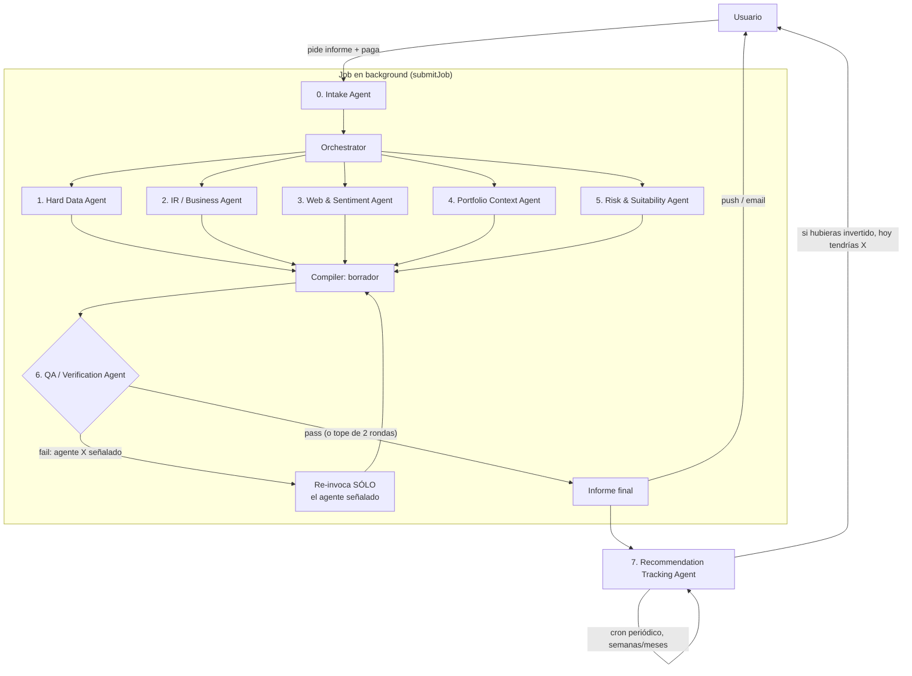

# PRD — Investment Screening & Recommendation Agents (pay-per-generation)

Owner: TBD · Status: Draft v0.5 · Target: Warren Pro / Trefolio Plus

**Cambios v0.2**: el modelo de negocio pasa de "cuota mensual" a **pago por
generación** — cada informe es una compra individual. Esto invierte la
prioridad de diseño: la latencia deja de ser una restricción y la
**exhaustividad** pasa a ser el requisito central. Se agrega un agente de
seguimiento de recomendaciones que sigue cada candidato en el tiempo —haya
invertido el usuario o no— para poder decir "si hubieras invertido acá, hoy
tendrías X".

**Cambios v0.3**: se formaliza el paso de verificación como un **agente
propio con loop de corrección dirigida** (§3.7) — si encuentra un error,
sólo se re-invoca el agente responsable, no todo el pipeline, y se vuelve a
verificar hasta que pasa o se llega a un tope de rondas. Esto corre el
número del agente de seguimiento (antes "Agente 6") a **Agente 7** (§3.8).
Se agrega además §8, una descripción de las tecnologías con las que se
implementa cada pieza, y una sección de **métricas de calidad del
informe** (rondas de QA, tasa de alucinación de datos, etc.) separada de
las métricas de negocio.

**Cambios v0.4**: el Intake Agent suma un **chequeo de viabilidad** antes
de cobrar (§3.0) — un brief puede estar bien formado y aun así no poder
devolver resultados (ej. `peMax: 1`, un P/E casi inalcanzable en el
mercado real). Se valida con límites de sensatez por campo más un conteo
rápido contra el universo real, y si da 0 el brief se rechaza **sin
cobrar**, en vez de dejar que corra un pipeline completo para terminar en
reembolso.

**Cambios v0.5**: se agrega §9, un relevamiento de qué integraciones de
datos subirían más la calidad del informe por menos esfuerzo — no es
alcance de v1, es roadmap priorizado. El hallazgo principal: buena parte
del salto de calidad no requiere un proveedor nuevo — el plan de FMP ya
incluido en Trefolio trae 13F institucional, trading de congresistas,
ESG ratings y estimados de analistas que el diseño actual todavía no usa.
La integración nueva de mayor impacto es **SEC EDGAR** (oficial, gratis):
le da al QA Agent (§3.7) una tercera fuente independiente contra la cual
verificar, más fuerte que la que ya usa, porque es el filing regulatorio
original, no un dato ya parseado por un proveedor.

## 1. Problema y caso de uso

El usuario tiene una cartera con sobre-exposición a un sector (o quiere buscar
empresas que cumplan cierta condición: "P/E bajo con moat", "dividendo >4% y
payout sano", "small cap value en healthcare", etc.) y quiere una
recomendación accionable para rebalancear — no solo un screener de números,
sino un informe con contexto de negocio, catalizadores y cómo encaja con lo
que ya tiene en cartera.

Hoy `analyze-gaps.ts` sólo detecta un gap fijo (infra/utilities vs 8%
target) y el screener de moat (`moat-screener-intent.ts`) filtra por P/E y
score contra una caché. El mockup `mockup-rebalancing-tool.html` (sección
"Industry Screener Pro") ya anticipa la UI de este feature pero corre sobre
datos estáticos de ejemplo. Este PRD define el backend real: un pipeline
multi-agente que sustituye ese mock por datos vivos y research real.

Es una **feature de pago por generación**: el usuario paga cada vez que pide
un informe (no una cuota mensual incluida en el plan). Eso cambia el
contrato implícito con el usuario — no está comprando velocidad, está
comprando un análisis exhaustivo que le tomaría horas hacer a mano. Un run
que tarda 6 minutos porque cruzó 30 tickers contra 3 fuentes cada uno, y se
tomó el trabajo de verificarse y corregirse a sí mismo antes de entregar,
vale más que uno que tarda 20 segundos y cortó camino.

## 2. Objetivo

Dado un trigger del usuario (manual, "screening" tab, o detectado por Warren
en conversación: "estoy muy expuesto a tech"), producir — a cambio de un
pago — un **informe ejecutivo exhaustivo y verificado** con 3–5 candidatos
accionables, cada uno con:
- Por qué encaja (dato duro + narrativa de negocio + contexto de cartera)
- Riesgos / qué vigilar, con fuentes citadas
- Sizing sugerido y si es mejor "comprar nuevo" o "incrementar algo que ya
  tengo"

Y, a partir de la entrega, **seguir cada candidato en el tiempo** — se haya
invertido o no — para poder responder objetivamente "¿esta recomendación fue
buena?".

### Principio de diseño: exhaustividad > velocidad

Como el usuario paga por generación y no está esperando en un chat en vivo,
el pipeline corre **asíncrono en background** (no bloquea una request HTTP
ni compite contra un timeout de UI) y notifica cuando termina — reusa
`deferTask`/`submitJob` (`src/lib/task-runner.ts`) y el sistema de push
(`web-push.ts`) / email transaccional ya existentes. Esto habilita:
- Universo de screening más amplio en Agente 1 (no cortar a 10–20 por costo
  de tiempo de UI — cortar solo cuando ya no aporta señal).
- Múltiples rondas de research en Agentes 2/3 (cross-verificar un hecho
  contra 2+ fuentes en vez de aceptar la primera).
- Un **agente de verificación con loop de corrección** después del borrador
  del Compiler, que puede pedirle a un agente específico que rehaga su
  trabajo si encuentra un error, y volver a chequear (ver §3.7).

El límite que sí importa es el **costo en $** de cada run (tokens LLM +
llamadas FMP/WebSearch), porque tiene que quedar cubierto por el precio
cobrado — no el tiempo de reloj. Por eso el loop de verificación tiene un
tope de rondas: exhaustividad no significa loops infinitos pagados por
nadie.

### Métricas de éxito
- ≥80% de los runs generan al menos 1 candidato "accionable" (no vacío) —
  la barra sube respecto a v0.1 porque ahora no hay excusa de "no daba el
  tiempo"
- **% de recomendaciones con alpha positivo vs. benchmark** a 90 días / 1
  año, medido por el Agente 7 de seguimiento — es la métrica de verdad del
  producto, no un proxy
- Tasa de reembolso automático (runs vacíos o degradados) — debe ser baja;
  cada reembolso es señal de una generación que no debió cobrarse
  (ver §5)
- **Tasa de rechazo por inviabilidad** (`rejected_infeasible` / total de
  briefs) — a diferencia del reembolso, esto nunca llegó a cobrarse; una
  tasa alta y estable no es un problema del pipeline, es señal de que la
  UI de armado de filtros necesita mejores defaults o validación en el
  cliente (ver §3.0)
- Tasa de recompra: % de usuarios que piden un segundo informe en 90 días
- Margen por run: precio cobrado − costo real (LLM + FMP + WebSearch)

Estas son métricas de negocio/producto. La calidad del *proceso de
generación en sí* — cuánto hay que corregir, dónde alucina cada agente —
se mide aparte, ver la siguiente sección.

### Métricas de calidad del informe

Miden el pipeline, no el negocio: cuánta corrección hace falta antes de
entregar, y dónde. Son internas (dashboard de producto, §8) — el usuario
no ve estos números crudos, ve el resultado en el track record (§3.8).
Todas se calculan a partir de `screening_qa_rounds` (§4), que registra
cada ronda del QA Agent (§3.7) con el tipo de incidencia encontrada.

| Métrica | Qué mide | Cómo se calcula | Objetivo |
|---|---|---|---|
| **Rondas de QA por run** | Cuánta corrección dirigida hizo falta antes de pasar | Distribución del `round_number` final por run (0 = pasó a la primera) | Mayoría en 0–1; una cola larga en 2 es señal de escalar |
| **Tasa de alucinación de datos** | % de afirmaciones cuantitativas del borrador que NO coincidían con el campo estructurado que decían citar | incidencias `issue_type = quant_mismatch` / total de claims cuantitativos verificados por el QA Agent | &lt;5% — si es mayor, el problema está en el prompt/modelo del agente de research, no en subir el tope de rondas |
| **Tasa de fuente no confirmada** | % de afirmaciones cualitativas sin 2 fuentes independientes | incidencias `issue_type = unconfirmed_source` / total de claims cualitativos verificados | &lt;10% |
| **Tasa de inconsistencia entre agentes** | % de incidencias por contradicción entre dos agentes (ej. Agente 4 dice `topUpExisting` de un ticker que no está en el snapshot) | incidencias `issue_type = cross_agent_inconsistency` / total de incidencias | Debería ser la categoría más chica — si crece, hay un problema de contrato entre agentes, no de un agente puntual |
| **Tasa de corrección por agente** | Qué agente específico falla más seguido | count(`flagged_agent_kinds` incluye X) / veces que X corrió, por agente | Identifica qué agente necesita mejor prompt, más fuentes, o cambio de modelo |
| **Tasa de degradación de candidato** | % de candidatos investigados que se cayeron del informe por no pasar el tope de rondas (§3.7) | candidatos con `recommendation_outcomes.status` nunca creado por degradación / candidatos investigados en `screening_agent_outputs` | &lt;5% — distinto del reembolso total: acá el run sí se entregó, sólo con menos candidatos |

**Cómo se usan**: no son un checkbox de calidad, son la señal para saber
*qué* mejorar y *dónde*. Si la tasa de alucinación sube consistentemente
en un agente puntual (ej. Agente 3), la respuesta es mejorar su prompt,
cambiar de proveedor de búsqueda, o subir de tier de modelo — no subir el
tope de rondas del QA Agent, que sólo trata el síntoma y sube el costo
por run (§5.1). Se revisan explícitamente en Sprint 8 al ajustar el tope
de rondas con datos reales de beta (§7, §9 pregunta 3).

### Fuera de alcance (v1)
- Ejecución de órdenes / trading automático
- Backtesting histórico general (el tracking de §3.8 es forward-looking
  desde la fecha de la recomendación, no backtesting retroactivo)
- Cobertura fuera de US/EU large & mid cap (FMP free/starter tier limita esto)
- Multi-idioma del research crudo (el resumen final sí respeta `locale`, el
  research interno puede ser en inglés)

## 3. Arquitectura

Reutiliza el patrón ya existente de **Agent Office**
(`src/lib/ai/office/orchestrator.ts` + `dispatch-step.ts`) para la
composición de agentes, pero el disparo es **asíncrono**, no una respuesta
de chat en vivo: la request de generación crea un job (`submitJob` /
`deferTask`), cobra, y corre los agentes en background sin presión de
timeout de request HTTP.



### 3.0 Intake Agent (definición del brief)

Responsable de convertir la señal del usuario (mensaje libre en Warren, o
formulario en la UI del screener) en un **brief estructurado**:

```ts
interface ScreeningBrief {
  trigger: "manual" | "warren_detected" | "sector_gap_alert";
  mode: "rebalance_overexposure" | "find_by_criteria";
  overexposedSector?: string;         // si mode = rebalance
  criteria?: string;                   // texto libre, ej. "dividendo >4%, payout <70%"
  hardFilters?: {                      // extraídos del criteria por LLM + reglas existentes
    peMax?: number; sectorIn?: string[]; marketCapMin?: number;
    dividendYieldMin?: number; excludeHeld?: boolean;
  };
  riskProfile?: "conservative" | "balanced" | "growth"; // de perfil de usuario si existe
  baseCurrency: string;
  portfolioId: string;
}
```

Reutiliza `wantsMoatScreenerIntent` / `extractPeMaxFromMessage` como base de
parsing y los extiende. Si el brief es ambiguo, el Intake Agent pregunta
**antes de cobrar** — nunca se cobra un run que arrancó con un brief
adivinado a medias.

**Chequeo de viabilidad (nuevo en v0.4)**: un brief bien formado puede
seguir siendo inviable — un filtro que no va a devolver resultados. El
Intake Agent lo valida **antes de crear el cobro**, en dos capas:

1. **Límites de sensatez por campo** (instantáneo, sin llamar a ninguna
   API): rangos de referencia por filtro — ej. P/E realista ≈ 3–60x,
   dividend yield realista ≈ 0–12% — contra los que se valida cada valor
   del brief. `peMax: 1` cae fuera de cualquier rango plausible: casi
   ninguna empresa cotiza sosteniblemente a P/E 1x. Se lo señala al
   usuario de inmediato, con una sugerencia (ej. "P/E ≤1x no es
   realista, ¿quisiste decir ≤10x?").
2. **Conteo rápido contra el universo real** (una llamada barata, no el
   screening completo): usa la misma query que el Agente 1, pero pide
   sólo un conteo, no el research. Filtros individualmente razonables
   pueden combinarse en una intersección vacía (ej. un sector + rango de
   P/E + market cap que no se solapan en ningún ticker real) — el chequeo
   de rangos por campo no detecta esto solo, hace falta preguntarle al
   universo real. Si el conteo estimado es 0 (o por debajo de un mínimo,
   ver §9 pregunta abierta), el brief se marca inviable.

Si el brief no pasa este chequeo, el Intake Agent **nunca crea el
cobro** — vuelve al usuario con la razón concreta y una sugerencia de
ajuste, igual que con un brief ambiguo. Se persiste en `screening_runs`
con `status = rejected_infeasible` y `charge_id = null` (§4) — no es un
run fallido que hay que reembolsar, es uno que nunca llegó a cobrarse.

### 3.1 Agente 1 — Hard Data / Screener Agent

- **Fuentes**: FMP (screener endpoint, ratios, key metrics) vía
  `resolveFundamentalsProvider` / `resolvePremiumStockDataProvider` ya
  existentes; Yahoo Finance como fallback/cross-check de precio y quote
  (mismo patrón que `company-analysis`).
- **Input**: `hardFilters` del brief.
- **Output**: universo amplio de candidatos (sin techo artificial de 10–20 —
  screenea todo lo que cumple el filtro duro) con métricas duras (P/E, P/B,
  EV/EBITDA, yield, payout, deuda/EBITDA, crecimiento revenue/EPS, moat
  score si existe en `queryMoatCache`), rankeado para que los Agentes 2–5
  investiguen primero el top 8–12 y sigan bajando en la lista si el tiempo
  de background lo permite.
- Sigue siendo el único agente que hace *filtering* masivo — no porque
  cueste tiempo, sino porque research cualitativo (Agentes 2/3) sobre miles
  de tickers no aporta señal proporcional al costo en $.

### 3.2 Agente 2 — Investor Relations / Business Agent

- Por cada candidato investigado: busca IR page / último earnings call /
  press releases (FMP tiene transcripts + press-release endpoints; fallback
  a IR site scraping con WebFetch si FMP no cubre el ticker).
- **Multi-pasada**: cuando la primera fuente es ambigua o contradice el dato
  duro de Agente 1 (ej. guidance bajado pero revenue creciendo), hace una
  segunda pasada cruzando contra un segundo earnings call/press release
  antes de asentar la conclusión — el presupuesto de tiempo ya no es una
  razón para conformarse con la primera fuente.
- Extrae: qué hace el negocio en una frase, guidance reciente, segmentos de
  revenue, catalizadores anunciados (buybacks, M&A, nuevos productos).
- Output: 3–5 bullets de negocio por ticker, no números (esos ya los tiene
  Agente 1).

### 3.3 Agente 3 — Web & Sentiment Agent

- WebSearch sobre cada candidato: noticias últimos 30–90 días, menciones de
  analistas, insider buying/selling (FMP tiene endpoint de insider trading),
  sentimiento general.
- **Cross-verificación obligatoria**: todo claim relevante para la
  recomendación necesita 2 fuentes independientes antes de entrar al
  informe (o se marca explícitamente como "señal única, no confirmada").
- Output: señales cualitativas — "tailwind", "headwind", "insider buying
  reciente", "cobertura analista mayormente bullish/bearish" — con
  citación de fuente y fecha (para evitar alucinación y dar trazabilidad).
- Sigue siendo el agente con mayor riesgo de alucinar / traer info stale →
  el QA Agent (§3.7) descarta cualquier claim sin fuente o con una sola
  fuente no corroborada.

### 3.4 Agente 4 — Portfolio Context Agent (datos propios de Trefolio)

- Éste es el diferencial vs. cualquier screener externo: usa
  `buildPortfolioSnapshot` (ya usado por Warren) para responder:
  - ¿Ya tengo algo en este sector/condición que está barato hoy? →
    incrementar posición existente en vez de abrir una nueva.
  - Overlap / correlación con holdings actuales (evitar recomendar algo
    99% correlacionado con lo que ya se quiere reducir).
  - Cash disponible (`portfolioCashEur`) y si hay fiscalidad relevante
    (plusvalías latentes si se vende para financiar la compra).
- Generaliza `findPrimarySectorGap` (hoy hardcodeado a infra/8%) a **N
  sectores dinámicos** calculados desde el snapshot real, no una constante.
- Output: para cada candidato, flag `newPosition | topUpExisting(ticker)` +
  gap sizing sugerido en EUR.

### 3.5 Agente 5 — Risk & Suitability Agent

- Position sizing (Kelly-lite / % cartera cap), impacto en concentración
  top-N, correlación aproximada con holdings, encaja con `riskProfile`.
- Tax & Withholding y ESG/Exclusions quedan como backlog fase 2 (ver
  evaluación completa en el PRD v0.1 — sin cambios respecto a esa
  priorización).
- El disclaimer regulatorio no es un agente de research — va cableado
  directo en el Compiler.

### 3.6 Executive Summary Compiler (borrador)

1. Recibe el output tipado de los 5 agentes (`Promise.allSettled`,
   degradando con gracia si uno falla).
2. Rankea candidatos (score compuesto: fit con filtros duros + business
   quality + sentiment + fit de cartera).
3. Redacta un **borrador** del resumen ejecutivo vía LLM, citando los datos
   estructurados de los Agentes 1–5 — el Compiler ya no verifica su propio
   trabajo; ese paso ahora es un agente aparte con más independencia de
   criterio (§3.7).
4. Entrega el borrador al QA Agent.

Una vez que el borrador pasa verificación (§3.7):

5. Persiste el informe y **registra cada candidato recomendado** en
   `recommendation_outcomes` para que el Agente 7 lo siga en el tiempo
   (ver §3.8) — esto ocurre siempre, incluso si el usuario nunca vuelve a
   abrir el informe.
6. Dispara la notificación (push/email) de "tu informe está listo".

### 3.7 Agente 6 — QA / Verification Loop Agent (nuevo en v0.3)

Corre **dentro del mismo job**, después del borrador del Compiler y antes
de que exista un informe final — es un segundo agente independiente que
audita el trabajo de los Agentes 1–5, no una relectura del propio Compiler
sobre sí mismo.

- **Qué revisa**: por cada afirmación del borrador, vuelve a la fuente — no
  al texto del Compiler, al `output_json` estructurado de cada agente en
  `screening_agent_outputs`:
  - Afirmación cuantitativa → ¿coincide exactamente con el campo del
    Agente 1/4 que dice citar? Nada de redondeos que cambien el sentido,
    nada de números que no estén en ningún output estructurado.
  - Afirmación cualitativa → ¿tiene ≥2 fuentes independientes del Agente 3,
    con fecha dentro de la ventana de frescura?
  - Consistencia entre agentes → ej. si el Agente 4 marcó `topUpExisting`,
    ¿el ticker efectivamente aparece en el snapshot de cartera que usó?
- **Veredicto**: `pass` o `fail` con una lista de incidencias, cada una
  apuntando a **qué agente específico** la originó
  (`{agentKind, ticker, issue}`) — no "el informe tiene un error", sino
  "Agente 2 dijo yield 5.8% para XYZ; el dato estructurado del Agente 1
  dice 4.9%".
- **Corrección dirigida**: si hay `fail`, se re-invoca **únicamente el/los
  agente(s) señalados**, con el detalle de la incidencia como contexto
  adicional. Los agentes que pasaron la verificación **no se vuelven a
  correr** — sus outputs se reusan tal cual. El Compiler rehace el
  borrador combinando lo corregido con lo que ya estaba validado.
- **Loop**: el QA Agent vuelve a verificar el borrador corregido. Se repite
  hasta `pass` o hasta un **tope de 2 rondas de corrección dirigida**
  (configurable, ver §8 pregunta abierta) — el loop no es infinito: sigue
  siendo dinero real por run.
- **Si se llega al tope sin pasar**: se degrada quitando del informe el
  candidato puntual que sigue fallando (no todo el informe) — mismo
  criterio de degradación por fallo de agente ya definido en §5. Si eso
  deja el informe en 0 candidatos accionables, es un run fallido →
  reembolso automático (mismo criterio de §5).
- Corre en el mismo tier de modelo "premium" que el Compiler — necesita
  buen juicio para detectar contradicciones sutiles entre agentes, no es
  un chequeo de reglas simple de regex.

### 3.8 Agente 7 — Recommendation Tracking Agent

Este agente no corre dentro del job del informe — corre **después**, en un
cron periódico, y es el que convierte el producto de "una opinión de IA
verificada" en "un historial verificable".

- **Qué persiste el Compiler al terminar cada run** (una vez que el QA
  Agent dio `pass`): por cada candidato recomendado — ticker, fecha y
  precio al momento de la recomendación, monto sugerido de asignación, si
  era posición nueva o top-up, y un snapshot corto de la tesis. Se
  persiste **independientemente de si el usuario terminó invirtiendo o
  no**.
- **Qué hace el cron** (reusa el patrón `withCronLogging` /
  `verifyCronAuth` de los crons existentes, ej.
  `src/app/api/cron/portfolio-recommendations`): con una cadencia periódica
  (diaria para precio, semanal para el resumen que ve el usuario), para
  cada recomendación activa:
  1. Trae el precio actual (mismos providers que Agente 1).
  2. Calcula el retorno hipotético: "si hubieras puesto €X el [fecha], hoy
     tendrías €Y (+Z%)" — con o sin dividendos según corresponda.
  3. Compara contra un benchmark (ETF del sector o índice amplio) para dar
     contexto de si el pick agregó valor o solo siguió al mercado (alfa).
  4. Cruza contra las transacciones reales del usuario para detectar si
     efectivamente compró el ticker recomendado cerca de esa fecha — si sí,
     compara el retorno hipotético contra el real (mismo cálculo, dos
     escenarios); si no, el hipotético queda como el único dato, y es
     igual de válido para evaluar la calidad de la recomendación.
- **Dónde lo ve el usuario**: las recomendaciones se guardan en la base de
  datos **junto al informe que las generó** (`recommendation_outcomes` /
  `recommendation_valuations` cuelgan de `report_id`) — no es una sección
  aparte y desconectada. El usuario entra al informe guardado (desde su
  historial) y ahí mismo ve, candidato por candidato, el resultado
  actualizado: "así te hubiera ido". Un listado agregado de todos los
  informes con su resultado (el "track record" en sí) es la vista de
  conjunto sobre esos mismos datos, no una fuente distinta.
- Esto es visible **incluso si el usuario nunca invirtió** — es el
  mecanismo de confianza del producto: no depende de que el usuario haya
  seguido el consejo para poder evaluarlo.
- Este track record (agregado y anonimizado) es también material de
  marketing/onboarding — "así de bien le fue a nuestras recomendaciones en
  los últimos 12 meses" — pero eso es explícitamente fuera de alcance de
  v1 (ver §9).

## 4. Modelo de datos

- **`screening_runs`** (id, user_id, portfolio_id, brief_json, status,
  charge_id, created_at) — `charge_id` referencia el cobro (ver §5).
  `status` incluye `rejected_infeasible` (nuevo en v0.4): el chequeo de
  viabilidad del Intake Agent (§3.0) rechazó el brief antes de cobrar —
  `charge_id` queda `null`. Se persiste igual para poder medir qué tan
  seguido pasa (métrica de producto, no sólo de calidad del informe).
- **`screening_agent_outputs`** (run_id, agent_kind, status, output_json,
  latency_ms, cost_estimate) — para debuggear qué agente falló/tardó;
  `latency_ms` se guarda para observabilidad interna, no como SLA hacia el
  usuario.
- **`screening_qa_rounds`** (id, run_id, round_number, verdict
  `pass|fail`, flagged_agent_kinds json, issue_type
  `quant_mismatch|unconfirmed_source|cross_agent_inconsistency`,
  issue_summary, created_at) — nueva en v0.3: una fila por incidencia
  detectada en cada ronda del QA Agent (§3.7). `issue_type` es lo que
  hace posible calcular la tasa de alucinación de datos y las demás
  métricas de calidad del informe (§2) sin tener que parsear texto
  libre — cada incidencia ya viene clasificada por el propio QA Agent
  al emitir su veredicto.
- **`screening_reports`** (run_id, summary_json, candidates_json).
- **`recommendation_outcomes`** (id, run_id, report_id, ticker,
  recommended_at, recommended_price, suggested_alloc_eur, position_kind
  `new|topup`, thesis_snapshot, status `active|closed`) — una fila por
  candidato recomendado, se crea siempre al finalizar el run (después de
  que el QA Agent dio `pass`).
- **`recommendation_valuations`** (id, recommendation_id, as_of_date, price,
  hypothetical_value_eur, hypothetical_return_pct, benchmark_symbol,
  benchmark_return_pct, alpha_pct, user_acted boolean, actual_return_pct
  nullable) — una fila por corrida del cron de tracking por recomendación
  activa.
- Cache por ticker con TTL (reusar patrón de `company-analysis/cache.ts`)
  para que Agente 2/3 no vuelvan a golpear IR/web si el ticker ya fue
  research-eado esta semana por otro usuario — comparten caché global, no
  por-usuario (el research de negocio no es específico al usuario). Esto
  además baja el costo marginal de generaciones repetidas sobre tickers
  populares, lo cual importa para el margen por run (ver §5).

## 5. Monetización: pago por generación

- **Modelo**: cada informe es un cobro individual (Stripe PaymentIntent /
  checkout one-time — capacidad nueva, hoy `src/lib/stripe.ts` sólo
  soporta suscripciones, no cobros puntuales). Se cobra **al confirmar el
  brief**, después de que el Intake Agent resolvió ambigüedades **y**
  confirmó que el brief es viable (§3.0) — no al entregar — pero con
  reembolso automático si el run igual falla o degrada una vez en curso.
- **Reembolso automático**: si el run termina con 0 candidatos accionables,
  o si ≥2 de los 5 agentes de research fallaron, o si el QA Agent llega al
  tope de rondas sin poder validar ningún candidato, se reembolsa
  automáticamente y se notifica al usuario — extiende el patrón que ya
  existe (`refundFeatureQuota` en `company-analysis`) a un reembolso de
  dinero real en vez de cuota. Cobrar por una generación vacía o no
  verificada rompe confianza en un producto de pago-por-uso más rápido que
  en uno de cuota mensual.
- **Presupuesto de costo por run** (no de tiempo): cap de tokens LLM +
  llamadas FMP/WebSearch por run, incluyendo las rondas del QA Agent — si
  se acerca al techo, el Compiler prioriza terminar de investigar los
  candidatos con mejor score antes de seguir bajando en la lista de
  Agente 1, en vez de cortar todo de golpe.
- **Teaser gratuito**: dado que ahora no hay "sección parcial" de un run
  pago que blurear, el hook gratuito es la detección de sobre-exposición
  (ya cubierta por una versión generalizada de `findPrimarySectorGap`, sin
  research) con un CTA a "generar informe completo" — el usuario ve *que*
  hay un problema gratis, paga para ver *qué hacer* al respecto.
- El seguimiento de recomendaciones (§3.8) es parte del precio ya pagado —
  no es un cobro adicional; es lo que sostiene la percepción de valor de
  compras futuras.

### 5.1 Estimación de costo por generación

Números de referencia (no un compromiso de proveedor — el gateway de
modelo ya está abstraído en `run-turn.ts`, y el proveedor de búsqueda
queda como decisión de Sprint 0 §9). Sirven para validar que el precio por
generación tiene margen incluso en el peor caso, que es la pregunta
abierta #1. Incluye el costo del loop de verificación de §3.7.

| Componente | Costo estimado / run | Base del cálculo |
|---|---|---|
| LLM — Agentes 1–5 (research, modelo económico) | **$0.05 – $0.10** | ~134K tokens input + ~15K output a precio tipo GPT-4.1 mini ($0.40 / $1.60 por M tokens) |
| LLM — Compiler (ranking + borrador, modelo premium) | **$0.06 – $0.10** | ~35K tokens input + ~3K output a precio tipo GPT-4.1 ($2 / $8 por M tokens) |
| LLM — QA / Verification Loop Agent (1–3 rondas + reintentos dirigidos) | **$0.08 – $0.35** | Cada ronda revisa el borrador contra los outputs estructurados (~40K tokens) a precio premium (~$0.09/ronda); reintentos dirigidos sólo re-corren el agente señalado en tier económico (~$0.02–0.03 c/u) — típico 1 ronda sin fallas, hasta 3 en el peor caso |
| Web Search API (Agente 3, cross-verificación 2 fuentes + Agente 2 fallback) | **$0.15 – $0.35** | ~20–40 búsquedas por run a precio tipo Tavily ($0.008/crédito básico, $0.016 avanzado) |
| FMP (datos duros, Agentes 1 y 4) | **~$0 marginal** | Plan mensual fijo (Starter/Premium, ~$99+/mes) ya compartido con el resto de Trefolio — no es costo por-run salvo que el volumen de este feature fuerce upgrade de tier (riesgo a vigilar, no un costo directo) |
| Vercel — compute del job async (Fluid compute, Active CPU) | **$0.005 – $0.015** | $0.128/hora CPU activa + $0.0106/GB·hora memoria provisionada; el job es mayormente espera de I/O (LLM streaming, APIs externas), y Active CPU sólo cobra el cómputo real, no el tiempo de espera — el diseño async de §2 no sólo habilita exhaustividad, también mantiene este costo marginal aun con el loop de QA |
| Notificación (push / email) | **~$0** | Infra ya existente (`web-push.ts`, proveedor de email transaccional) |
| **Total estimado por generación** | **$0.35 – $0.65** (caso típico, QA pasa en la primera ronda) · hasta **~$1.20** en el peor caso (universo grande sin hits de caché, QA llega al tope de 3 rondas con reintentos) | |

**Lectura para el precio**: incluso en el peor caso (~$1.20), un precio
por generación en el rango de referencia habitual de este tipo de
producto (informe de research puntual) deja margen bruto amplio. El
componente que más pesa es LLM (research + Compiler + QA) + Search
(~90% del costo variable); el compute de Vercel es marginal. La caché de
research compartida entre usuarios (§4) baja el costo de Agentes 2/3 en
generaciones repetidas sobre tickers populares, mejorando el margen con
el tiempo sin cambiar el precio. Si la tasa de corrección del QA Agent
(§2) resulta consistentemente alta en producción, es señal de que algún
agente de research necesita mejor prompt/modelo — no de que el loop en sí
sea el problema.

**Fuentes de referencia** (pricing público, sujeto a cambio — validar en
Sprint 0 antes de fijar el precio final):
- Vercel Fluid compute / Active CPU pricing — [vercel.com/docs/functions/usage-and-pricing](https://vercel.com/docs/functions/usage-and-pricing), [vercel.com/blog/introducing-active-cpu-pricing-for-fluid-compute](https://vercel.com/blog/introducing-active-cpu-pricing-for-fluid-compute)
- Tavily API pricing — [tavily.com](https://tavily.com) (vía comparativas de pricing 2026)
- OpenAI API pricing (GPT-4.1 / GPT-4.1 mini) — [openai.com/api/pricing](https://openai.com/api/pricing) (vía comparativas de pricing 2026)
- FMP planes — [site.financialmodelingprep.com/pricing-plans](https://site.financialmodelingprep.com/pricing-plans)

## 6. Riesgos y mitigaciones

| Riesgo | Mitigación |
|---|---|
| Esto se puede leer como asesoramiento financiero regulado | Disclaimer obligatorio en cada informe (no personalizado, "no es asesoramiento de inversión"), copy revisado por legal antes de GA |
| Alucinación de datos (precios, ratios inventados) | Números SIEMPRE vienen de Agente 1/4 (tool calls estructurados); Agente 3 exige 2 fuentes por claim; el QA Agent (§3.7) audita cada afirmación contra la fuente estructurada antes de entregar, con corrección dirigida si encuentra un error |
| Loop de verificación no converge (el mismo agente sigue fallando) | Tope de 2 rondas de corrección dirigida (§3.7); si no pasa, se degrada el candidato puntual o se reembolsa si el informe queda vacío (§5) |
| Cobrar por un run vacío o de baja calidad rompe confianza | Reembolso automático si 0 candidatos, ≥2 agentes fallidos, o QA sin validar nada tras el tope (§5); nunca cobrar antes de que Intake resuelva ambigüedad |
| Usuario arma un filtro que no puede dar resultados (ej. P/E ≤1x, o una combinación de sector/P/E/market cap sin intersección real) y paga por un run que iba a salir vacío desde el inicio | Chequeo de viabilidad del Intake Agent **antes de cobrar** (§3.0): límites de sensatez por campo + conteo rápido contra el universo real; el brief se rechaza sin cargo, no se reembolsa después |
| Costo real por run no cubierto por el precio | Estimado en $0.35–$0.65 típico / ~$1.20 peor caso, incluye el loop de QA (§5.1); presupuesto duro de $ por run + caché de research compartida entre usuarios; monitoreo de margen por run como KPI (§2) |
| Datos stale (noticias/insider viejos) | TTL corto en caché de Agente 3 (días, no semanas), mostrar fecha de cada fuente en el UI |
| Cron de tracking falla silenciosamente (precios no se actualizan, recomendaciones quedan "congeladas") | Reusa `withCronLogging` (alerting ya existente en `monitoring/`); backfill si se detecta un gap de días sin valuación |
| Metodología de benchmark cuestionable (¿qué índice/ETF comparar?) | Metodología fija y documentada por sector, mostrada de forma transparente en el UI del track record — no se elige post-hoc para favorecer el resultado |
| Sobre-alcance de scope (7 agentes → mantenimiento) | v1 = 4 agentes de research + compiler + QA + tracking; Risk Agent (5) puede lanzarse en fase 1.5 si el timeline aprieta sin bloquear el resto |

## 7. Plan de sprints (2 semanas c/u, salvo Sprint 0)

### Sprint 0 — Discovery & contratos (1 semana)
- Definir `ScreeningBrief`, el shape de output de cada agente, y el shape de
  `recommendation_outcomes`/`recommendation_valuations`/`screening_qa_rounds`
  (TypeScript types + zod schemas), sin implementación aún.
- Validar con legal/compliance el copy de disclaimer y qué se puede/no se
  puede afirmar.
- Definir el punto de precio por generación y la política de reembolso
  automático con negocio/finanzas, validando la estimación de costo de
  §5.1 contra proveedores reales (LLM gateway, proveedor de búsqueda web).
- Elegir proveedor de búsqueda web para el Agente 3 (Tavily vs.
  alternativas) — cotizar volumen real esperado, no sólo precio de lista.
- Definir el tope de rondas del QA Agent y la metodología de benchmark por
  sector — deben quedar fijos antes de implementar el loop y antes de que
  exista el primer track record real.
- **Salida**: este PRD aprobado + `types.ts` de contratos + ADR sobre modelo
  de datos.

### Sprint 1 — Job asíncrono + Intake Agent + Hard Data Agent
- Tablas `screening_runs` / `screening_agent_outputs` + migración.
- Wiring del job en background (`submitJob`/`deferTask`) + notificación
  push/email al terminar — reemplaza el modelo síncrono de chat.
- Intake Agent: parsing de brief, detección de ambigüedad → pregunta antes
  de cobrar. **Chequeo de viabilidad** (§3.0): límites de sensatez por
  campo (instantáneo) + conteo rápido reusando la query del Hard Data
  Agent (sin el research completo) → `rejected_infeasible` si da 0.
- Hard Data Agent: screener FMP + fallback Yahoo sobre universo amplio
  (sin techo artificial), reusando `resolveFundamentalsProvider`.
- **Salida**: dado un brief, obtener un universo rankeado de candidatos con
  métricas duras, y rechazar en el acto un brief tipo "P/E ≤1x" antes de
  que llegue a cobro. Demo interna vía endpoint de debug (sin cobro real
  aún).

### Sprint 2 — Portfolio Context Agent + generalización de sector-gap
- Generalizar `findPrimarySectorGap` a N sectores dinámicos desde el
  snapshot real (hoy solo detecta infra) — esta versión generalizada es
  también el teaser gratuito de §5.
- Lógica `newPosition | topUpExisting` + overlap/correlación básica con
  holdings actuales.
- **Salida**: para cada candidato de Sprint 1, saber si "ya tengo algo
  parecido y barato" o si es posición nueva.

### Sprint 3 — IR/Business Agent + Web/Sentiment Agent (multi-pasada)
- Agente 2: transcripts/press releases vía FMP + fallback WebFetch,
  segunda pasada cuando hay ambigüedad o contradicción con el dato duro.
- Agente 3: WebSearch con cross-verificación de 2 fuentes por claim
  relevante, insider trading vía FMP.
- **Salida**: candidatos enriquecidos con narrativa de negocio + señales
  cualitativas citadas y cross-verificadas.

### Sprint 4 — Risk Agent + Compiler + QA Verification Loop Agent
- Agente 5: sizing sugerido, concentración, fit con `riskProfile`.
- Compiler: ranking + borrador (ya no verifica su propio trabajo).
- **QA Agent (6)**: verificación contra outputs estructurados, veredicto
  con agente señalado, corrección dirigida (re-invoca sólo ese agente),
  loop con tope de 2 rondas, degradación puntual si no converge.
- Persistencia de `screening_reports`, `screening_qa_rounds` y
  `recommendation_outcomes` por candidato.
- **Salida**: pipeline end-to-end produce un informe verificado y deja
  sembradas las recomendaciones para tracking (aún sin cobro/UI real).
  Demo interna: forzar un error deliberado en un agente y confirmar que
  el loop lo detecta, corrige sólo ese agente, y re-verifica.

### Sprint 5 — Cobro por generación + UI real (reemplaza el mockup)
- Integración de Stripe one-time payment (capacidad nueva) + reembolso
  automático en runs vacíos/degradados/no verificados.
- Conectar UI real sobre `mockup-rebalancing-tool.html` (sección "Industry
  Screener Pro") a los endpoints reales, con el flujo async (pedir →
  pagar → notificación → ver informe).
- Feedback simple 👍/👎 por candidato.
- **Salida**: feature usable end-to-end por un beta tester real, con cobro
  real y reembolso automático funcionando.

### Sprint 6 — Recommendation Tracking Agent (7) + cron
- Tablas `recommendation_valuations` + migración.
- Cron de tracking (reusa `withCronLogging`/`verifyCronAuth`): revalúa
  precio, calcula retorno hipotético, compara contra benchmark, cruza
  contra transacciones reales del usuario.
- **Salida**: cada recomendación emitida desde Sprint 4 empieza a
  acumular historial de valuaciones.

### Sprint 7 — Track record / scorecard UI
- Superficie nueva: historial de recomendaciones del usuario con estado,
  retorno hipotético vs. benchmark, si actuó o no.
- Agregados a nivel producto (hit rate, alfa promedio, tasa de corrección
  del QA Agent por agente) para uso interno (dashboard de producto) —
  exposición pública/marketing queda fuera de v1 (ver §9).
- **Salida**: el usuario puede ver, para cualquier informe pasado, "así te
  hubiera ido".

### Sprint 8 — Hardening, observabilidad, beta cerrada
- Monitoreo de costo real por run vs. precio cobrado (margen), alertas de
  Grafana/Prometheus (reusa `monitoring/` existente).
- Dashboard de métricas de calidad del informe (§2): rondas de QA por run,
  tasa de alucinación de datos, tasa de fuente no confirmada, tasa de
  corrección por agente, tasa de degradación de candidato.
- Ajustar el tope de rondas del QA Agent con datos reales de beta usando
  ese dashboard (si casi nunca hace falta una 2ª ronda, bajarlo; si un
  agente concentra la mayoría de las incidencias, priorizar arreglar su
  prompt/modelo antes que subir el tope).
- Alerting sobre el cron de tracking (gaps de valuación, fallos
  silenciosos).
- Manejo de fallos parciales del job async, reintentos.
- Beta cerrada con N usuarios reales, medir métricas de §2.
- **Salida**: go/no-go para GA basado en métricas de beta.

### Sprint 9 (buffer / GA)
- Fixes de beta, ajuste de prompts según feedback real, GA rollout
  progresivo.

## 8. Tecnologías de implementación

No se introduce un framework nuevo — el feature se implementa sobre la
misma pila que ya corre en producción para Warren, Clara y Will.

| Pieza | Tecnología | Notas |
|---|---|---|
| Runtime / app | Next.js (App Router) + TypeScript, sobre Vercel | Mismo repo, mismos API routes (`src/app/api/*`) que el resto de Trefolio |
| Orquestación de agentes | Patrón **Agent Office** (`src/lib/ai/office/orchestrator.ts`, `dispatch-step.ts`) | Se reusa la composición de agentes; el disparo pasa a ser asíncrono en vez de un turno de chat |
| Definición de agentes / tool calls | **Vercel AI SDK** (`ai`, `@ai-sdk/openai`) con `tool({ description, inputSchema: zod, execute })` | Mismo patrón que `sister-agent-tools.ts` / `warren/tools.ts` — cada agente es un tool tipado, no un prompt suelto |
| Selección de modelo por agente | Gateway de modelo abstraído (`provider.chat(gatewayModelId)` en `run-turn.ts`) | Permite tier económico para Agentes 1–5 y tier premium para Compiler/QA sin acoplar el código a un proveedor. Proveedor final (OpenAI, u otro vía el mismo gateway) es decisión de Sprint 0 |
| Validación de outputs estructurados | **Zod** | `ScreeningBrief`, el output de cada agente, y el veredicto del QA Agent son schemas Zod — es lo que hace posible que el QA Agent compare "afirmación vs. campo estructurado" en vez de comparar texto contra texto |
| Ejecución en background | `deferTask` / `submitJob` (`src/lib/task-runner.ts`) | En Vercel usa `waitUntil` (`@vercel/functions`) para mantener el job vivo después de responder al cliente; en local corre en el proceso Node de larga duración |
| Compute / hosting | **Vercel Fluid compute** (Active CPU pricing) | Ver desglose de costo en §5.1 — el mismo mecanismo que habilita "sin límite de tiempo" en §2 |
| Base de datos | **Turso (libSQL)**, vía `@libsql/client` (`src/lib/db`) | Mismo cliente y patrón `ensureInitialized()` / `client.execute({ sql, args })` que el resto de las tablas de Trefolio |
| Datos duros (mercado) | **FMP** (Financial Modeling Prep) vía `resolveFundamentalsProvider`/`resolvePremiumStockDataProvider`, con **Yahoo Finance** como fallback | Mismos providers que ya usa `company-analysis` |
| Búsqueda web (Agente 3) | API de búsqueda orientada a agentes (Tavily como referencia de costo en §5.1; alternativas en evaluación — pregunta abierta) | Necesita extracción de contenido, no sólo links — de ahí la preferencia por APIs "agent-native" sobre un SERP crudo |
| Cron / scheduling | **Vercel Cron** (`vercel.json`) + patrón `withCronLogging` / `verifyCronAuth` ya existente en `src/app/api/cron/*` | Mismo mecanismo que `portfolio-recommendations`, `screener-sync`, etc. |
| Pagos | **Stripe** (`src/lib/stripe.ts`), extendido a PaymentIntent/Checkout one-time | Hoy sólo maneja suscripciones — el cobro por generación es una capacidad nueva sobre el mismo proveedor |
| Notificaciones | **Web Push** (VAPID, `web-push.ts`) + email transaccional (**Resend**) | Mismos canales que ya usa el resto del producto |
| Observabilidad | **Prometheus + Grafana** (`monitoring/`) | Dashboards de margen por run y de métricas de calidad del informe (§2): rondas de QA, tasa de alucinación de datos, tasa de corrección por agente, gaps del cron de tracking |
| Tests | **Vitest** (unit/integration) + **Playwright** (e2e) | Mismos frameworks que el resto del repo (`vitest.config.ts`, `playwright.config.ts`) — el loop de QA en sí se testea con casos que fuerzan un error deliberado en un agente para confirmar que la corrección dirigida funciona (ver Sprint 4) |

## 9. Integraciones que elevarían la calidad (roadmap)

No son parte del alcance de v1 (§7) — es investigación de qué integraciones
suben más la calidad por menos esfuerzo, para priorizar fase 1.5/2. El
hallazgo más importante: **buena parte de esto ya está pago y sin usar**,
porque el plan de FMP que Trefolio ya tiene incluye endpoints que el
diseño actual (§3) no toca todavía.

### Nivel 0 — Ya está pago, sólo falta cablearlo (FMP)

FMP incluye 13F institucional, trading de congresistas/senadores, ESG
ratings y estimados de analistas (vía partnership con TipRanks) en el
mismo plan que ya se usa para Agentes 1 y 4. No es una integración nueva,
es dejar de dejar datos arriba de la mesa.

| Dato | Qué agrega | A quién mejora | Prioridad |
|---|---|---|---|
| **13F institucional** | Tendencia de holdings institucionales trimestre a trimestre — ¿el "smart money" está entrando o saliendo? | Agente 3 (Web & Sentiment) | Alta |
| **Analyst estimates & price targets** (TipRanks) | Consenso de precio objetivo, cantidad de analistas, revisiones recientes al alza/baja | Agente 1, Agente 7 (tracking — "el mercado re-rateó esto o no") | Alta |
| **Senate/Congress trading** | Señal alternativa difícil de fabricar — compras/ventas de legisladores con acceso a información sectorial | Agente 3 | Media |
| **ESG ratings** | Desbloquea el ESG/Exclusions Agent que hoy está en backlog fase 2 (§3.5) sin tener que licenciar MSCI/Sustainalytics — ver nota abajo | Agente 5, o un futuro agente ESG dedicado | Media — sube de prioridad respecto al PRD original |

### Nivel 1 — Integraciones nuevas, oficiales y gratis

| Fuente | Qué agrega | A quién mejora | Costo |
|---|---|---|---|
| **SEC EDGAR full-text search + XBRL** (`data.sec.gov`, oficial) | Fuente de verdad regulatoria: el **QA Agent (6) puede verificar un claim contra el 10-K/10-Q real**, no sólo contra el dato ya parseado de FMP — es una tercera fuente independiente de la misma que generó el research. Agente 2 puede citar directo de "Item 1A Risk Factors" en vez de depender de que el research lo mencione | **QA Agent (6)** — reduce la tasa de alucinación de datos de §2 en la fuente, no sólo la detecta; Agente 2 | Gratis, sin API key |
| **FRED** (Federal Reserve Economic Data, oficial) | Contexto macro (tasas, inflación, curva) para sizing — ej. "small caps con deuda variable en el entorno de tasas actual" | Agente 5 (Risk & Suitability) | Gratis |

### Nivel 2 — Alternative data paga, barata, evaluar por señal específica

| Fuente | Qué agrega | A quién mejora | Costo de referencia |
|---|---|---|---|
| **Short interest** (FINRA gratis quincenal, u Ortex pago diario) | Señal de riesgo de squeeze / posicionamiento bajista extremo antes de recomendar sizing | Agente 5 | Gratis (FINRA) o desde $39/mes (Ortex) |
| **Quiver Quant** (lobbying, contratos de gobierno, patentes — más allá de lo que ya da FMP en congress trading) | Señales únicas de más difícil acceso, pero se solapan parcialmente con lo que FMP ya cubre en Nivel 0 | Agente 3 | Desde ~$10–75/mes según tier |

### Explícitamente no recomendado para v1

**ESG enterprise (MSCI, Sustainalytics directo)**: en 2025 los proveedores
grandes discontinuaron sus bases públicas de scores y pasaron todo a
licenciamiento comercial — caro y con fricción de contrato desproporcionada
para lo que aporta sobre el ESG que ya viene incluido en FMP (Nivel 0).
Reevaluar sólo si el ESG/Exclusions Agent pasa de backlog a roadmap real
y FMP resulta insuficiente en cobertura.

**Opciones/unusual activity** (estilo Unusual Whales): señal de trading de
corto plazo, poco alineada con el caso de uso de rebalanceo de cartera de
largo plazo de este producto — no vale la complejidad/costo para v1.

### Cómo priorizar esto en la práctica

El orden natural es Nivel 0 primero (costo marginal ~$0, ya pago) →
SEC EDGAR (gratis, y el que más pega directo en la métrica de calidad que
más importa: alucinación de datos) → recién después evaluar Nivel 2 con
datos reales de qué tan seguido el research se queda corto sin esas
señales. Ninguno de estos bloquea el roadmap de v1 (§7) — son candidatos
para las fases 1.5/2 una vez que el pipeline base esté en producción.

## 10. Preguntas abiertas

1. ¿Cuál es el punto de precio por generación? La estimación de §5.1
   ($0.35–$0.65 típico, ~$1.20 peor caso) da margen amplio en casi
   cualquier precio razonable, pero falta validarla contra proveedores
   reales antes de fijar el precio.
2. ¿Qué proveedor de búsqueda web se usa para el Agente 3 (Tavily fue la
   referencia de costo en §5.1; evaluar alternativas como Exa, Serper o
   Brave Search API por precio/calidad de resultado financiero)? Afecta
   Sprint 3 y el costo real de §5.1.
3. ¿Cuál es el tope correcto de rondas de corrección dirigida del QA Agent
   (§3.7)? 2 es un punto de partida razonable — debe ajustarse con datos
   reales de beta (Sprint 8) según cuánto realmente ayuda cada ronda
   adicional vs. cuánto cuesta.
4. ¿Cuál es el mínimo de candidatos estimados para considerar viable un
   brief en el chequeo de §3.0 — 1, 3, 5? Y ¿quién define y actualiza los
   límites de sensatez por campo (P/E, yield, market cap...) a medida que
   cambian las condiciones de mercado? Afecta Sprint 1.
5. ¿El trigger "Warren detecta sobre-exposición en conversación" dispara el
   flujo de pago automáticamente o solo lo sugiere? Recomendación: sugerir
   siempre, nunca cobrar sin confirmación explícita del usuario.
6. ¿Qué canal de notificación es el principal cuando el informe está listo
   — push, email, o ambos? Afecta Sprint 1.
7. ¿Qué benchmark se usa por sector para calcular alfa en el tracking?
   Debe cerrarse en Sprint 0, antes de que exista el primer track record.
8. ¿El track record agregado/anonimizado se usa como material de
   marketing en v1, o queda estrictamente para fase 2? Afecta el alcance
   de Sprint 7.
9. ¿Cobertura de mercados fuera de US/EU large-mid cap es un requisito de
   v1 o puede quedar fuera dado el tier de FMP actual?
10. ¿Quién aprueba el copy de disclaimer legal y la política de reembolso
    antes de Sprint 5 (cobro real)?
11. ¿Alguna integración de §9 debería entrar en v1 en vez de fase 1.5,
    particularmente SEC EDGAR — es gratis y mejora directo la tasa de
    alucinación de datos, la métrica de calidad más crítica del producto?
