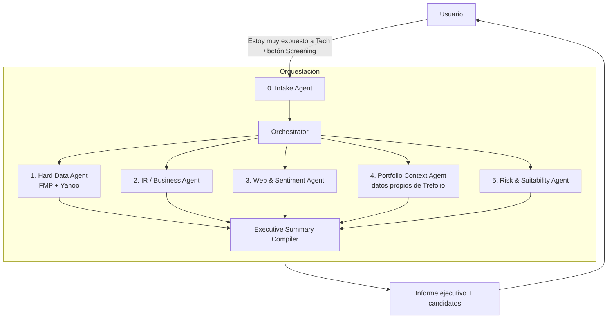

# PRD — Investment Screening & Recommendation Agents (paid feature)

Owner: TBD · Status: Draft v0.1 · Target: Warren Pro / Trefolio Plus

## 1. Problema y caso de uso

El usuario tiene una cartera con sobre-exposición a un sector (o quiere buscar
empresas que cumplan cierta condición: "P/E bajo con moat", "dividendo >4% y
payout sano", "small cap value en healthcare", etc.) y quiere una
recomendación accionable para rebalancear — no solo un screener de números,
sino un informe con contexto de negocio, catalizadores y cómo encaja con lo
que ya tiene en cartera.

Hoy `analyze-gaps.ts` sólo detecta un gap fijo (infra/utilities vs 8%
target) y el screener de moat (`moat-screener-intent.ts`) filtra por P/E y
score contra una caché. El mockup `mockup-rebalancing-tool.html` (sección
"Industry Screener Pro") ya anticipa la UI de este feature pero corre sobre
datos estáticos de ejemplo. Este PRD define el backend real: un pipeline
multi-agente que sustituye ese mock por datos vivos y research real.

Esto es una **feature de pago** (Warren Pro), gateada por
`requireFeatureQuota` igual que `company-analysis`, con teaser gratuito vía
`redactPaidSections`.

## 2. Objetivo

Dado un trigger del usuario (manual, "screening" tab, o detectado por Warren
en conversación: "estoy muy expuesto a tech"), producir un **resumen
ejecutivo** con 3–5 candidatos accionables, cada uno con:
- Por qué encaja (dato duro + narrativa de negocio + contexto de cartera)
- Riesgos / qué vigilar
- Sizing sugerido y si es mejor "comprar nuevo" o "incrementar algo que ya
  tengo"

### Métricas de éxito
- ≥60% de los runs generan al menos 1 candidato "actionable" (no vacío)
- Latencia p95 del run completo < 45s
- Tasa de conversión free→paid en el touchpoint del screener
- % de recomendaciones que el usuario marca como "útil" (feedback simple 👍/👎)
- Coste por run (LLM tokens + llamadas FMP) monitoreado y con presupuesto

### Fuera de alcance (v1)
- Ejecución de órdenes / trading automático
- Backtesting de las recomendaciones
- Cobertura fuera de US/EU large & mid cap (FMP free/starter tier limita esto)
- Multi-idioma del research crudo (el resumen final sí respeta `locale`, el
  research interno puede ser en inglés)

## 3. Arquitectura

Reutiliza el patrón ya existente de **Agent Office**
(`src/lib/ai/office/orchestrator.ts` + `dispatch-step.ts` +
`agent_missions` table) en vez de crear un framework nuevo. Este feature es
una nueva "misión" (`mission.kind = "portfolio_screening"`) con sus propios
tipos de step, corriendo research en paralelo en vez de steps secuenciales
confirmados por el usuario.



### 3.0 Intake Agent (definición del brief)

Responsable de convertir la señal del usuario (mensaje libre en Warren, o
formulario en la UI del screener) en un **brief estructurado**:

```ts
interface ScreeningBrief {
  trigger: "manual" | "warren_detected" | "sector_gap_alert";
  mode: "rebalance_overexposure" | "find_by_criteria";
  overexposedSector?: string;         // si mode = rebalance
  criteria?: string;                   // texto libre, ej. "dividendo >4%, payout <70%"
  hardFilters?: {                      // extraídos del criteria por LLM + reglas existentes
    peMax?: number; sectorIn?: string[]; marketCapMin?: number;
    dividendYieldMin?: number; excludeHeld?: boolean;
  };
  riskProfile?: "conservative" | "balanced" | "growth"; // de perfil de usuario si existe
  baseCurrency: string;
  portfolioId: string;
}
```

Reutiliza `wantsMoatScreenerIntent` / `extractPeMaxFromMessage` como base de
parsing y los extiende. Si el brief es ambiguo, el Intake Agent devuelve
preguntas de aclaración (1 turno, no una entrevista larga) antes de disparar
el resto del pipeline — evita quemar cuota en runs mal definidos.

### 3.1 Agente 1 — Hard Data / Screener Agent

- **Fuentes**: FMP (screener endpoint, ratios, key metrics) vía
  `resolveFundamentalsProvider` / `resolvePremiumStockDataProvider` ya
  existentes; Yahoo Finance como fallback/cross-check de precio y quote
  (mismo patrón que `company-analysis`).
- **Input**: `hardFilters` del brief.
- **Output**: lista de 10–20 tickers candidatos con métricas duras (P/E,
  P/B, EV/EBITDA, yield, payout, deuda/EBITDA, crecimiento revenue/EPS,
  moat score si existe en `queryMoatCache`).
- **Nota**: es el único agente que hace *filtering* masivo; los demás
  agentes operan solo sobre el short-list que este agente produce (control
  de coste — no todos hacen web search sobre 500 tickers).

### 3.2 Agente 2 — Investor Relations / Business Agent

- Por cada candidato del short-list (top 5–8 tras un primer corte de
  Agente 1): busca IR page / último earnings call / press releases (FMP
  tiene transcripts + press-release endpoints; fallback a IR site scraping
  con WebFetch si FMP no cubre el ticker).
- Extrae: qué hace el negocio en una frase, guidance reciente, segmentos de
  revenue, catalizadores anunciados (buybacks, M&A, nuevos productos).
- Output: 3–5 bullets de negocio por ticker, no números (esos ya los tiene
  Agente 1).

### 3.3 Agente 3 — Web & Sentiment Agent

- WebSearch sobre cada candidato: noticias últimos 30–90 días, menciones de
  analistas, insider buying/selling (FMP tiene endpoint de insider trading),
  sentimiento general.
- Output: señales cualitativas — "tailwind", "headwind", "insider buying
  reciente", "cobertura analista mayormente bullish/bearish" — con
  citación de fuente y fecha (para evitar alucinación y dar trazabilidad).
- Es el agente con mayor riesgo de alucinar / traer info stale → siempre
  debe citar fuente+fecha, y el Compiler descarta claims sin fuente.

### 3.4 Agente 4 — Portfolio Context Agent (datos propios de Trefolio)

- Éste es el diferencial vs. cualquier screener externo: usa
  `buildPortfolioSnapshot` (ya usado por Warren) para responder:
  - ¿Ya tengo algo en este sector/condición que está barato hoy? →
    incrementar posición existente en vez de abrir una nueva.
  - Overlap / correlación con holdings actuales (evitar recomendar algo
    99% correlacionado con lo que ya se quiere reducir).
  - Cash disponible (`portfolioCashEur`) y si hay fiscalidad relevante
    (plusvalías latentes si se vende para financiar la compra).
- Generaliza `findPrimarySectorGap` (hoy hardcodeado a infra/8%) a **N
  sectores dinámicos** calculados desde el snapshot real, no una constante.
- Output: para cada candidato, flag `newPosition | topUpExisting(ticker)` +
  gap sizing sugerido en EUR.

### 3.5 Agente 5 — Risk & Suitability Agent (recomendado, nuevo)

Agentes candidatos adicionales evaluados — se recomienda **uno** para v1 y
se deja el resto en backlog:

| Candidato | Qué hace | Prioridad |
|---|---|---|
| **Risk & Portfolio Construction** (recomendado v1) | Position sizing (Kelly-lite / % cartera cap), impacto en concentración top-N, correlación aproximada con holdings, encaja con `riskProfile` | Alta |
| Tax & Withholding Agent | Retención de dividendos por país, implicancia fiscal de vender para comprar (plusvalías), accumulating vs distributing ETF si aplica | Media — mucho valor para usuarios EU multi-país de Trefolio, pero complejo (jurisdicción por usuario) |
| ESG / Exclusions Agent | Filtra por exclusiones del usuario (armas, tabaco, controversias) | Baja — nice-to-have, depende de si hay demanda |
| Compliance / Disclaimer Agent | No es research — inyecta el disclaimer regulatorio correcto según jurisdicción del usuario, marca el output como "no es asesoramiento financiero individualizado" | **Obligatorio**, pero implementado como un paso fijo del Compiler, no como agente de research separado |

**Recomendación**: implementar Risk & Suitability como Agente 5 real (usa
sizing + correlación + risk profile). Tax/ESG quedan como fase 2 si hay
señal de usuarios pidiéndolo. El disclaimer de compliance no es un agente
de investigación — va cableado directo en el Compiler (ver §6).

### 3.6 Executive Summary Compiler

No es un "agente de research" más — es la función que:
1. Recibe el output tipado de los 5 agentes (todos corren en paralelo con
   `Promise.allSettled`, degradando con gracia si uno falla/timeoutea).
2. Rankea candidatos (score compuesto: fit con filtros duros + business
   quality + sentiment + fit de cartera).
3. Redacta el resumen ejecutivo vía LLM con un prompt que **cita** los
   datos estructurados (no deja que el LLM invente números — los números
   vienen de Agente 1/4, el LLM solo redacta la narrativa).
4. Aplica `redactPaidSections` si el usuario no tiene plan Pro (teaser:
   sector detectado + 1 candidato visible, resto blureado con CTA upgrade).
5. Persiste el informe (nueva tabla, ver §4) y devuelve al front.

## 4. Modelo de datos

Reutilizar tablas existentes donde se pueda, extender donde no:

- **`agent_missions`**: nuevo `kind: "portfolio_screening"` en el JSON de
  steps, o tabla dedicada `screening_runs` si el shape diverge mucho del
  mission-step pattern actual (que es secuencial+confirmable; esto es
  paralelo+automático). Recomendación: tabla nueva `screening_runs`
  (id, user_id, portfolio_id, brief_json, status, created_at) +
  `screening_agent_outputs` (run_id, agent_kind, status, output_json,
  latency_ms, cost_estimate) para poder debuggear qué agente falló/tardó,
  y `screening_reports` (run_id, summary_json, candidates_json).
- Cache por ticker con TTL (reusar patrón de `company-analysis/cache.ts`)
  para que Agente 2/3 no vuelvan a golpear IR/web si el ticker ya fue
  research-eado esta semana por otro usuario — comparten caché global, no
  por-usuario (el research de negocio no es específico al usuario).

## 5. Feature gating y costos

- Gate con `requireFeatureQuota` (mismo mecanismo que `company-analysis`),
  cuota mensual de runs completos por plan.
- Presupuesto de coste por run: cap de llamadas FMP + tokens LLM,
  abortar/degradar (menos candidatos, saltar Agente 3) si se excede —
  mismo patrón de `checkPublicAnalysisBuildGlobalBudget`.
- Teaser gratuito: mostrar que existe sobre-exposición + 1 candidato
  parcial, resto tras paywall (`redactPaidSections`).

## 6. Riesgos y mitigaciones

| Riesgo | Mitigación |
|---|---|
| Esto se puede leer como asesoramiento financiero regulado | Disclaimer obligatorio en cada informe (no personalizado, "no es asesoramiento de inversión"), copy revisado por legal antes de GA |
| Alucinación de datos (precios, ratios inventados) | Números SIEMPRE vienen de Agente 1/4 (tool calls estructurados), el LLM solo narra; Agente 3 debe citar fuente+fecha o el claim se descarta |
| Coste/latencia (5 agentes + LLM compiler) | Paralelizar con timeout por agente + degradación elegante; caché de research por ticker; presupuesto duro por run |
| Datos stale (noticias/insider viejos) | TTL corto en caché de Agente 3 (días, no semanas), mostrar fecha de cada fuente en el UI |
| Sobre-alcance de scope (5 agentes → mantenimiento) | v1 = 4 agentes + compiler; Risk agent puede lanzarse en fase 1.5 si el timeline aprieta |

## 7. Plan de sprints (2 semanas c/u)

### Sprint 0 — Discovery & contratos (1 semana)
- Definir `ScreeningBrief` y el shape de output de cada agente (TypeScript
  types + zod schemas), sin implementación aún.
- Validar con legal/compliance el copy de disclaimer y qué se puede/no se
  puede afirmar ("recomendación" vs "candidato para research propio").
- Decidir modelo de datos final (§4) y confirmar límites de API FMP
  (rate limits, cobertura de tickers, coste por request en el tier actual).
- **Salida**: este PRD aprobado + `types.ts` de contratos + ADR corto sobre
  tabla nueva vs reuso de `agent_missions`.

### Sprint 1 — Orquestador + Intake Agent + Hard Data Agent
- Tabla `screening_runs` / `screening_agent_outputs` + migración.
- Intake Agent: parsing de brief (extiende `moat-screener-intent.ts`),
  detección de ambigüedad → pregunta de aclaración.
- Hard Data Agent: screener FMP + fallback Yahoo, reusando
  `resolveFundamentalsProvider`. Sin UI todavía — testeable por script/API
  interna.
- **Salida**: dado un brief, obtener short-list de 5–8 tickers con métricas
  duras. Demo interna vía endpoint de debug.

### Sprint 2 — Portfolio Context Agent + generalización de sector-gap
- Generalizar `findPrimarySectorGap` a N sectores dinámicos desde el
  snapshot real (hoy solo detecta infra).
- Lógica `newPosition | topUpExisting` + overlap/correlación básica con
  holdings actuales.
- **Salida**: para cada candidato de Sprint 1, saber si "ya tengo algo
  parecido y barato" o si es posición nueva.

### Sprint 3 — IR/Business Agent + Web/Sentiment Agent
- Agente 2: transcripts/press releases vía FMP + fallback WebFetch a IR
  site.
- Agente 3: WebSearch con citación obligatoria fuente+fecha, insider
  trading vía FMP.
- Ejecutar Agente 2 y 3 en paralelo con timeout + `Promise.allSettled`.
- **Salida**: short-list enriquecida con narrativa de negocio + señales
  cualitativas citadas.

### Sprint 4 — Risk & Suitability Agent + Executive Summary Compiler
- Agente 5: sizing sugerido, concentración, fit con `riskProfile`.
- Compiler: ranking, redacción LLM con citas a datos estructurados,
  disclaimer inyectado, persistencia de `screening_reports`.
- **Salida**: pipeline end-to-end produce un informe ejecutivo completo
  (aún sin paywall/UI final).

### Sprint 5 — Monetización + UI real (reemplaza el mockup)
- Wiring de `requireFeatureQuota` + `redactPaidSections` (teaser free).
- Conectar UI real sobre `mockup-rebalancing-tool.html` (sección "Industry
  Screener Pro") a los endpoints reales — quitar los datos hardcodeados
  del mock.
- Feedback simple 👍/👎 por candidato para medir utilidad.
- **Salida**: feature usable end-to-end por un beta tester real, gateada
  por plan.

### Sprint 6 — Hardening, observabilidad, beta cerrada
- Presupuesto de coste por run + alertas (Grafana/Prometheus, reusa
  `monitoring/` existente).
- Caché de research por ticker (compartida entre usuarios) para bajar
  coste/latencia en runs repetidos.
- Rate limiting, manejo de fallos parciales (mostrar informe aunque un
  agente haya fallado), logging de latencia por agente.
- Beta cerrada con N usuarios reales, medir métricas de §2.
- **Salida**: go/no-go para GA basado en métricas de beta.

### Sprint 7 (buffer / GA)
- Fixes de beta, ajuste de prompts según feedback real, GA rollout
  progresivo (% de usuarios Pro).

## 8. Preguntas abiertas

1. ¿El trigger "Warren detecta sobre-exposición en conversación" dispara el
   pipeline automáticamente o solo lo sugiere y el usuario confirma? (costo
   vs proactividad — recomiendo: sugerir, nunca auto-disparar un run pago
   sin confirmación explícita).
2. ¿Risk & Suitability Agent entra en v1 o se difiere? (afecta Sprint 4).
3. ¿Cobertura de mercados fuera de US/EU large-mid cap es un requisito de
   v1 o puede quedar fuera dado el tier de FMP actual?
4. ¿Quién aprueba el copy de disclaimer legal antes de Sprint 5 (UI real)?
