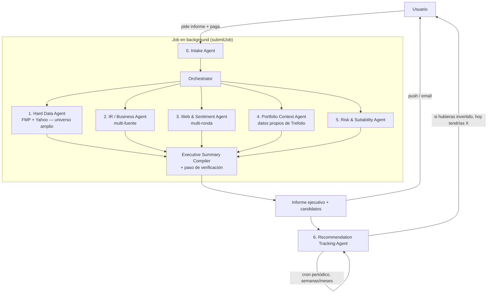

# PRD — Investment Screening & Recommendation Agents (pay-per-generation)

Owner: TBD · Status: Draft v0.2 · Target: Warren Pro / Trefolio Plus

**Cambios v0.2**: el modelo de negocio pasa de "cuota mensual" a **pago por
generación** — cada informe es una compra individual. Esto invierte la
prioridad de diseño: la latencia deja de ser una restricción y la
**exhaustividad** pasa a ser el requisito central (el usuario está pagando
por profundidad, no por velocidad). Se agrega un **Agente 6 de seguimiento
de recomendaciones** que seguimenta cada candidato recomendado en el tiempo
—compró el usuario o no— para poder decir "si hubieras invertido acá, hoy
tendrías X". Ver §3.6, §4 y §7 para el detalle de qué cambió.

## 1. Problema y caso de uso

El usuario tiene una cartera con sobre-exposición a un sector (o quiere buscar
empresas que cumplan cierta condición: "P/E bajo con moat", "dividendo >4% y
payout sano", "small cap value en healthcare", etc.) y quiere una
recomendación accionable para rebalancear — no solo un screener de números,
sino un informe con contexto de negocio, catalizadores y cómo encaja con lo
que ya tiene en cartera.

Hoy `analyze-gaps.ts` sólo detecta un gap fijo (infra/utilities vs 8%
target) y el screener de moat (`moat-screener-intent.ts`) filtra por P/E y
score contra una caché. El mockup `mockup-rebalancing-tool.html` (sección
"Industry Screener Pro") ya anticipa la UI de este feature pero corre sobre
datos estáticos de ejemplo. Este PRD define el backend real: un pipeline
multi-agente que sustituye ese mock por datos vivos y research real.

Es una **feature de pago por generación**: el usuario paga cada vez que pide
un informe (no una cuota mensual incluida en el plan). Eso cambia el
contrato implícito con el usuario — no está comprando velocidad, está
comprando un análisis exhaustivo que le tomaría horas hacer a mano. Un run
que tarda 6 minutos porque cruzó 30 tickers contra 3 fuentes cada uno vale
más que uno que tarda 20 segundos y cortó camino.

## 2. Objetivo

Dado un trigger del usuario (manual, "screening" tab, o detectado por Warren
en conversación: "estoy muy expuesto a tech"), producir — a cambio de un
pago — un **informe ejecutivo exhaustivo** con 3–5 candidatos accionables,
cada uno con:
- Por qué encaja (dato duro + narrativa de negocio + contexto de cartera)
- Riesgos / qué vigilar, con fuentes citadas
- Sizing sugerido y si es mejor "comprar nuevo" o "incrementar algo que ya
  tengo"

Y, a partir de la entrega, **seguir cada candidato en el tiempo** — se haya
invertido o no — para poder responder objetivamente "¿esta recomendación fue
buena?".

### Principio de diseño: exhaustividad > velocidad

Como el usuario paga por generación y no está esperando en un chat en vivo,
el pipeline corre **asíncrono en background** (no bloquea una request HTTP
ni compite contra un timeout de UI) y notifica cuando termina — reusa
`deferTask`/`submitJob` (`src/lib/task-runner.ts`) y el sistema de push
(`web-push.ts`) / email transaccional ya existentes. Esto habilita:
- Universo de screening más amplio en Agente 1 (no cortar a 10–20 por costo
  de tiempo de UI — cortar solo cuando ya no aporta señal).
- Múltiples rondas de research en Agentes 2/3 (cross-verificar un hecho
  contra 2+ fuentes en vez de aceptar la primera).
- Un paso de **verificación** en el Compiler antes de entregar (ver §3.6).

El límite que sí importa es el **costo en $** de cada run (tokens LLM +
llamadas FMP/WebSearch), porque tiene que quedar cubierto por el precio
cobrado — no el tiempo de reloj.

### Métricas de éxito
- ≥80% de los runs generan al menos 1 candidato "accionable" (no vacío) —
  la barra sube respecto a v0.1 porque ahora no hay excusa de "no daba el
  tiempo"
- **% de recomendaciones con alpha positivo vs. benchmark** a 90 días / 1
  año, medido por el Agente 6 de seguimiento — es la métrica de verdad del
  producto, no un proxy
- Tasa de reembolso automático (runs vacíos o degradados) — debe ser baja;
  cada reembolso es señal de una generación que no debió cobrarse
  (ver §5)
- Tasa de recompra: % de usuarios que piden un segundo informe en 90 días
- Margen por run: precio cobrado − costo real (LLM + FMP + WebSearch)

### Fuera de alcance (v1)
- Ejecución de órdenes / trading automático
- Backtesting histórico general (el tracking de §3.6 es forward-looking
  desde la fecha de la recomendación, no backtesting retroactivo)
- Cobertura fuera de US/EU large & mid cap (FMP free/starter tier limita esto)
- Multi-idioma del research crudo (el resumen final sí respeta `locale`, el
  research interno puede ser en inglés)

## 3. Arquitectura

Reutiliza el patrón ya existente de **Agent Office**
(`src/lib/ai/office/orchestrator.ts` + `dispatch-step.ts`) para la
composición de agentes, pero el disparo es **asíncrono**, no una respuesta
de chat en vivo: la request de generación crea un job (`submitJob` /
`deferTask`), cobra, y corre los agentes en background sin presión de
timeout de request HTTP.



### 3.0 Intake Agent (definición del brief)

Responsable de convertir la señal del usuario (mensaje libre en Warren, o
formulario en la UI del screener) en un **brief estructurado**:

```ts
interface ScreeningBrief {
  trigger: "manual" | "warren_detected" | "sector_gap_alert";
  mode: "rebalance_overexposure" | "find_by_criteria";
  overexposedSector?: string;         // si mode = rebalance
  criteria?: string;                   // texto libre, ej. "dividendo >4%, payout <70%"
  hardFilters?: {                      // extraídos del criteria por LLM + reglas existentes
    peMax?: number; sectorIn?: string[]; marketCapMin?: number;
    dividendYieldMin?: number; excludeHeld?: boolean;
  };
  riskProfile?: "conservative" | "balanced" | "growth"; // de perfil de usuario si existe
  baseCurrency: string;
  portfolioId: string;
}
```

Reutiliza `wantsMoatScreenerIntent` / `extractPeMaxFromMessage` como base de
parsing y los extiende. Si el brief es ambiguo, el Intake Agent pregunta
**antes de cobrar** — nunca se cobra un run que arrancó con un brief
adivinado a medias.

### 3.1 Agente 1 — Hard Data / Screener Agent

- **Fuentes**: FMP (screener endpoint, ratios, key metrics) vía
  `resolveFundamentalsProvider` / `resolvePremiumStockDataProvider` ya
  existentes; Yahoo Finance como fallback/cross-check de precio y quote
  (mismo patrón que `company-analysis`).
- **Input**: `hardFilters` del brief.
- **Output**: universo amplio de candidatos (sin techo artificial de 10–20 —
  screenea todo lo que cumple el filtro duro) con métricas duras (P/E, P/B,
  EV/EBITDA, yield, payout, deuda/EBITDA, crecimiento revenue/EPS, moat
  score si existe en `queryMoatCache`), rankeado para que los Agentes 2–5
  investiguen primero el top 8–12 y sigan bajando en la lista si el tiempo
  de background lo permite.
- Sigue siendo el único agente que hace *filtering* masivo — no porque
  cueste tiempo, sino porque research cualitativo (Agentes 2/3) sobre miles
  de tickers no aporta señal proporcional al costo en $.

### 3.2 Agente 2 — Investor Relations / Business Agent

- Por cada candidato investigado: busca IR page / último earnings call /
  press releases (FMP tiene transcripts + press-release endpoints; fallback
  a IR site scraping con WebFetch si FMP no cubre el ticker).
- **Multi-pasada**: cuando la primera fuente es ambigua o contradice el dato
  duro de Agente 1 (ej. guidance bajado pero revenue creciendo), hace una
  segunda pasada cruzando contra un segundo earnings call/press release
  antes de asentar la conclusión — el presupuesto de tiempo ya no es una
  razón para conformarse con la primera fuente.
- Extrae: qué hace el negocio en una frase, guidance reciente, segmentos de
  revenue, catalizadores anunciados (buybacks, M&A, nuevos productos).
- Output: 3–5 bullets de negocio por ticker, no números (esos ya los tiene
  Agente 1).

### 3.3 Agente 3 — Web & Sentiment Agent

- WebSearch sobre cada candidato: noticias últimos 30–90 días, menciones de
  analistas, insider buying/selling (FMP tiene endpoint de insider trading),
  sentimiento general.
- **Cross-verificación obligatoria**: todo claim relevante para la
  recomendación necesita 2 fuentes independientes antes de entrar al
  informe (o se marca explícitamente como "señal única, no confirmada").
- Output: señales cualitativas — "tailwind", "headwind", "insider buying
  reciente", "cobertura analista mayormente bullish/bearish" — con
  citación de fuente y fecha (para evitar alucinación y dar trazabilidad).
- Sigue siendo el agente con mayor riesgo de alucinar / traer info stale →
  el Compiler descarta cualquier claim sin fuente o con una sola fuente no
  corroborada.

### 3.4 Agente 4 — Portfolio Context Agent (datos propios de Trefolio)

- Éste es el diferencial vs. cualquier screener externo: usa
  `buildPortfolioSnapshot` (ya usado por Warren) para responder:
  - ¿Ya tengo algo en este sector/condición que está barato hoy? →
    incrementar posición existente en vez de abrir una nueva.
  - Overlap / correlación con holdings actuales (evitar recomendar algo
    99% correlacionado con lo que ya se quiere reducir).
  - Cash disponible (`portfolioCashEur`) y si hay fiscalidad relevante
    (plusvalías latentes si se vende para financiar la compra).
- Generaliza `findPrimarySectorGap` (hoy hardcodeado a infra/8%) a **N
  sectores dinámicos** calculados desde el snapshot real, no una constante.
- Output: para cada candidato, flag `newPosition | topUpExisting(ticker)` +
  gap sizing sugerido en EUR.

### 3.5 Agente 5 — Risk & Suitability Agent

- Position sizing (Kelly-lite / % cartera cap), impacto en concentración
  top-N, correlación aproximada con holdings, encaja con `riskProfile`.
- Tax & Withholding y ESG/Exclusions quedan como backlog fase 2 (ver
  evaluación completa en el PRD v0.1 — sin cambios respecto a esa
  priorización).
- El disclaimer regulatorio no es un agente de research — va cableado
  directo en el Compiler.

### 3.6 Executive Summary Compiler (+ paso de verificación)

1. Recibe el output tipado de los 5 agentes (`Promise.allSettled`,
   degradando con gracia si uno falla).
2. Rankea candidatos (score compuesto: fit con filtros duros + business
   quality + sentiment + fit de cartera).
3. **Paso de verificación** (nuevo en v0.2): antes de redactar, chequea que
   cada afirmación cuantitativa tenga un campo estructurado de origen
   (Agente 1/4) y que cada afirmación cualitativa tenga ≥2 fuentes o esté
   marcada como no confirmada. Esto es viable precisamente porque no hay
   presión de tiempo — es la razón de ser de cobrar por generación en vez
   de por cuota.
4. Redacta el resumen ejecutivo vía LLM citando sólo lo verificado.
5. Persiste el informe y **registra cada candidato recomendado** en
   `recommendation_outcomes` para que el Agente 6 lo siga en el tiempo
   (ver §3.7) — esto ocurre siempre, incluso si el usuario nunca vuelve a
   abrir el informe.
6. Dispara la notificación (push/email) de "tu informe está listo".

### 3.7 Agente 6 — Recommendation Tracking Agent (nuevo)

Este agente no corre dentro del job síncrono del informe — corre **después**,
en un cron periódico, y es el que convierte el producto de "una opinión de
IA" en "un historial verificable".

- **Qué persiste el Compiler al terminar cada run**: por cada candidato
  recomendado — ticker, fecha y precio al momento de la recomendación,
  monto sugerido de asignación, si era posición nueva o top-up, y un
  snapshot corto de la tesis. Se persiste **independientemente de si el
  usuario terminó invirtiendo o no**.
- **Qué hace el cron** (reusa el patrón `withCronLogging` /
  `verifyCronAuth` de los crons existentes, ej.
  `src/app/api/cron/portfolio-recommendations`): con una cadencia periódica
  (diaria para precio, semanal para el resumen que ve el usuario), para
  cada recomendación activa:
  1. Trae el precio actual (mismos providers que Agente 1).
  2. Calcula el retorno hipotético: "si hubieras puesto €X el [fecha], hoy
     tendrías €Y (+Z%)" — con o sin dividendos según corresponda.
  3. Compara contra un benchmark (ETF del sector o índice amplio) para dar
     contexto de si el pick agregó valor o solo siguió al mercado (alfa).
  4. Cruza contra las transacciones reales del usuario para detectar si
     efectivamente compró el ticker recomendado cerca de esa fecha — si sí,
     compara el retorno hipotético contra el real (mismo cálculo, dos
     escenarios); si no, el hipotético queda como el único dato, y es
     igual de válido para evaluar la calidad de la recomendación.
- **Dónde lo ve el usuario**: las recomendaciones se guardan en la base de
  datos **junto al informe que las generó** (`recommendation_outcomes` /
  `recommendation_valuations` cuelgan de `report_id`) — no es una sección
  aparte y desconectada. El usuario entra al informe guardado (desde su
  historial) y ahí mismo ve, candidato por candidato, el resultado
  actualizado: "así te hubiera ido". Un listado agregado de todos los
  informes con su resultado (el "track record" en sí) es la vista de
  conjunto sobre esos mismos datos, no una fuente distinta.
- Esto es visible **incluso si el usuario nunca invirtió** — es el
  mecanismo de confianza del producto: no depende de que el usuario haya
  seguido el consejo para poder evaluarlo.
- Este track record (agregado y anonimizado) es también material de
  marketing/onboarding — "así de bien le fue a nuestras recomendaciones en
  los últimos 12 meses" — pero eso es explícitamente fuera de alcance de
  v1 (ver §8).

## 4. Modelo de datos

- **`screening_runs`** (id, user_id, portfolio_id, brief_json, status,
  charge_id, created_at) — `charge_id` referencia el cobro (ver §5).
- **`screening_agent_outputs`** (run_id, agent_kind, status, output_json,
  latency_ms, cost_estimate) — para debuggear qué agente falló/tardó;
  `latency_ms` se guarda para observabilidad interna, no como SLA hacia el
  usuario.
- **`screening_reports`** (run_id, summary_json, candidates_json).
- **`recommendation_outcomes`** (id, run_id, report_id, ticker,
  recommended_at, recommended_price, suggested_alloc_eur, position_kind
  `new|topup`, thesis_snapshot, status `active|closed`) — una fila por
  candidato recomendado, se crea siempre al finalizar el run.
- **`recommendation_valuations`** (id, recommendation_id, as_of_date, price,
  hypothetical_value_eur, hypothetical_return_pct, benchmark_symbol,
  benchmark_return_pct, alpha_pct, user_acted boolean, actual_return_pct
  nullable) — una fila por corrida del cron de tracking por recomendación
  activa.
- Cache por ticker con TTL (reusar patrón de `company-analysis/cache.ts`)
  para que Agente 2/3 no vuelvan a golpear IR/web si el ticker ya fue
  research-eado esta semana por otro usuario — comparten caché global, no
  por-usuario (el research de negocio no es específico al usuario). Esto
  además baja el costo marginal de generaciones repetidas sobre tickers
  populares, lo cual importa para el margen por run (ver §5).

## 5. Monetización: pago por generación

- **Modelo**: cada informe es un cobro individual (Stripe PaymentIntent /
  checkout one-time — capacidad nueva, hoy `src/lib/stripe.ts` sólo
  soporta suscripciones, no cobros puntuales). Se cobra **al confirmar el
  brief** (después de que Intake Agent resolvió ambigüedades), no al
  entregar — pero con reembolso automático si el run falla o degrada.
- **Reembolso automático**: si el run termina con 0 candidatos accionables,
  o si ≥2 de los 5 agentes de research fallaron, se reembolsa
  automáticamente y se notifica al usuario — extiende el patrón que ya
  existe (`refundFeatureQuota` en `company-analysis`) a un reembolso de
  dinero real en vez de cuota. Cobrar por una generación vacía rompe
  confianza en un producto de pago-por-uso más rápido que en uno de cuota
  mensual.
- **Presupuesto de costo por run** (no de tiempo): cap de tokens LLM +
  llamadas FMP/WebSearch por run — si se acerca al techo, el Compiler
  prioriza terminar de investigar los candidatos con mejor score antes de
  seguir bajando en la lista de Agente 1, en vez de cortar todo de golpe.
- **Teaser gratuito**: dado que ahora no hay "sección parcial" de un run
  pago que blurear, el hook gratuito es la detección de sobre-exposición
  (ya cubierta por una versión generalizada de `findPrimarySectorGap`, sin
  research) con un CTA a "generar informe completo" — el usuario ve *que*
  hay un problema gratis, paga para ver *qué hacer* al respecto.
- El seguimiento de recomendaciones (§3.7) es parte del precio ya pagado —
  no es un cobro adicional; es lo que sostiene la percepción de valor de
  compras futuras.

### 5.1 Estimación de costo por generación

Números de referencia (no un compromiso de proveedor — el gateway de
modelo ya está abstraído en `run-turn.ts`, y el proveedor de búsqueda
queda como decisión de Sprint 0 §8). Sirven para validar que el precio por
generación tiene margen incluso en el peor caso, que es la pregunta
abierta #1.

| Componente | Costo estimado / run | Base del cálculo |
|---|---|---|
| LLM — Agentes 1–5 (research, modelo económico) | **$0.05 – $0.10** | ~134K tokens input + ~15K output a precio tipo GPT-4.1 mini ($0.40 / $1.60 por M tokens) |
| LLM — Compiler (verificación + redacción, modelo premium) | **$0.10 – $0.15** | ~50K tokens input + ~4K output a precio tipo GPT-4.1 ($2 / $8 por M tokens) — necesita más calidad de razonamiento que los sub-agentes |
| Web Search API (Agente 3, cross-verificación 2 fuentes + Agente 2 fallback) | **$0.15 – $0.35** | ~20–40 búsquedas por run a precio tipo Tavily ($0.008/crédito búsqueda básica, $0.016 avanzada) |
| FMP (datos duros, Agentes 1 y 4) | **~$0 marginal** | Plan mensual fijo (Starter/Premium, ~$99+/mes) ya compartido con el resto de Trefolio — no es costo por-run salvo que el volumen de este feature fuerce upgrade de tier (riesgo a vigilar, no un costo directo) |
| Vercel — compute del job async (Fluid compute, Active CPU) | **$0.005 – $0.01** | $0.128/hora CPU activa + $0.0106/GB·hora memoria provisionada; el job es mayormente espera de I/O (LLM streaming, APIs externas), y Active CPU sólo cobra el cómputo real, no el tiempo de espera — el diseño async de §2 no sólo habilita exhaustividad, también mantiene este costo marginal |
| Notificación (push / email) | **~$0** | Infra ya existente (`web-push.ts`, proveedor de email transaccional) |
| **Total estimado por generación** | **$0.35 – $0.60** (caso típico) · hasta **~$1.00** en el peor caso (universo grande sin hits de caché, retries, brief con más de 10 candidatos investigados en profundidad) | |

**Lectura para el precio**: incluso en el peor caso (~$1.00), un precio
por generación en el rango de referencia habitual de este tipo de
producto (informe de research puntual) deja margen bruto amplio. El
componente que más pesa es LLM + Search (~85–90% del costo variable); el
compute de Vercel es marginal. La caché de research compartida entre
usuarios (§4) baja el costo de Agentes 2/3 en generaciones repetidas sobre
tickers populares, mejorando el margen con el tiempo sin cambiar el
precio.

**Fuentes de referencia** (pricing público, sujeto a cambio — validar en
Sprint 0 antes de fijar el precio final):
- Vercel Fluid compute / Active CPU pricing — [vercel.com/docs/functions/usage-and-pricing](https://vercel.com/docs/functions/usage-and-pricing), [vercel.com/blog/introducing-active-cpu-pricing-for-fluid-compute](https://vercel.com/blog/introducing-active-cpu-pricing-for-fluid-compute)
- Tavily API pricing — [tavily.com](https://tavily.com) (vía comparativas de pricing 2026)
- OpenAI API pricing (GPT-4.1 / GPT-4.1 mini) — [openai.com/api/pricing](https://openai.com/api/pricing) (vía comparativas de pricing 2026)
- FMP planes — [site.financialmodelingprep.com/pricing-plans](https://site.financialmodelingprep.com/pricing-plans)

## 6. Riesgos y mitigaciones

| Riesgo | Mitigación |
|---|---|
| Esto se puede leer como asesoramiento financiero regulado | Disclaimer obligatorio en cada informe (no personalizado, "no es asesoramiento de inversión"), copy revisado por legal antes de GA |
| Alucinación de datos (precios, ratios inventados) | Números SIEMPRE vienen de Agente 1/4 (tool calls estructurados); Agente 3 exige 2 fuentes por claim relevante; paso de verificación del Compiler antes de redactar |
| Cobrar por un run vacío o de baja calidad rompe confianza | Reembolso automático si 0 candidatos o ≥2 agentes fallidos (§5); nunca cobrar antes de que Intake resuelva ambigüedad |
| Costo real por run no cubierto por el precio | Estimado en $0.35–$0.60 típico / ~$1.00 peor caso (§5.1); presupuesto duro de $ por run + caché de research compartida entre usuarios; monitoreo de margen por run como KPI (§2) |
| Datos stale (noticias/insider viejos) | TTL corto en caché de Agente 3 (días, no semanas), mostrar fecha de cada fuente en el UI |
| Cron de tracking falla silenciosamente (precios no se actualizan, recomendaciones quedan "congeladas") | Reusa `withCronLogging` (alerting ya existente en `monitoring/`); backfill si se detecta un gap de días sin valuación |
| Metodología de benchmark cuestionable (¿qué índice/ETF comparar?) | Metodología fija y documentada por sector, mostrada de forma transparente en el UI del track record — no se elige post-hoc para favorecer el resultado |
| Sobre-alcance de scope (6 agentes → mantenimiento) | v1 = 4 agentes de research + compiler + tracking; Risk Agent (5) puede lanzarse en fase 1.5 si el timeline aprieta sin bloquear el resto |

## 7. Plan de sprints (2 semanas c/u, salvo Sprint 0)

### Sprint 0 — Discovery & contratos (1 semana)
- Definir `ScreeningBrief`, el shape de output de cada agente, y el shape de
  `recommendation_outcomes`/`recommendation_valuations` (TypeScript types +
  zod schemas), sin implementación aún.
- Validar con legal/compliance el copy de disclaimer y qué se puede/no se
  puede afirmar.
- Definir el punto de precio por generación y la política de reembolso
  automático con negocio/finanzas, validando la estimación de costo de
  §5.1 contra proveedores reales (LLM gateway, proveedor de búsqueda web).
- Elegir proveedor de búsqueda web para el Agente 3 (Tavily vs.
  alternativas) — cotizar volumen real esperado, no sólo precio de lista.
- Definir la metodología de benchmark por sector (qué ETF/índice se usa
  para calcular alfa) — debe quedar fija antes de que exista el primer
  track record real.
- **Salida**: este PRD aprobado + `types.ts` de contratos + ADR sobre modelo
  de datos.

### Sprint 1 — Job asíncrono + Intake Agent + Hard Data Agent
- Tablas `screening_runs` / `screening_agent_outputs` + migración.
- Wiring del job en background (`submitJob`/`deferTask`) + notificación
  push/email al terminar — reemplaza el modelo síncrono de chat.
- Intake Agent: parsing de brief, detección de ambigüedad → pregunta antes
  de cobrar.
- Hard Data Agent: screener FMP + fallback Yahoo sobre universo amplio
  (sin techo artificial), reusando `resolveFundamentalsProvider`.
- **Salida**: dado un brief, obtener un universo rankeado de candidatos con
  métricas duras. Demo interna vía endpoint de debug (sin cobro real aún).

### Sprint 2 — Portfolio Context Agent + generalización de sector-gap
- Generalizar `findPrimarySectorGap` a N sectores dinámicos desde el
  snapshot real (hoy solo detecta infra) — esta versión generalizada es
  también el teaser gratuito de §5.
- Lógica `newPosition | topUpExisting` + overlap/correlación básica con
  holdings actuales.
- **Salida**: para cada candidato de Sprint 1, saber si "ya tengo algo
  parecido y barato" o si es posición nueva.

### Sprint 3 — IR/Business Agent + Web/Sentiment Agent (multi-pasada)
- Agente 2: transcripts/press releases vía FMP + fallback WebFetch,
  segunda pasada cuando hay ambigüedad o contradicción con el dato duro.
- Agente 3: WebSearch con cross-verificación de 2 fuentes por claim
  relevante, insider trading vía FMP.
- **Salida**: candidatos enriquecidos con narrativa de negocio + señales
  cualitativas citadas y cross-verificadas.

### Sprint 4 — Risk Agent + Compiler con paso de verificación
- Agente 5: sizing sugerido, concentración, fit con `riskProfile`.
- Compiler: ranking, paso de verificación (cita estructurada obligatoria),
  redacción LLM, disclaimer inyectado, persistencia de `screening_reports`
  **y** de `recommendation_outcomes` por candidato.
- **Salida**: pipeline end-to-end produce un informe ejecutivo completo y
  dejа sembradas las recomendaciones para tracking (aún sin cobro/UI real).

### Sprint 5 — Cobro por generación + UI real (reemplaza el mockup)
- Integración de Stripe one-time payment (capacidad nueva) + reembolso
  automático en runs vacíos/degradados.
- Conectar UI real sobre `mockup-rebalancing-tool.html` (sección "Industry
  Screener Pro") a los endpoints reales, con el flujo async (pedir →
  pagar → notificación → ver informe).
- Feedback simple 👍/👎 por candidato.
- **Salida**: feature usable end-to-end por un beta tester real, con cobro
  real y reembolso automático funcionando.

### Sprint 6 — Recommendation Tracking Agent + cron
- Tablas `recommendation_valuations` + migración.
- Cron de tracking (reusa `withCronLogging`/`verifyCronAuth`): revalúa
  precio, calcula retorno hipotético, compara contra benchmark, cruza
  contra transacciones reales del usuario.
- **Salida**: cada recomendación emitida desde Sprint 4 empieza a
  acumular historial de valuaciones.

### Sprint 7 — Track record / scorecard UI
- Superficie nueva: historial de recomendaciones del usuario con estado,
  retorno hipotético vs. benchmark, si actuó o no.
- Agregados a nivel producto (hit rate, alfa promedio) para uso interno
  (dashboard de producto) — exposición pública/marketing queda fuera de
  v1 (ver §8).
- **Salida**: el usuario puede ver, para cualquier informe pasado, "así te
  hubiera ido".

### Sprint 8 — Hardening, observabilidad, beta cerrada
- Monitoreo de costo real por run vs. precio cobrado (margen), alertas de
  Grafana/Prometheus (reusa `monitoring/` existente).
- Alerting sobre el cron de tracking (gaps de valuación, fallos
  silenciosos).
- Manejo de fallos parciales del job async, reintentos.
- Beta cerrada con N usuarios reales, medir métricas de §2.
- **Salida**: go/no-go para GA basado en métricas de beta.

### Sprint 9 (buffer / GA)
- Fixes de beta, ajuste de prompts según feedback real, GA rollout
  progresivo.

## 8. Preguntas abiertas

1. ¿Cuál es el punto de precio por generación? La estimación de §5.1
   ($0.35–$0.60 típico, ~$1.00 peor caso) da margen amplio en casi
   cualquier precio razonable, pero falta validarla contra proveedores
   reales antes de fijar el precio.
2. ¿Qué proveedor de búsqueda web se usa para el Agente 3 (Tavily fue la
   referencia de costo en §5.1; evaluar alternativas como Exa, Serper o
   Brave Search API por precio/calidad de resultado financiero)? Afecta
   Sprint 3 y el costo real de §5.1.
3. ¿El trigger "Warren detecta sobre-exposición en conversación" dispara el
   flujo de pago automáticamente o solo lo sugiere? Recomendación: sugerir
   siempre, nunca cobrar sin confirmación explícita del usuario.
4. ¿Qué canal de notificación es el principal cuando el informe está listo
   — push, email, o ambos? Afecta Sprint 1.
5. ¿Qué benchmark se usa por sector para calcular alfa en el tracking?
   Debe cerrarse en Sprint 0, antes de que exista el primer track record.
6. ¿El track record agregado/anonimizado se usa como material de
   marketing en v1, o queda estrictamente para fase 2? Afecta el alcance
   de Sprint 7.
7. ¿Cobertura de mercados fuera de US/EU large-mid cap es un requisito de
   v1 o puede quedar fuera dado el tier de FMP actual?
8. ¿Quién aprueba el copy de disclaimer legal y la política de reembolso
   antes de Sprint 5 (cobro real)?
