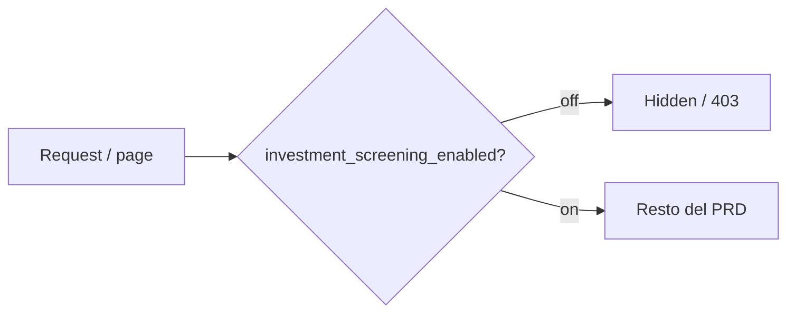
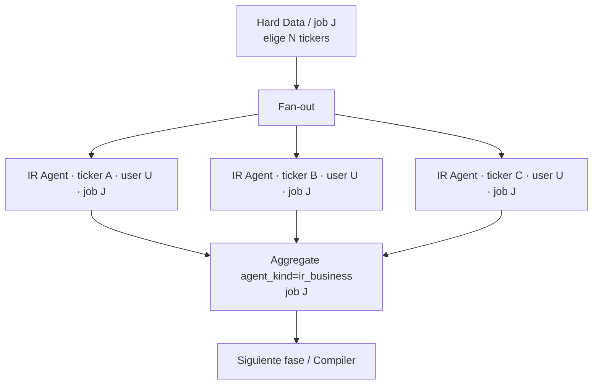
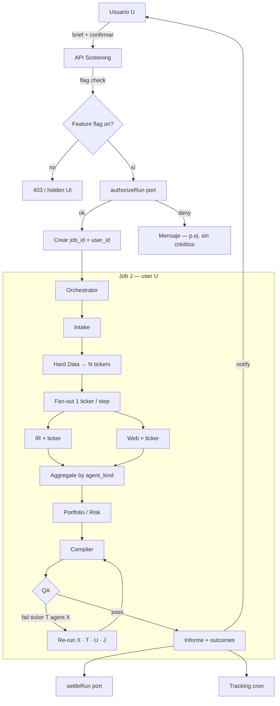
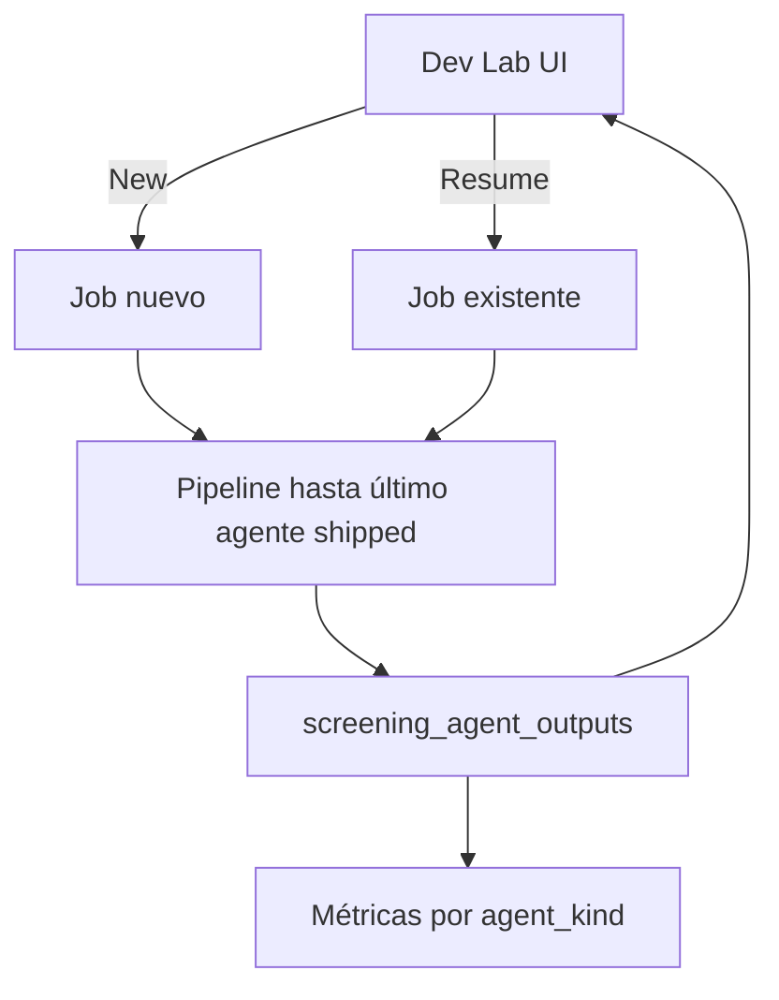

# PRD — Investment Screening Agents (versión factible)

Owner: Engineering · Status: **Feasible v1.6** · Baseline: `PRD_INVESTMENT_SCREENING_AGENTS.md` v0.7  
Companion: [`HLD_INVESTMENT_SCREENING_AGENTS.md`](./HLD_INVESTMENT_SCREENING_AGENTS.md)

## 1. Feature flag (prerrequisito — antes que nada)

**Nada de esta feature se expone ni se ejecuta sin el flag.** Registrar el flag es el **primer entregable** del proyecto (antes de UI, API, agents o jobs). Sin flag en registry + checks cableados, no se mergea el resto.

| Ítem | Detalle |
|---|---|
| Flag | `investment_screening_enabled` (provisional — cerrar nombre en Sprint 0 día 1) |
| Default | **Off** globalmente |
| Resolución | Patrón existente: global + override por usuario (`isFeatureEnabledForUser`) |
| Dónde se registra | `PlatformFeature` / `ALL_PLATFORM_FEATURES` / `PLATFORM_FEATURE_ENUM` / admin `FLAG_META` / allowlists API — skill `engineer-feature-flags` |
| Superficies gated | UI (`/tools/screening`, CTA teaser), API `/api/screening/*`, sugerencia Warren → CTA |
| Si flag off | UI oculta; API 403/404; Warren no ofrece el flujo; workers no aceptan runs de usuarios sin flag |
| Beta | Overrides **on** para N usuarios; global sigue **off** |
| GA | Flag global on (típicamente tras la iteración de créditos si se exige saldo) |

**Orden de implementación (inviolable):**

1. Registrar flag + admin UI + tests de resolución  
2. Guards en rutas/API/UI (fail closed)  
3. Resto del pipeline (Intake → agents → …)



---

## 2. Propósito de este documento

Este PRD define el **alcance funcional** del screening multi-agente (Modo Informe + Modo Cribado + tracking + QA), corregido para ser viable en la infra de Trefolio. Todo lo funcional vive **detrás del flag de §1**.

**v1.6 — metodología trefolio + ficha enriquecida:** el marco de evaluación se llama **metodología trefolio** (cinco pilares, score 0–8) y se explica al usuario en el intake y en el informe. Estructura del informe: resumen → tabla → fichas. Los números viven en **campos tipados**; la tesis es narrativa corta que cita esos campos. No hinchar prosa con ratios. Sin referencias a metodologías de terceros en copy de producto.

**v1.5 — informe en HTML:** no se genera PDF. El informe se renderiza en la app (React/HTML) desde `screening_reports` / JSON tipado. Blob queda opcional solo para exports staff (p.ej. Excel cribado), no como delivery del informe al usuario.

**v1.4 — todo desde la app:** ningún GitHub Actions. Triggers = UI / API / Vercel Cron del propio proyecto. Sin filesystem persistente local.

**v1.3 — plan incremental:** Etapa 0 = UX sin backend de agentes; luego **una etapa por agente** con métricas, resume de workflow y **Dev Lab UI** para inspeccionar outputs.

**v1.2 — una empresa por agente + job scoped:** research fan-out por ticker; outputs agregados por `agent_kind`+`job_id`; todo step lleva `user_id`+`job_id`.

**v1.1 — créditos y monetización:** el producto está pensado para un **modelo de créditos** (saldo; consumo por informe; créditos de bienvenida posibles). **Este PRD no especifica la mecánica de créditos ni la monetización** (compra, ledger, Stripe, precios, grants). Eso es una **iteración aparte**. Aquí solo funcionalidad + puerto de extensión para créditos.

| Supuesto original | Corrección (v1.1 factible) |
|---|---|
| Feature abierta a todos | **Feature flag primero** (§1) — obligatorio hasta GA |
| `submitJob` / `deferTask` para pipelines largos | **Orquestación event-driven durable** con checkpoints en Turso |
| “Sin límite de tiempo” en Vercel | **Steps acotados**; el run completo puede tardar minutos vía reanudación |
| Mismos Agentes 1–3 en Informe y Cribado | **Kernel compartido** + **dos pipelines** |
| FMP “marginal ~$0” / endpoints “ya pagos” | **Matriz de tier FMP explícita** |
| QA Agent 100% LLM | **Verificación híbrida** (código + LLM cualitativo) |
| Pago por generación / cobro en este PRD | **Modelo de créditos** (intención); **monetización fuera de alcance** |
| Un agente procesa N tickers en un solo call | **Una empresa por invocación de agente**; luego **agregación** por `agent_kind` + job |
| Jobs sin aislamiento multi-usuario | Todo step lleva **`user_id` + `job_id` (run_id)** — sin eso no se ejecuta |
| Big-bang pipeline completo | **Plan incremental**: UX primero → un agente por etapa + resume + Dev Lab |
| Cribado en GitHub Actions / FS local | **Todo triggereado desde la app**; sin runners externos |
| Informe como PDF descargable | **Informe HTML en la app** (React desde JSON tipado) |
| Tesis = muro de métricas en prosa | **Ficha tipada** (score, pasos, múltiplos, catalizador…) + tesis corta que cita campos |
| “Recomendación accionable” sin fricción legal | **“Informe de investigación”**; sizing ilustrativo; gate legal de copy |

El HLD detalla diagramas, eventos, tablas, prompts y despliegue.

---

## 3. Problema y caso de uso

El usuario necesita un **informe de investigación** con 3–5 candidatos contextualizados a su cartera — no solo un screener de números. Exhaustividad > velocidad; seguimiento forward-looking de cada candidato.

**Modelo de acceso (intención de producto, no alcance de este PRD):** créditos. El usuario acumula un saldo (compra y/o bienvenida); cada informe consume un número fijo de créditos. La implementación de saldo, compra, grants y descuento vive en la **iteración de monetización**.

**Teaser gratuito** (sí en alcance): detección de sobre-exposición sectorial generalizada (`findPrimarySectorGap` → N sectores) + CTA a generar informe completo (**solo si §1 flag on** para el usuario).

---

## 4. Objetivo y principios de diseño

### 4.1 Objetivo de producto

Informe verificado con 3–5 candidatos, cada uno con:
- Fit cuantitativo + narrativa de negocio + contexto de cartera
- Riesgos con fuentes citadas
- **Escenario de asignación ilustrativo** (no “orden de compra”)
- Tracking post-entrega: “si hubieras invertido €X el día D, hoy tendrías €Y”

### 4.2 Principios de ingeniería (no negociables)

1. **Feature flag first**: ninguna superficie de screening sin el check de §1; el flag se registra antes que cualquier otra pieza.
2. **Incremental delivery**: UX coherente antes de agentes reales; luego **un agente por etapa**, medible y resumible (§13).
3. **Job + user scoped**: cada invocación de agente conoce `user_id` + `job_id` (`screening_runs.id`); multi-usuario concurrente no mezcla outputs.
4. **One company per agent call**: en research por empresa, un step = un `agent_kind` × un `ticker`; el fan-in agrupa resultados del mismo agente/job.
5. **Durable first**: ningún estado crítico en memoria de instancia; checkpoint en Turso.
6. **App-triggered only**: UI, API y Vercel Cron del proyecto — **no** GitHub Actions ni workers externos.
7. **Report = HTML in-app**: el usuario lee el informe en la web; **no** pipeline PDF.
8. **Event-driven**: cada transición emite un evento persistido; workers idempotentes.
9. **Chunked execution**: un run = N steps reanudables (`maxDuration` Vercel).
10. **Deterministic before LLM**: números y R1–R10 no pasan solo por el Compiler.
11. **Structured card before thesis prose**: todo dato que decida score/ranking vive en campos tipados; la tesis narra el patrón citando paths — no duplica el Excel en prosa.
12. **Fail closed on brief**: no arrancar research si el brief es ambiguo o inviable.
13. **Monetization-agnostic core**: el pipeline no conoce Stripe ni precios; solo un puerto `authorizeRun` / `settleRun` que la iteración de créditos implementará.
14. **Observable by default**: latencia, QA rounds, FMP calls, costo interno $ (ops) son métricas de primera clase.
15. **Dev visibility**: en modo dev, la UI muestra qué hace cada agente y su output crudo/structured (Dev Lab §13.3).


### 4.3 Métricas de éxito (esta iteración)

**Producto / calidad:**
- ≥80% runs con ≥1 candidato accionable
- Tasa `rejected_infeasible` monitoreada (UI/filtros)
- Rondas QA, `quant_mismatch`, `unconfirmed_source`, `cross_agent_inconsistency`, `rule_violation`, degradación por agente

**Operación:**
- p95 duración Modo Informe <15 min end-to-end
- p99 step retry <3
- 0 runs zombie (>24h en `running` sin heartbeat)

**Fuera de las métricas de este PRD** (iteración créditos): margen por crédito, tasa de compra, conversión welcome→paid.

**Alfa a 90d/1a**: métrica **interna**; no claim público en v1.

---

## 5. Alcance funcional

Todo lo de esta sección asume **§1 flag on** para el usuario (o job interno de cribado).

### 5.1 Modo Informe (usuario + cartera)

| Capacidad | Este PRD |
|---|---|
| Gate §1 feature flag | Sí — primero |
| Intake + brief estructurado | Sí |
| Chequeo viabilidad pre-run | Sí (antes de encolar research) |
| Agentes 1–5 + Compiler + QA | Sí |
| Push/email al completar | Sí (link al informe HTML en la app) |
| Agente 7 tracking | Sí |
| Entrega del informe | **Página web HTML/React** (`/tools/screening/reports/:id`) — **sin PDF** |
| Trigger Warren | **Sugerir solo** — nunca arrancar run sin confirmación UI; solo si flag on |
| Compra de créditos / Stripe / ledger | **No** — iteración aparte |
| Descuento de créditos por informe | **No en este PRD** — solo puerto `authorizeRun`/`settleRun` stub |
| Risk Agent tax/ESG | Fase 1.5 |
| Multi-idioma research crudo | No (resumen respeta `locale`) |
| US/EU large & mid cap | Sí (límites FMP tier) |

### 5.2 Modo Cribado (cron diario, mercado US)

| Capacidad | Este PRD |
|---|---|
| Embudo 3 etapas + checklist 9 pasos | Sí |
| Exactamente 5 candidatas | Sí |
| QA reglas R1–R10 | Sí |
| Entrega | **HTML en la app** (misma superficie de informe); Excel/JSON opcionales vía Blob solo si ops lo pide |
| PDF | **No** |
| Registro cooldown 90 días | Sí (`screening_universe_registry` en Turso) |
| Runtime | **Mismo** worker durable / steps que Modo Informe (Vercel Fluid). **No** GitHub Actions |
| Trigger | App: admin UI, API interna, y/o **Vercel Cron** (`vercel.json` → `/api/cron/screening-cribado`) |
| Exposición a usuarios | **Interno** hasta decidir distribución |
| Créditos | No aplica (no es pedido de usuario) |
| Filesystem local / GHA / LibreOffice | **No** |

### 5.2.1 Metodología trefolio + estructura del informe HTML

**Metodología trefolio** — nombre de producto del marco de evaluación. Cinco pilares, puntuados por **código determinístico** (score 0–8) antes de que el LLM redacte:

| Pilar | Qué mide | Métricas |
|---|---|---|
| 1. Calidad del negocio | Retorno sobre capital y poder de precios | ROIC, margen bruto, margen EBIT |
| 2. Solidez financiera | Capacidad de aguantar un ciclo malo | Deuda neta/EBITDA, ratio corriente, deuda/fondos propios |
| 3. Valoración relativa | Barata vs su historia **y** vs comparables | PER fwd, TEV/EBITDA, P/FCF, TEV/Ventas |
| 4. Divergencia + catalizador | Precio cae mientras el negocio mejora, con evento fechado | Series precio vs fundamentales, catalizador con fecha |
| 5. Alineación de intereses | Insiders comprando; señal de mercado verificable | Compras discrecionales, participación fundador, sentimiento |

**Obligación de copy:** el producto nombra siempre “metodología trefolio” y **explica cada métrica al usuario** (intake + informe). Prohibido atribuir la metodología a terceros o citar metodologías de marca ajena en superficies de usuario.

Delivery = página web, no PDF.

**Capas de la UI** (una sola composición por informe):

| Capa | Contenido | Origen |
|---|---|---|
| Resumen ejecutivo | Metodología breve + orden de prioridad (1–5) con 1 párrafo por ticker | Compiler LLM + inputs de código |
| Tabla comparativa | PER vs histórico/peers, crecimiento, score, veredicto | **Código** (no LLM) |
| Fichas detalladas | Campos tipados + tesis + riesgos | Checklist código + Compiler LLM |
| Disclaimer | Investigación automatizada; fechas de corte por fuente | Template + `sources[].asOf` |

**Cada ficha empieza por “a qué se dedica”.** Antes de múltiplos y criterios, el informe explica el negocio en 1–3 frases en lenguaje llano (qué vende y cómo gana dinero) y ofrece enlaces: web oficial, relación con inversores, filings del regulador y la ficha interna `/stock/{ticker}`. Sin esto el usuario recibe una tabla de ratios sobre un ticker desconocido y no puede verificar nada. **Los enlaces nunca los escribe el modelo** — vienen del perfil del proveedor o de un resolver determinístico; si no hay dato, no se muestra el enlace (un enlace inventado es riesgo de phishing). Ver `card.business` en el HLD §5.3. Al implementarlo: enlaces externos con `rel="noopener noreferrer"`, marca visual de salida (`↗`) y una línea en el disclaimer aclarando que trefolio no controla ni respalda el contenido de sitios de terceros.

**Regla de copy — los criterios se nombran, nunca se numeran en pantalla.** El JSON persiste ids (1–9) para ser compacto y traducible, pero la ficha muestra **nombre del criterio + qué mide + estado** (✓ cumple / ✕ no cumple / – no puntúa / ? sin datos) y un contador “X de 8 cumplidos”. Ver el registro `SCREENING_CRITERIA` en el HLD §5.3. Una fila de dígitos sin etiqueta no es aceptable: el usuario no puede saber qué significa “6” ni por qué el máximo es 8.

**Regla de diseño — datos vs tesis:**

| Va en **campos tipados** (tabla / cabecera de ficha) | Va en **tesis** (prosa, ~120–180 palabras) |
|---|---|
| Score 0–8, veredicto (`fuerte` \| `watch`), criterios 1–9 pass/fail | Por qué encaja el patrón del checklist |
| Sector, país, market cap, precio, moneda, `asOf` | 2–3 hechos citados por path (`citedFields`) |
| Target / upside % (si hay consenso) | Por qué el ranking (prioridad vs peer del día) |
| Catalizador + fecha (nullable) | — |
| Múltiplos: fwd PE, hist. propio, peers, EV/EBITDA, ND/EBITDA | — |
| Flags: net cash, buyback, dividend yield; `moatScore` (si existe) | — |
| `sources[]` `{ url, asOf, field }` | — |
| Riesgos = `risks[]` estructurados (bullets), no escondidos en la tesis | — |

**No hacer:** hinchar `thesis` con más ratios “por si acaso”. Si un dato no cambia score ni ranking, no entra.

Detalle Zod / JSON: HLD §5.3 y §7.6.

### 5.3 Fuera de alcance (este PRD)

- **Monetización y créditos:** compra de packs, precio, Stripe, ledger de saldo, créditos de bienvenida, UI de saldo, reembolso de créditos, right-of-withdrawal de compra digital
- Trading automático, backtesting histórico general
- Marketing agregado de track record
- Small cap fuera de cobertura FMP
- GitHub Actions / runners externos / LibreOffice / **generación de PDF**

### 5.4 Intención de producto — créditos (solo contexto)

Para alinear diseño futuro, el modelo deseado es:

1. El usuario tiene un **saldo de créditos**.
2. Puede recibir **créditos de bienvenida** (grant).
3. Puede **comprar** packs de créditos (X créditos ↔ capacidad de generar informes).
4. Cada informe Modo Informe **consume** un coste fijo en créditos (p.ej. 1 crédito = 1 informe; el número exacto lo define la iteración de monetización).

**Este documento no define** tablas de ledger, APIs de compra, ni montos. El core deja:

```ts
// Puerto — implementación real en iteración de créditos
interface ScreeningAccessPort {
  /** Pre-flight: may this user start a run? Stub v1: allow if feature flag on. */
  authorizeRun(userId: string, runId: string): Promise<
    { ok: true } | { ok: false; reason: "flag_off" | "insufficient_credits" | "other"; message?: string }
  >;
  /** Post-outcome: settle success (consume) or failure (no-op / restore). Stub v1: no-op. */
  settleRun(userId: string, runId: string, outcome: "completed" | "failed_empty" | "rejected"): Promise<void>;
}
```

---

## 6. Arquitectura de producto (agentes)

Los siete roles del PRD original se mantienen; cambia la ejecución (HLD).

### 6.0 Identidad de job y aislamiento multi-usuario (obligatorio)

Varios usuarios (y varios jobs del mismo usuario) pueden correr en paralelo. El workflow **siempre** identifica:

| Campo | Qué es | Quién lo fija |
|---|---|---|
| `user_id` | Dueño del informe (nullable solo en Modo Cribado interno) | API al crear el run |
| `job_id` | = `screening_runs.id` — un informe/cribado concreto | API al crear el run |
| `agent_kind` | Rol del agente (`ir_business`, `web_sentiment`, …) | Orchestrator al encolar step |
| `ticker` | Empresa bajo investigación (null solo en steps globales: intake, compile, qa aggregate, macro) | Orchestrator tras Hard Data |

**Reglas:**

1. Todo `screening_run_steps` row lleva `user_id` + `job_id` denormalizados (o join obligatorio a `screening_runs` antes de ejecutar).
2. El worker **rechaza** un step si `user_id`/`job_id` no coinciden con el run, o si el run no está `authorized|running`.
3. `screening_agent_outputs` se escribe con `(job_id, user_id, agent_kind, ticker)` — nunca un blob global sin dueño.
4. Caché de research (`screening_research_cache`) puede ser **global por ticker** (dato de mercado no es del usuario); el **output del agente** es siempre por job.
5. Eventos, métricas y logs incluyen `user_id` + `job_id` en cada línea.

### 6.1 Una empresa por invocación de agente → agregación

En la fase de investigación por empresa (Agentes de research sobre candidatos, y checklist de cribado por candidata):



| Regla | Detalle |
|---|---|
| Scope de un step de research | **Exactamente un** `ticker` (salvo steps globales: Intake, Hard Data universe, Compiler, QA aggregate, macro Paso 8 cribado) |
| Prompt / contexto LLM | Solo datos de **esa** empresa + snapshot de cartera del `user_id` del job (si aplica) — no mezclar otros tickers del mismo job en el mismo call |
| Persistencia | Una fila `screening_agent_outputs` por `(job_id, agent_kind, ticker)` |
| Agregación | Cuando todos los steps de un `agent_kind` para ese `job_id` están `done` (o failed/skipped), un barrier `aggregate_{agent_kind}` (o el Compiler) lee el conjunto y produce el input tipado de la fase siguiente |
| QA dirigida | Re-invoca **solo** `(agent_kind, ticker)` señalado — no re-corre el resto del job |
| Paralelismo | Fan-out concurrente acotado (p.ej. 3–5 steps a la vez **por job**) para rate limits; jobs de otros usuarios compiten en la cola global con lease |

**Hard Data (Agente 1)** puede ser un step “universe” (lista de tickers + métricas) — filtrado masivo determinístico. El **research cualitativo** (IR, Web/Sentiment) y el checklist por candidata del cribado son **siempre 1 empresa / invocación**.

**Portfolio Context / Risk:** preferir un step por ticker candidato (mismo patrón) y agregar; si se hace job-level, el output sigue keyed por `ticker` + `job_id`.



**Agente 0 — Intake:** parsing, ambigüedad, viabilidad. `rejected_infeasible` **antes** de research pesado. Scope: job (sin ticker).

**Agentes 1–5:** outputs JSON tipado (Zod) en `screening_agent_outputs`, **keyed por ticker** cuando aplica.

**Compiler:** ranking + borrador sobre el **conjunto agregado** del job; no auto-verifica.

**Agente 6 — QA híbrido:** capa A código + capa B LLM; máx 2 rondas; degradación **por ticker**; si 0 candidatos → `settleRun(..., failed_empty)`.

**Agente 7 — Tracking:** cron precio + resumen semanal; cada valuation referencia `job_id` + `ticker` + `user_id`.

### 6.2 Kernel compartido

```
src/lib/screening/
  domain/          # JobContext { userId, jobId, agentKind, ticker? }
  prompts/         # English only (HLD) — one-company prompts
  data/
  rules/
  informe/
  cribado/
  qa/
  workers/         # enqueue fan-out; aggregate barriers
  access/          # ScreeningAccessPort + stub AllowIfFlagged
  outbox/
```

---

## 7. Orquestación event-driven

### 7.1 Por qué no `submitJob`

Estado en `Map` + `waitUntil` atado a `maxDuration` — no durable. Ver HLD.

### 7.2 Run + Steps + Events

| Entidad | Rol |
|---|---|
| `screening_runs` | Job raíz (`job_id`); `user_id`, `mode`, brief, status |
| `screening_run_steps` | Un step = `(job_id, user_id, agent_kind, ticker?)` + lease |
| `screening_run_events` | Append-only; siempre con `user_id` + `job_id` |
| `screening_agent_outputs` | Una fila por `(job_id, agent_kind, ticker)` |
| `screening_qa_rounds` | Incidencias QA; pueden apuntar a `ticker` + `agent_kind` |

**Transiciones (este PRD):**

```
created → intake_ok → authorized → hard_data → fan_out(agent,ticker)* → aggregate → …
        → qa_pass → completed → settled
                              └→ rejected_infeasible
                              └→ failed → settled(failed_empty)
```

`pending_payment` / `paid` / `refunded` (dinero) **no** forman parte de este PRD.

### 7.3 Workers

1. `POST /api/screening/runs` — **§1 flag** → Intake → `authorizeRun` → crea run con `user_id` + `job_id` → encola Intake/Hard Data.
2. Tras Hard Data: orchestrator **fan-out** — inserta N steps `(agent_kind, ticker)` con el mismo `user_id`/`job_id`.
3. `POST /api/internal/screening/worker` — toma **un** step; valida `user_id`+`job_id`; ejecuta **una** empresa; escribe output keyed.
4. Barrier: cuando faltan 0 steps pending de ese `agent_kind` en el job → encola `aggregate_*` o la siguiente fase.
5. Cron `screening-recover` — leases expirados / zombies **por job**.
6. Outbox — notify push/email scoped al `user_id` del job.

### 7.4 Idempotencia

`idempotency_key = job_id + agent_kind + ticker + attempt` (ticker vacío = `'_'` para steps globales). Side effects de notify vía outbox.

---

## 8. Modelo de datos (funcional)

```sql
screening_runs (
  id,              -- job_id
  user_id,         -- nullable solo daily_screen
  mode, brief_json, status, access_ref,
  created_at, updated_at, completed_at
)

screening_run_steps (
  id, job_id, user_id,     -- job_id = screening_runs.id; user_id denormalizado
  step_kind,               -- agent_kind o aggregate_* / compile / qa
  ticker,                  -- NULL = step global del job
  status,                  -- pending|running|done|failed|skipped
  lease_owner, lease_expires_at,
  attempt, input_json, output_json,
  started_at, finished_at, cost_estimate_usd
  -- UNIQUE(job_id, step_kind, ticker, attempt)
)

screening_agent_outputs (
  job_id, user_id, agent_kind, ticker,  -- ticker NULL solo si agent global
  status, output_json, latency_ms, cost_estimate
  -- UNIQUE(job_id, agent_kind, COALESCE(ticker,'_'))
)

screening_run_events ( id, job_id, user_id, event_type, payload_json, created_at )
screening_outbox ( kind: notify_push | notify_email )  -- payload incluye user_id + job_id
screening_research_cache ( cache_key, provider, payload_json, expires_at )  -- global por ticker
```

Tablas de informe/tracking: `screening_qa_rounds`, `screening_reports`, `recommendation_outcomes`, `recommendation_valuations`, `screening_universe_registry` — siempre referenciando `job_id` / `user_id` donde aplique.

`screening_runs.status`:
`draft | rejected_infeasible | authorized | running | completed | failed`

**No incluir en este PRD** tablas `screening_credits*`, `credit_ledger`, etc.

---

## 9. Modelo de acceso y monetización — fuera de alcance

### 9.1 Qué queda explícitamente fuera

| Tema | Estado |
|---|---|
| Compra de créditos (Stripe / packs) | Iteración aparte |
| Créditos de bienvenida (grant al signup/flag) | Iteración aparte |
| Coste en créditos por informe (X) | Iteración aparte |
| UI de saldo / historial de consumos | Iteración aparte |
| Política “fallo vacío → no descontar crédito” | Iteración aparte (el puerto `settleRun` lo habilita) |
| Precio €, margen, derecho de desistimiento de compra | Iteración aparte + legal |

### 9.2 Stub en esta iteración

- Gate de producto: **§1 feature flag** (obligatorio).
- `authorizeRun`: `{ ok: true }` si flag on; si no, `flag_off`.
- `settleRun`: no-op.
- Beta: acceso controlado **solo** por feature flag (overrides), no por saldo.

### 9.3 Costo interno ops (no precio al usuario)

Seguir midiendo costo $ interno LLM/FMP/Search por run (métricas ops §12) para dimensionar la futura tarifa en créditos. No es cobro al usuario.

---

## 10. FMP y datos — matriz de tier

| Endpoint / dato | Starter | Premium | Ultimate | Uso |
|---|---|---|---|---|
| Screener, ratios, growth | ✓ | ✓ | ✓ | Agente 1 |
| Insider trades | ✓ | ✓ | ✓ | Agente 3 |
| Analyst estimates | parcial | ✓ | ✓ | Cribado |
| Earnings transcripts | ✗ | ✗ | ✓ | Agente 2 |
| 13F institucional | ✗ | ✗ | ✓ | Cribado paso 9 |
| Senate/House trading | ✓ | ✓ | ✓ | Ya en `fmp.ts` |
| Histórico 30y (crisis BPA) | ✗ | ✓ | ✓ | Cribado paso 4 — mín. Premium |

Tier mínimo cribado: **Premium**. Ultimate si 13F/transcripts. Rate limit / key dedicada para cribado. Licencia FMP Display antes de mostrar datos FMP en UI user-facing.

Roadmap datos: cablear plan actual → SEC EDGAR → FRED.

---

## 11. Legal y compliance

| Tema | Este PRD |
|---|---|
| MiFID II | Copy “informe de investigación automatizado”; sizing ilustrativo |
| Disclaimer | En informe HTML/UI; AI-generated; fuentes con fecha |
| Track record | “Simulación hipotética” |
| Marketing agregado | Fuera |
| Privacy | Brief + outputs agentes — actualizar Privacy Policy al shippear |
| Cobro / créditos | **No aplica aún** — revisar legal en la iteración de monetización |

Sign-off de **copy del informe** en Sprint 0. Sign-off de **compra de créditos** cuando exista esa iteración.

---

## 12. Observabilidad y métricas

```
screening_runs_total{mode,status}
screening_step_duration_seconds{step_kind}
screening_qa_rounds_total{issue_type}
screening_cost_usd{mode,component}     # costo interno ops
screening_fmp_calls_total{mode,endpoint}
screening_runs_zombie_total
screening_authorize_denied_total{reason}  # flag_off | insufficient_credits (futuro)
```

Dashboards: calidad QA, health pipeline, FMP 429, cribado. **Sin** dashboards de margen/reembolso hasta la iteración de créditos.

Alertas: cribado fallido 2 días, zombies, FMP quota >80%.

---

## 13. Plan de entrega (incremental)

El plan **no** es big-bang. Cada etapa es shippable detrás del flag §1, con criterio de aceptación propio. Las etapas de agente son **aditivas**: se puede arrancar un job de cero o **reanudar** uno existente desde el último agente completado.

```mermaid
flowchart LR
    E0[E0 UX shell<br/>mocks / no agents] --> E1[E1 Flag + Job shell]
    E1 --> E2[E2 Intake]
    E2 --> E3[E3 Hard Data]
    E3 --> E4[E4 IR Agent]
    E4 --> E5[E5 Web/Sentiment]
    E5 --> E6[E6 Portfolio Context]
    E6 --> E7[E7 Risk]
    E7 --> E8[E8 Compiler]
    E8 --> E9[E9 QA]
    E9 --> E10[E10 Tracking + polish]
    E10 --> E11[E11 Cribado]
    E11 --> EC[Iteración créditos<br/>PRD aparte]
```



### 13.1 Etapa 0 — UX primero (sin backend de agentes)

**Objetivo:** validar que la experiencia de usuario es coherente **antes** de invertir en el pipeline.

| Incluye | No incluye |
|---|---|
| Feature flag §1 (día 1 de la etapa) | LLM / FMP research agents |
| Rutas UI: brief → “generando” → informe → historial → track record (mock) | Worker durable real |
| Estados vacíos, errores, loading, empty report, teaser de overexposure | Cobro / créditos |
| Copy + disclaimer placeholders | Persistencia de outputs reales de agentes |
| Datos **mock / fixtures** tipados con el mismo Zod que usará el backend | |

**Aceptación:** walkthrough con producto/diseño: el flujo se entiende sin explicar el backend; no hay callejones sin salida; mobile usable.

**Dev:** toggle “Use mock pipeline” (default on en esta etapa) para no llamar agents.

#### 13.1.1 E0 implementado en main (flag `investment_screening_enabled`, off)

| Superficie | Ruta | Nota |
|---|---|---|
| Entrada | `/screening` | Pesos por sector **reales** (mismo helper que las recomendaciones del home, umbral `REC_THRESHOLDS.topSectorPct`); dos CTAs |
| Intake | `/screening/intake?intent=rebalance\|explore` | Chat guionizado, explicación por métrica, “terminar y buscar”, brief de confirmación |
| Ejecución + informe | `/screening/runs/[runId]` | 8 steps con progreso y, al terminar, el informe HTML |
| API | `POST /api/screening/runs`, `GET /api/screening/runs/:id`, `GET /api/screening/reports/:id` | Contrato §6.1; flag off ⇒ 404 |
| Contrato | `src/lib/screening/schemas.ts` | Zod de `ScreeningBrief` / `ScreeningRun` / `ScreeningReport` (HLD §5.3) |

Sin persistencia: el `runId` codifica `createdAt` y de ahí se deriva el progreso; el
brief vive en estado de cliente + `sessionStorage`. **No hay criterios de cribado
guardados contra la cuenta**, así que E0 no añade datos personales en reposo — cuando
E1 los persista habrá que añadir la categoría a la Privacy Policy.

Copy del flujo en `src/lib/screening/copy.ts` (en base + es completo, resto cae a
inglés) hasta que el flag llegue al 100% y se mueva a `src/locales/`.

Spec: [`knowledge/product-specs/investment-screening.md`](../knowledge/product-specs/investment-screening.md).

### 13.2 Etapas por agente (una por vez)

A partir de E2, cada etapa añade **un** `agent_kind` (o un bloque cohesivo mínimo) y se cierra solo cuando sus métricas y Dev Lab son usables.

| Etapa | Entrega | Métricas mínimas de la etapa | Aceptación |
|---|---|---|---|
| **E1** | Job shell: `screening_runs` / steps / events, `JobContext`, worker stub, `authorizeRun` stub, Dev Lab vacío | runs creados, steps pending | Crear job con `user_id`+`job_id`; UI lista jobs |
| **E2** | **Intake** (Ambiguo / viable / `rejected_infeasible`) | tasa rejected, latency | Brief malo no encola research |
| **E3** | **Hard Data** (+ fan-out de tickers) | universe size, empty rate, FMP calls, latency | Lista N tickers en Dev Lab; resume desde aquí |
| **E4** | **IR / Business** (1 ticker / step + aggregate) | cost/ticker, gaps %, contradiction rate | Ver output por ticker; resume desde E3 o E4 |
| **E5** | **Web & Sentiment** | unconfirmed_source %, search cost | Idem |
| **E6** | **Portfolio Context** | top_up vs new ratio | Idem + teaser overexposure real |
| **E7** | **Risk** | suitability distribution | Idem |
| **E8** | **Compiler** (borrador + merge a `ScreeningReport` §5.3 HLD) | draft latency, citedFields coverage | Informe HTML con fichas tipadas + tesis corta |
| **E9** | **QA** híbrido + directed retry | QA rounds, issue_type rates | Forzar fail → re-run solo (agent, ticker) |
| **E10** | Notify + **Tracking** (Agente 7) + harden UX mock→real | valuation lag | Track record hipotético en UI |
| **E11** | Modo Cribado (worker + HTML; Excel Blob opcional) | FMP 429, 5 cards schema-complete | Corrida interna vía cron/UI |
| **EC** | Iteración créditos (PRD aparte) | — | — |

**Regla de etapa:** no empezar E(n+1) hasta que E(n) tenga Dev Lab + métricas + tests del contrato Zod de ese agente en verde.

### 13.3 Resume de workflow + Dev Lab UI

#### Resume (herramienta de workflow)

Desde UI (flag on) y/o API interna:

| Acción | Comportamiento |
|---|---|
| **New from scratch** | Crea `job_id` nuevo; corre desde Intake (o desde el primer agente ya implementado) |
| **Resume job** | Elige un `job_id` existente; re-encola desde el **siguiente** `agent_kind` pendiente (p.ej. ya tengo outputs de Hard Data + IR → resume arranca Web/Sentiment) |
| **Re-run agent** | Borra/marca stale outputs de `(job_id, agent_kind[, ticker])` y re-encola solo ese agente |
| **Freeze upstream** | Al resume, no recalcula agentes ya `done` salvo “Re-run” explícito |

Contrato:

```ts
POST /api/screening/jobs/:jobId/resume
{ "fromAgentKind"?: AgentKind }  // default = first incomplete

POST /api/screening/jobs/:jobId/rerun
{ "agentKind": AgentKind, "ticker"?: string }
```

Así, al implementar el Agente 3, se puede: (a) informe de 0, o (b) retomar el job que ya tenía Agente 2 y comparar solo el delta del 3.

#### Dev Lab (modo desarrollo)

Visible **solo** cuando `NODE_ENV=development` **o** flag/admin `screening_dev_lab_enabled` (nunca en prod para usuarios normales).

En la página del job (`/tools/screening/jobs/:jobId` o panel lateral):

1. **Timeline** del job: steps con status, `agent_kind`, `ticker`, latency, cost estimate  
2. **Panel por agente**: qué hace (descripción corta) + **output JSON** pretty-printed + gaps  
3. **Comparar tickers** del mismo `agent_kind`  
4. **Botones**: Resume / Re-run agent / Re-run ticker / New from scratch  
5. **Métricas de la etapa** (counters locales del job + link a dashboard cuando exista)

En prod (flag on, lab off): el usuario ve progreso agregado (“Analizando negocio…”, “Sentimiento…”) **sin** JSON crudo.



### 13.4 Orden resumido

| # | Nombre | Backend agents | UX |
|---|---|---|---|
| E0 | UX shell | mocks | completa (fixtures) |
| E1 | Job shell + flag | stub worker | lista + Dev Lab vacío |
| E2…E9 | Un agente / etapa | real, aditivo | progreso real + Dev Lab |
| E10 | Tracking + polish | Agente 7 | track record |
| E11 | Cribado | worker + HTML report | interno / cron app |
| EC | Créditos | — | PRD aparte |

---

## 14. Riesgos residuales

| Riesgo | Mitigación |
|---|---|
| Shippear código sin flag / flag al final | §1 + E0/E1 día 1; checklist “¿está gated?” |
| Big-bang sin validar UX | **E0 obligatorio** antes de agents reales |
| No poder aislar regresión al añadir Agente N | Resume + Re-run + métricas por `agent_kind` (§13.3) |
| Dev Lab filtrado a prod | Solo `development` o flag admin; never default on |
| Pipeline chunked complejo | ADR + tests reanudación + recover cron |
| FMP cuota cribado vs app | Key/rate limit dedicado |
| GHA / entorno externo | **Eliminado** — un solo runtime (app + Vercel Cron) |
| Artefactos / FS | Informe = HTML; Excel opcional en Blob; **sin PDF** |
| Regulación EU | Copy conservador; gate legal |
| Shippear sin créditos confunde “gratis ilimitado” | Flag off; beta pequeña; no marketing “gratis” |
| Stub `authorizeRun` olvidado al añadir créditos | Contrato + test del puerto |

---

## 15. Preguntas abiertas

1. ¿Nombre final del flag (`investment_screening_enabled` vs `screening_agents`)? — **cerrar en E0/E1 día 1**
2. ¿Dev Lab también con override admin en preview/staging, o solo `NODE_ENV=development`?
3. ¿Worker self-chain inmediato vs solo cron recover?
4. ¿FMP Ultimate desde beta o degradar transcripts/13F?
5. ¿Chunking 120s vs 300–800s por step?
6. Proveedor de búsqueda web (Tavily / Exa / …).
7. Tope de rondas QA (partir de 2).
8. Mínimo de candidatos para brief viable.
9. Benchmark por sector (Agente 7).
10. Distribución Modo Cribado (interno vs Pro).
11. ¿Cron diario cribado solo admin-triggerable o también schedule fijo en `vercel.json`?
12. **(Iteración créditos)** ¿1 crédito = 1 informe? ¿Cuántos de bienvenida? ¿Packs?

---

## 16. Referencias

- PRD original: [`PRD_INVESTMENT_SCREENING_AGENTS.md`](./PRD_INVESTMENT_SCREENING_AGENTS.md)
- HLD: [`HLD_INVESTMENT_SCREENING_AGENTS.md`](./HLD_INVESTMENT_SCREENING_AGENTS.md) (**v1.6** — schema §5.3)
- Feature flags: `.cursor/skills/engineer-feature-flags/SKILL.md` — **leer antes de implementar §1**
- Arquitectura: [`ARCHITECTURE.md`](../ARCHITECTURE.md)
- Outbox: `src/lib/prodops.ts`
