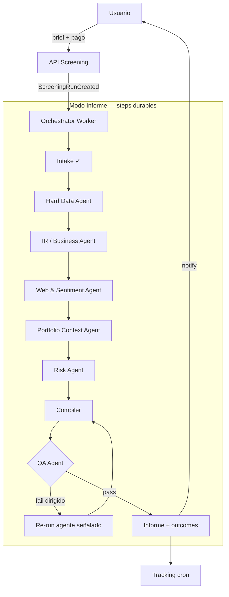

# PRD — Investment Screening Agents (versión factible)

Owner: Engineering · Status: **Feasible v1.0** · Baseline: `PRD_INVESTMENT_SCREENING_AGENTS.md` v0.6  
Companion: [`HLD_INVESTMENT_SCREENING_AGENTS.md`](./HLD_INVESTMENT_SCREENING_AGENTS.md)

## 0. Propósito de este documento

Este PRD **conserva el alcance funcional** del draft v0.6 (Modo Informe + Modo Cribado + tracking + QA + pago por generación) pero **corrige supuestos no viables** detectados en la revisión de arquitectura:

| Supuesto original (v0.6) | Corrección (v1.0 factible) |
|---|---|
| `submitJob` / `deferTask` para pipelines largos | **Orquestación event-driven durable** con checkpoints en Turso |
| “Sin límite de tiempo” en Vercel | **Steps acotados** (≤120s CPU/I/O por step); el run completo puede tardar minutos vía reanudación |
| Mismos Agentes 1–3 en Informe y Cribado | **Kernel compartido** (datos + reglas) + **dos pipelines** (research LLM vs embudo determinístico) |
| FMP “marginal ~$0” y endpoints “ya pagos” | **Matriz de tier FMP explícita**; cribado reserva cuota; 13F/transcripts = Ultimate |
| QA Agent 100% LLM | **Verificación híbrida**: asserts determinísticos + LLM solo para juicio cualitativo |
| Producto = “recomendación accionable” sin fricción legal | **Marco “informe de investigación”**; sizing ilustrativo; **gate legal** antes de cobro real |
| Track record como métrica de marketing v1 | **Simulación hipotética** en UI; agregados públicos = fase 2 post-legal |

El HLD detalla diagramas, eventos, tablas y despliegue.

---

## 1. Problema y caso de uso (sin cambios)

Igual que v0.6 §1: el usuario necesita un **informe de investigación** con 3–5 candidatos contextualizados a su cartera, no un screener de números. Pago **por generación**, exhaustividad > velocidad, seguimiento forward-looking de cada candidato.

**Teaser gratuito** (sin cambios): detección de sobre-exposición sectorial generalizada (`findPrimarySectorGap` → N sectores) + CTA a generar informe completo.

---

## 2. Objetivo y principios de diseño

### 2.1 Objetivo de producto (igual que v0.6)

Informe verificado con 3–5 candidatos, cada uno con:
- Fit cuantitativo + narrativa de negocio + contexto de cartera
- Riesgos con fuentes citadas
- **Escenario de asignación ilustrativo** (no “orden de compra”)
- Tracking post-entrega: “si hubieras invertido €X el día D, hoy tendrías €Y”

### 2.2 Principios de ingeniería (nuevos — no negociables)

1. **Durable first**: ningún estado crítico en memoria de proceso; todo checkpoint en Turso.
2. **Event-driven**: cada transición de estado emite un evento persistido; workers idempotentes.
3. **Chunked execution**: un “run” = N steps reanudables; compatible con `maxDuration` de Vercel (300s default, hasta 800s Pro).
4. **Deterministic before LLM**: números y reglas R1–R10 nunca pasan solo por el Compiler.
5. **Fail closed on money**: sin cobro si brief inviable; reembolso automático si run vacío/degradado.
6. **Observable by default**: costo, latencia, QA rounds y FMP calls son métricas de primera clase.

### 2.3 Métricas de éxito

**Negocio** (igual que v0.6, con matiz en alfa):
- ≥80% runs con ≥1 candidato accionable
- Tasa de reembolso <5%
- Tasa `rejected_infeasible` monitoreada (producto/UI, no pipeline)
- Recompra a 90 días
- Margen por run: precio − costo real

**Calidad del pipeline** (igual que v0.6 §2):
- Rondas QA, `quant_mismatch`, `unconfirmed_source`, `cross_agent_inconsistency`, `rule_violation`, degradación por agente

**Operación** (nuevo):
- p95 duración Modo Informe <15 min end-to-end
- p99 step retry <3
- 0 runs “zombie” (>24h en `running` sin heartbeat)

**Alfa a 90d/1a**: métrica **interna** con metodología fija; no claim público en v1.

---

## 3. Alcance funcional

### 3.1 Modo Informe (usuario + cartera + cobro)

| Capacidad | v1.0 |
|---|---|
| Intake + brief estructurado | Sí |
| Chequeo viabilidad pre-cobro | Sí |
| Agentes 1–5 + Compiler + QA | Sí |
| Cobro Stripe one-time | Sí |
| Reembolso automático | Sí |
| Push/email al completar | Sí |
| Agente 7 tracking | Sí |
| Trigger Warren conversacional | **Sugerir solo** — nunca cobrar sin confirmación UI |
| Risk Agent tax/ESG | Fase 1.5 (igual v0.6) |
| Multi-idioma research crudo | No (resumen respeta `locale`) |
| US/EU large & mid cap | Sí (límites FMP tier) |

### 3.2 Modo Cribado (cron diario, mercado US)

| Capacidad | v1.0 |
|---|---|
| Embudo 3 etapas + checklist 9 pasos | Sí |
| Exactamente 5 candidatas | Sí |
| QA reglas R1–R10 | Sí |
| PDF + Excel append + JSON | Sí |
| Registro cooldown 90 días | Sí (`screening_universe_registry`) |
| Ejecución fuera de Vercel | Sí — **GitHub Actions** + persistencia vía API |
| LibreOffice / fórmulas vivas | **No v1** — `exceljs` valores calculados (pregunta abierta fase 1.5) |
| Exposición a usuarios Pro | **Interno v1**; distribución Pro = fase 1.5 post-licencia FMP |

### 3.3 Fuera de alcance v1 (sin cambios)

Trading automático, backtesting histórico general, marketing agregado de track record, small cap fuera de cobertura FMP.

---

## 4. Arquitectura de producto (agentes)

Los **siete roles de agente** del PRD original se mantienen. Lo que cambia es **cómo se ejecutan** (ver HLD §3).



**Agente 0 — Intake** (v0.6 §3.0): parsing, ambigüedad pre-cobro, viabilidad en dos capas. Persiste `rejected_infeasible` sin `charge_id`.

**Agentes 1–5**: misma responsabilidad que v0.6. Outputs **siempre JSON tipado (Zod)** en `screening_agent_outputs`.

**Compiler**: ranking + borrador; no auto-verifica.

**Agente 6 — QA híbrido**:
- Capa A (código): `quant_mismatch`, `cross_agent_inconsistency`, `rule_violation` R1–R10
- Capa B (LLM premium): `unconfirmed_source`, juicio R6/R7/R8 cuando no hay regla cerrada
- Máx **2 rondas** de corrección dirigida; degradación por candidato; reembolso si 0 candidatos

**Agente 7 — Tracking**: cron diario precio + resumen semanal; benchmark documentado por sector.

### 4.1 Kernel compartido vs pipelines separados

```
src/lib/screening/
  domain/          # Zod schemas, event types, enums
  data/            # FMP fetchers, cache, SEC EDGAR (fase 1.5)
  rules/           # R1–R10, sanity limits, peer filters
  informe/         # pipeline usuario (LLM-heavy)
  cribado/         # embudo determinístico + LLM puntual
  qa/              # verificador híbrido
  workers/         # step handlers idempotentes
```

Modo Informe importa `informe/*`; Modo Cribado importa `cribado/*`; ambos usan `data/`, `rules/`, `qa/`.

---

## 5. Orquestación event-driven (cambio central)

### 5.1 Por qué no `submitJob`

El `task-runner` actual guarda jobs en un `Map` en memoria y usa `waitUntil` atado al `maxDuration` de la función HTTP. **No sobrevive cold starts, no escala horizontalmente, no reanuda tras timeout.**

### 5.2 Modelo: Run + Steps + Events

| Entidad | Rol |
|---|---|
| `screening_runs` | Agregado raíz; status global; `mode`, brief, charge |
| `screening_run_steps` | Un row por step (`hard_data`, `qa_round_1`, …); status, lease, `attempt` |
| `screening_run_events` | Log append-only (auditoría + replay debug) |
| `screening_agent_outputs` | Output JSON por agente/ticker |
| `screening_qa_rounds` | Incidencias QA (igual v0.6) |

**Transiciones** (cada una = INSERT event + UPDATE step):

```
created → intake_ok → charged → step_*_running → step_*_done → … → qa_pass → completed
                                                              └→ failed → refunded
```

### 5.3 Workers

1. **API route** (`POST /api/screening/runs`): valida, cobra, crea run, emite `ScreeningRunCreated`, encola primer step.
2. **Worker route** (`POST /api/internal/screening/worker`): autenticado con `CRON_SECRET`; toma steps `pending` con lease; ejecuta **un step**; marca done/failed; encola siguiente.
3. **Cron safety net** (`/api/cron/screening-recover`): cada 5 min reencola steps con lease expirado o runs zombie.

Modo Cribado: GHA ejecuta `scripts/screening/run-daily-cribado.ts` que llama la misma librería `cribado/*` y persiste vía `POST /api/internal/screening/cribado/ingest`.

### 5.4 Idempotencia y reintentos

- Cada step tiene `idempotency_key = run_id + step_name + attempt`.
- Side effects externos (Stripe refund, email) usan **outbox** (`screening_outbox`) patrón igual que ProdOps.
- Reintento exponencial: 1s, 2s, 4s en FMP 429; máx 5 intentos por step.

---

## 6. Modelo de datos (v1.0)

Extiende v0.6 §4:

```sql
-- Nuevas / ampliadas respecto v0.6
screening_run_steps (
  id, run_id, step_kind, status, -- pending|running|done|failed|skipped
  lease_owner, lease_expires_at,
  attempt, input_json, output_json,
  started_at, finished_at, cost_estimate_usd
)

screening_run_events (
  id, run_id, event_type, payload_json, created_at
)

screening_outbox (
  id, run_id, kind, -- notify_push|notify_email|stripe_refund
  payload_json, status, attempts, next_attempt_at
)

screening_research_cache (
  cache_key, provider, payload_json, expires_at
) -- TTL global cross-user (v0.6 §4)
```

Tablas v0.6 sin cambio semántico: `screening_runs`, `screening_universe_registry`, `screening_agent_outputs`, `screening_qa_rounds`, `screening_reports`, `recommendation_outcomes`, `recommendation_valuations`.

`screening_runs.status` ampliado:
`draft | rejected_infeasible | pending_payment | paid | running | completed | failed | refunded`

---

## 7. Monetización

Igual que v0.6 §5 con precisiones:

- **Stripe Checkout Session** one-time (nueva capacidad en `src/lib/stripe.ts`).
- Cobro **después** de brief válido + viable; `PaymentIntent` metadata: `run_id`.
- Reembolso automático vía outbox → `stripe.refunds.create` si:
  - 0 candidatos accionables
  - ≥2 agentes research fallaron irrecuperablemente
  - QA agotó rondas sin validar ningún candidato
- **Derecho de desistimiento UE**: copy legal en checkout (contenido digital generado bajo demanda — revisar con legal).

### 7.1 Presupuesto de costo (ajustado)

| Componente | Estimado / run Informe | Notas |
|---|---|---|
| LLM research (1–5) | $0.05–$0.10 | Tier mini |
| Compiler | $0.06–$0.10 | Tier premium |
| QA híbrido | $0.04–$0.20 | Menor que v0.6 — capa A reduce tokens |
| Web Search | $0.15–$0.35 | Tavily/Exa — Sprint 0 |
| FMP | **Cuota compartida** | Reservar bucket; cribado usa key dedicada o rate limiter global |
| Vercel compute | $0.01–$0.03 | Muchos steps cortos vs un job largo |
| **Total** | **$0.35–$0.80** típico | Peor caso ~$1.10 |

---

## 8. FMP y datos — matriz de tier (corrección v0.5)

| Endpoint / dato | Starter | Premium | Ultimate | Uso |
|---|---|---|---|---|
| Screener, ratios, growth | ✓ | ✓ | ✓ | Agente 1 ambos modos |
| Insider trades | ✓ | ✓ | ✓ | Agente 3 |
| Analyst estimates | parcial | ✓ | ✓ | Cribado paso 1/10 |
| Earnings transcripts | ✗ | ✗ | ✓ | Agente 2 Informe |
| 13F institucional | ✗ | ✗ | ✓ | Cribado paso 9 |
| Senate/House trading | ✓ | ✓ | ✓ | Ya cableado en `fmp.ts` |
| ESG ratings | ✗ | ✗ | ✓ | Fase 1.5 |
| Histórico 30y (crisis BPA) | ✗ | ✓ | ✓ | Cribado paso 4 — **mínimo Premium** |

**Acciones**:
- Documentar tier mínimo de despliegue: **Premium** para cribado; **Ultimate** si se activan 13F + transcripts en Informe.
- **API key separada** para cribado diario con rate limiter (`src/lib/rate-limit.ts` patrón FMP existente).
- Evaluar **licencia FMP Data Display** antes de PDF/Excel usuario-facing.

**Roadmap datos** (prioridad igual v0.6 §9):
1. Cablear endpoints ya en plan (sin proveedor nuevo)
2. SEC EDGAR gratis → QA capa A (fase 1.5)
3. FRED → Risk Agent macro (fase 2)

---

## 9. Legal y compliance (gate obligatorio)

Antes de Sprint 5 (cobro real):

| Tema | Tratamiento v1 |
|---|---|
| MiFID II / asesoramiento | Copy: **“informe de investigación automatizado”**; no “recomendación de inversión”; sizing = “escenario ilustrativo” |
| Disclaimer | En informe PDF/UI; AI-generated badge; fuentes con fecha |
| Track record | “Simulación hipotética”; no implica rendimiento futuro |
| Marketing agregado | Fuera v1 |
| Privacy | Nuevo procesamiento: brief, outputs agentes, cobro — actualizar Privacy Policy |
| OpenAI / búsqueda web | Disclosure en UI pre-compra |

**Bloqueante**: sign-off legal explícito en Sprint 0.

---

## 10. Observabilidad y métricas

### 10.1 Métricas Prometheus (nuevo)

```
screening_runs_total{mode,status}
screening_step_duration_seconds{step_kind}
screening_qa_rounds_total{issue_type}
screening_cost_usd{mode,component}
screening_fmp_calls_total{mode,endpoint}
screening_refunds_total{reason}
screening_runs_zombie_total
```

### 10.2 Dashboards Grafana

- **Producto**: margen/run, reembolsos, recompra proxy
- **Calidad**: distribución QA rounds, top agentes con incidencias
- **Ops**: FMP 429 rate, step lease timeouts, cribado GHA success

### 10.3 Alertas

- Refund rate >10% en 24h
- Cribado GHA falló 2 días seguidos
- Runs zombie >0 por >1h
- FMP quota >80% del minuto

---

## 11. Plan de entrega (ajustado)

| Sprint | Entrega | Cambio vs v0.6 |
|---|---|---|
| **0** (1 sem) | Contratos Zod, ADR event-driven, legal gate, precio, benchmark methodology | + ADR orquestación |
| **1** | Tablas run/steps/events + worker + Intake + Hard Data | No `submitJob` |
| **2** | Portfolio Context + sector gap teaser | Igual |
| **3** | IR + Web/Sentiment agents | Igual |
| **4** | Risk + Compiler + QA híbrido + persistencia report/outcomes | QA capa A primero |
| **5** | Stripe one-time + UI + reembolso outbox | Gate legal |
| **6** | Tracking cron + valuations | Igual |
| **7** | Track record UI (hipotético) | Sin marketing agregado |
| **8** | Hardening, métricas, beta | + alertas zombie/FMP |
| **9** | GA buffer | Igual |
| **1.5** | Modo Cribado GHA + ingest API + PDF/Excel | Tras Sprint 4 |

**Duración total**: ~18–20 semanas (igual orden de magnitud v0.6).

---

## 12. Riesgos residuales

| Riesgo | Mitigación |
|---|---|
| Pipeline chunked más complejo que un job | ADR + tests de reanudación; cron recover |
| Coste FMP cribado + app | Key/rate limit dedicado; cache 24h/30d |
| QA LLM aún alucina en cualitativo | 2 fuentes obligatorias; capa A bloquea números |
| Regulación EU | Gate legal; copy conservador v1 |
| GHA single point para cribado | Retry workflow; alerta; fallback manual trigger |

---

## 13. Preguntas abiertas (heredadas + nuevas)

Heredadas de v0.6 §10 (precio, proveedor búsqueda, tope QA rounds, mínimo viabilidad, benchmark, distribución cribado, exceljs vs LibreOffice, registry compartido).

**Nuevas v1.0**:
1. ¿Worker polling vía cron cada 30s o trigger inmediato post-step (`fetch` interno)?
2. ¿FMP Ultimate desde GA o degradar paso 9 cribado / transcripts Informe?
3. ¿Vercel Pro 800s por step o chunking estricto a 120s?

---

## 14. Referencias

- PRD original: [`PRD_INVESTMENT_SCREENING_AGENTS.md`](./PRD_INVESTMENT_SCREENING_AGENTS.md) v0.6
- HLD: [`HLD_INVESTMENT_SCREENING_AGENTS.md`](./HLD_INVESTMENT_SCREENING_AGENTS.md)
- Arquitectura repo: [`ARCHITECTURE.md`](../ARCHITECTURE.md)
- Patrón outbox existente: `src/lib/prodops.ts`
