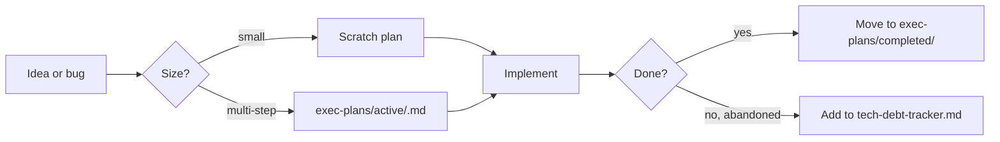

# PLANS.md — how we plan work in this repo

## Principle

> Plans are first-class artifacts. The plan is part of the code.

Humans and agents steer with plans. Plans are short-lived for small work and
checked-in for multi-step work. The repository is the memory.

## Plan types

| Type | When | Where |
|------|------|-------|
| Scratch plan | 1-5 steps, fits in one agent turn | in-chat only, no commit |
| Exec plan | multi-step, multi-session, or multi-author | [`exec-plans/active/`](exec-plans/active) as markdown |
| Tech-debt item | known gap, not scheduled yet | [`exec-plans/tech-debt-tracker.md`](exec-plans/tech-debt-tracker.md) |
| Completed plan | done, archived for history | [`exec-plans/completed/`](exec-plans/completed) |

## Template

Use [`templates/exec-plan.template.md`](templates/exec-plan.template.md). Every
exec plan contains:

- Status, owner, started, target.
- Goal (one paragraph).
- Acceptance criteria (checkboxes).
- Step-by-step plan.
- Decisions log (append-only).
- Risks and mitigations.
- Follow-ups.

## Lifecycle

## Decisions log

Append-only inside the plan. One line per decision, dated. When a decision
affects multiple features or long-term architecture, also reflect it in
[`design-docs/`](design-docs/README.md).

## Follow-ups become new plans

A completed plan that surfaces new work should spawn a new plan (or a
tech-debt entry) rather than becoming a "phase 2" inside the old plan.

## When to promote a plan into code

- If a step is really "enforce this rule everywhere," promote it into a lint
  or a test rather than documenting it in the plan.
- If a step is "remember to do X whenever Y" — that's a rule
  ([`.cursor/rules/`](../.cursor/rules)) or a skill
  ([`.cursor/skills/`](../.cursor/skills)), not a recurring plan.

## Cadence

- Active plans are reviewed by the doc-gardener weekly.
- Stale plans (no updates in 30 days) are either revived, abandoned, or
  archived with notes.
