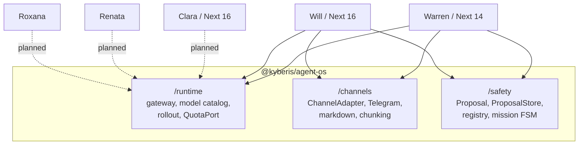

# Kyberis Agent OS

`@kyberis/agent-os` is the shared platform layer behind our five agents. This
document is both the audit that motivated it and the contract for using it.

- **Package repo:** <https://github.com/kyberis/agent-os> (public)
- **Current version:** `v0.1.0`
- **Install:** `npm i github:kyberis/agent-os#v0.1.0`

## Why this exists

We have five agents and are likely to build more. Before this extraction, every
new agent re-implemented the same six capabilities from scratch, and every bug
in those capabilities had to be fixed once per repo. The Telegram 4096-character
limit was handled in three places, three different ways; two of them silently
truncated. AI Gateway auth was resolved in three places with three different
env-var priority orders, so "works locally, 401s on Vercel" debugging happened
per repo.

The goal is not code golf. It is that the sixth agent should not have to
rediscover any of this.

## The agents (corrected repo map)

The names below are the product names; the repos are named after their original
scope, which is a recurring source of confusion.

| Agent | Repo | Domain | Runtime | Data layer |
| --- | --- | --- | --- | --- |
| Warren | `kyberis/stocktracker` (this repo) | Portfolio / markets | Next 14 | Turso (libSQL) |
| Clara | `kyberis/etracker` (`external/etracker`) | Personal expenses | Next 16 | Prisma |
| Will | `kyberis/notetaker` (`external/notetaker`) | Notes / journaling | Next 16 | Prisma |
| Renata | `kyberis/curriculumsupport` (`external/curriculumsupport`) | CV / curriculum | Next 16 | Prisma |
| Roxana | `kyberis/roxana` | Ops / internal | Next 16 | Drizzle + Neon |

Warren on Next 14 is the binding constraint, not an accident to be fixed
later. Extraction had to work without forcing an upgrade, which is why the
package ships dual ESM/CJS and depends on nothing at runtime.

## Audit: what was duplicated

Counted at the time of extraction. "Copies" means independent
implementations, not call sites.

| Capability | Copies | Where | State before |
| --- | --- | --- | --- |
| AI Gateway auth + model-id normalisation | 3 | Warren `src/lib/ai/gateway.ts`, Clara `src/lib/ai/gateway-auth.ts`, Will `src/lib/ai/gateway-auth.ts` | Three different env priority chains. Only Warren read the per-request OIDC header, so Clara and Will could not use Vercel's zero-config auth. |
| Telegram Markdown → transport format | 3 | Warren `src/lib/telegram/format.ts`, Clara `src/lib/telegram/chunk-html.ts`, Will `src/lib/telegram/format.ts` | Warren emits MarkdownV2, Clara and Will emit HTML. All three had distinct escaping bugs. |
| Long-message chunking | 3 | same files | Warren split on paragraphs at 3500; Clara hard-cut at 4096 mid-word; Will had no hard ceiling and relied on the API rejecting the send. |
| Daily message quota | 2 | Will `src/lib/agent-quota.ts`, Warren via `src/lib/auth/guards.ts` | Both keyed on UTC day but computed the boundary differently. |
| Confirm-before-write | 1.5 | Warren `src/lib/ai/warren/dispatch.ts` | Only Warren had it, coupled to Warren's tool types. Will deleted notes with no confirmation at all. |
| Model catalog / cost estimation | 2 | Warren admin settings, Clara | Diverging price tables, both stale. |

The `1.5` is deliberate. Warren's confirm-before-write was real but not
reusable: the proposal type embedded Warren's tool union, so lifting it meant
designing the generic version rather than moving code.

## What got extracted

Three subpaths. The split is by blast radius, not by topic — you can adopt one
without the others.



### `@kyberis/agent-os/runtime`

Gateway credential resolution (`resolveGatewayApiKey`, the sync variant, and
`fetchGatewayChatCompletions`), `toGatewayModelId`, the model catalog with
cost-per-million-tokens, deterministic rollout bucketing, and `QuotaPort`.

The env priority chain is a parameter, not a constant, because each agent has
its own legacy env name to keep honouring:

```ts
const WARREN_GATEWAY_ENV_KEYS = [
  "AI_GATEWAY_API_KEY",
  "VERCEL_OIDC_TOKEN",
  "STOCKTRACKER_OPENAI_API_KEY",
] as const;
```

### `@kyberis/agent-os/channels`

`ChannelAdapter` (send / parse-incoming), a fetch-based Telegram adapter with no
SDK dependency, a web adapter, CommonMark → Telegram HTML and MarkdownV2
converters, `stripMarkdown` for TTS, and `chunkMessage`.

### `@kyberis/agent-os/safety`

The generic `Proposal<Kind>` type, the `ProposalStore` port, the
`ProposalRegistry` that enforces ownership / conversation / expiry on confirm,
and the mission-step state machine for multi-agent workflows.

## Design rules

These are the rules that keep the package adoptable by all five agents. Breaking
one of them is how a shared package becomes an unshared package.

1. **Zero runtime dependencies.** Not Zod, not an ORM, not the AI SDK, not a
   Telegram SDK. Every one of those would pin a version across five repos.
2. **Ports, not adapters, for anything stateful.** Persistence enters through
   `QuotaPort` and `ProposalStore`, which the consumer implements with its own
   Prisma / Drizzle / libSQL client.
3. **Validation is the caller's job.** Handlers expose `parse(raw)` so each app
   validates with whatever it already uses.
4. **Dual ESM/CJS, Node 22 target, `sideEffects: false`.** Next 14 and Next 16
   both consume it unmodified.
5. **No i18n inside the package.** Rendering takes label objects; the strings
   live in the consuming app's dictionaries.

## Adoption status

| Consumer | Modules | Status |
| --- | --- | --- |
| Will (`notetaker`) | runtime, channels, safety | Migrated. Gained confirm-before-delete as a side effect. |
| Warren (`stocktracker`) | runtime, channels, safety | Migrated for gateway auth, Telegram formatting, and proposal callback encoding. |
| Clara (`etracker`) | — | Planned. Highest-value target is `chunk-html.ts`. |
| Renata, Roxana | — | Planned. |

Warren's migration is deliberately narrow: it is the Next 14 compatibility proof
and it is validated by 26 pre-existing tests in
[src/lib/telegram/\_\_tests\_\_/format.test.ts](../../src/lib/telegram/__tests__/format.test.ts)
that pin exact MarkdownV2 output and were not modified.

## Effort curve for the next agent

Rough but honest, based on what Will's migration actually removed.

| Capability | Before (from scratch) | After (with the package) |
| --- | --- | --- |
| Gateway auth + model routing | 1–2 days, plus a round of deploy-only 401s | ~1 hour, supply the env chain |
| Telegram channel + formatting | 3–5 days, escaping bugs found in production | ~half a day, implement the send hook |
| Long-message chunking | 0.5–1 day | free |
| Daily quota | 1 day | ~2 hours, implement `QuotaPort` |
| Confirm-before-write | 3–5 days, usually skipped | ~1 day, implement `ProposalStore` and the handlers |
| Model catalog + cost | 1 day, goes stale | free |

Call it two-and-a-half weeks down to two or three days for the shared
scaffolding, with the larger win being that the skipped capability
(confirm-before-write) stops being skipped.

## Known gaps

- WhatsApp adapter is specified in `ChannelAdapter` but not implemented.
- Clara, Renata, and Roxana are unmigrated, so the duplication counts above are
  reduced but not yet zero.
- Distribution is a git tag, not a registry. Upgrades are a manual bump of the
  ref in each consumer's `package.json`; there is no notification when a new tag
  lands.
- The package has no runtime deprecation path yet. Since consumers pin a tag,
  a breaking change to a port means coordinating the bump by hand.
