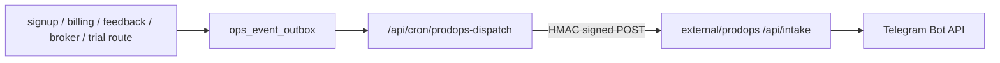
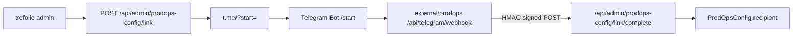
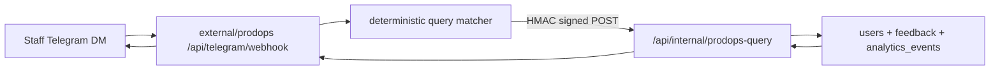

# trefolio-prodops-integration

> `trefolio-prodops` (repo `kyberis/trefolio-prodops`) is the external operational-notifications service for trefolio. It lives under `external/prodops` as a sibling repo, runs as a separate Vercel deployment, and receives signed event payloads from trefolio to fan out staff alerts to Telegram.

## Problem

Trefolio already emits important business and support signals inside the product app: new user registrations, successful membership payments, incoming feedback, broker-integration requests, and 7-day trial activations. Those events are valuable for operators, but they should not be delivered directly from the same request path that processes signup, billing, or feedback because Telegram outages, bot errors, or rate limits would then become user-facing failures.

We want:

1. A staff-facing Telegram notification flow.
2. Admin-managed routing and enablement from trefolio.
3. A hard operational boundary so Telegram delivery failures never break product transactions.
4. A sibling codebase the agent can read and evolve independently of trefolio's main build.

## Decision

1. **`trefolio-prodops` is a sibling repo** under `external/prodops`, following the same context-and-deploy separation used for Clara, Will, and Renata.
2. **Trefolio owns configuration and event production.** Admins configure the ProdOps base URL, bot username, shared secret, enabled event types, and the linked Telegram recipient from trefolio's admin settings.
3. **Trefolio writes an outbox row, not a Telegram message.** Business routes enqueue ops events into `ops_event_outbox`; a cron dispatcher sends them asynchronously.
4. **Runtime integration shape is signed HTTP.** Trefolio posts a signed JSON envelope to `trefolio-prodops` using an HMAC shared secret (`X-ProdOps-Timestamp` + `X-ProdOps-Signature`).
5. **ProdOps owns Telegram delivery and delivery-side dedupe.** The service verifies the signature, deduplicates by `eventId`, formats the operator message, and uses the Telegram Bot API.
6. **No direct imports across repos.** Trefolio never imports code from `external/prodops`; the boundary is API-only.

## Why this and not X

| Alternative | Why rejected |
|---|---|
| Send Telegram directly from trefolio routes | Couples external bot failures to signup, billing, feedback, and trials. Harder to retry safely. |
| Keep everything inside trefolio as one more API route | Blurs the product/admin boundary and makes it harder to evolve staff tooling separately. |
| Reuse the IdP ops digest path for real-time product events | The existing IdP ops flow is aggregate and staff-account centric. This feature needs per-event, trefolio-admin-managed routing. |
| Shared package imported from `external/prodops` | Violates the repo's sister-app rule; build/lint/test boundaries should stay explicit. |

## How to follow it

### Local dev

Trefolio runs on `3010`. `trefolio-prodops` defaults to `3400`.

```bash
cd stocktracker
npm run dev
npm run dev:prodops
```

Then set trefolio admin config:

- base URL: `http://localhost:3400`
- bot username: the Telegram bot username that points at `trefolio-prodops`
- shared secret: same value as `external/prodops/.env.local:PRODOPS_SHARED_SECRET`

On the **ProdOps** Vercel project, set `TREFOLIO_BASE_URL` to the main app host (`https://trefolio.com` in production, `http://localhost:3010` locally). **Do not** point it at `user.trefolio.com` (IdP) — that host does not expose `/api/internal/prodops-query` and staff queries will fail with HTTP 404.

### Event flow



### Recipient linking flow



### Staff query flow



### Payload contract

Trefolio sends:

- `eventId`
- `eventType`
- `occurredAt`
- `sourceApp`
- `summary`
- `adminUrl`
- `actor`
- `metadata`
- `destinations`

The `destinations` list is resolved in trefolio from the single linked recipient in admin settings, so `prodops` stays delivery-focused and does not own operator configuration.

### Security

- Shared secret is stored in trefolio admin settings (encrypted at rest) or via env.
- Delivery uses HMAC SHA-256 over `timestamp.body`.
- `prodops` rejects unsigned, invalid, or stale payloads.
- Recipient links use a short random Telegram token whose hash and expiry are stored in trefolio; the plaintext token is only returned once to the admin browser.
- Telegram payloads are deliberately minimal: human summary + admin link + selected metadata.
- Staff query replies are also deliberately minimal and fetched on demand from trefolio; `prodops` does not become the source of truth for user/account data.

## How to enforce it

### Trefolio side

| Area | Source |
|---|---|
| Admin config | `src/app/api/admin/prodops-config/route.ts`, `src/app/(app)/admin/tabs/ProdOpsConfigCard.tsx` |
| Link flow | `src/app/api/admin/prodops-config/link/route.ts`, `src/app/api/admin/prodops-config/link/complete/route.ts`, `src/lib/prodops-link.ts` |
| Outbox DB | `src/lib/db/ops-events.ts`, migration `v114` |
| Dispatcher cron | `src/app/api/cron/prodops-dispatch/route.ts` |
| Event builders | `src/lib/prodops.ts` |

### ProdOps side

| Area | Source |
|---|---|
| Intake verification | `external/prodops/app/api/intake/route.ts`, `external/prodops/lib/signature.ts` |
| Telegram link + query webhook | `external/prodops/app/api/telegram/webhook/route.ts` |
| Signed trefolio query client | `external/prodops/lib/trefolio.ts` |
| Telegram delivery | `external/prodops/lib/telegram.ts` |
| Dedupe / audit | `external/prodops/lib/store.ts` |
| Health | `external/prodops/app/api/health/route.ts` |

## Review checklist

- [ ] Product routes enqueue to the outbox but never call Telegram directly.
- [ ] `prodops` is called only from the cron dispatcher, never from client code.
- [ ] Event payloads do not include full feedback text or Stripe-sensitive fields.
- [ ] Shared secret is never returned in plaintext from admin APIs.
- [ ] New cron is registered in both `src/lib/cron-registry.ts` and `vercel.json`.
- [ ] The privacy policy covers Telegram as an operational delivery processor for staff alerts as well as user bot features.

## Open questions

- The GitHub repo `kyberis/trefolio-prodops` was empty when this integration was bootstrapped locally, so trefolio currently carries the local clone and integration docs first; the final parent gitlink can be pinned once the child repo gets its first commit.
- A future phase may let `external/accounts` publish the same envelope contract so IdP-owned signups and billing can flow through the same ProdOps service.
