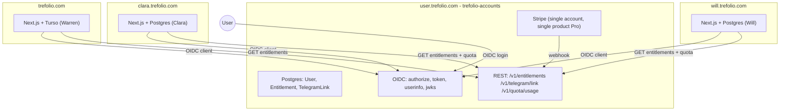

# unified-accounts-and-billing

> One identity, one subscription across **trefolio**, **Clara**, and **Will**. A dedicated service at `user.trefolio.com` (codename `trefolio-accounts`) owns users, sessions, OIDC, Stripe, entitlements, and Telegram linkage. Each product app becomes an OAuth client.

## Problem

Today the three sister products live in three independent codebases with three independent user tables, three auth stacks, and three Stripe surfaces:

| Product | Stack | Users / auth | Billing | Quota source |
|---|---|---|---|---|
| trefolio | Next.js + Turso, custom JWT cookie `trefolio_session` | email/password + Google + Apple + Passkeys | Stripe (`pro` €7.99/mo, €59.99/yr) | `feature-quotas.ts` + `rate_limits` table |
| Clara (`external/etracker`) | Next.js + Postgres + Prisma 7 | NextAuth v4 (Credentials + Google + Passkeys) | Stripe (`Supporter`, raises `dailyAgentMessageLimit` 30 → 200) | `User.dailyAgentMessageLimit` + `AgentMessageUsage` |
| Will (`external/notetaker`) | Next.js + Postgres + Prisma 7 | NextAuth v4 (Credentials + optional Google) | None | `User.dailyAgentMessageLimit` (default 30, Telegram-only enforcement) |

We want to:

1. Sign up on any of the three and have an account on all three.
2. Subscribe once and unlock all three.
3. Show a consistent paywall (web + Telegram) when free users hit a daily quota.
4. Reposition the trefolio landing as a three-agent ecosystem (Warren / Clara / Will).

## Decision

Build a fourth service — the **IdP**, codename `trefolio-accounts` — at `user.trefolio.com`. The three products become OIDC clients and stop owning auth/billing.



### Key design choices

- **IdP repo:** new `kyberis/trefolio-accounts`. Pinned into trefolio as a git submodule under `external/accounts/` following the same read-only policy as [etracker-clara-integration](etracker-clara-integration.md) and [notetaker-will-integration](notetaker-will-integration.md). Trefolio's build/lint/test never compiles it.
- **IdP stack:** Next.js 16 + Postgres + Prisma (matches Clara/Will so we can lift battle-tested code), deployed on Vercel at `user.trefolio.com`.
- **Auth flow:** OIDC Authorization Code + **PKCE** (mandatory). ID token TTL 15 min, refresh token rotated on use, signed RS256 with rotated JWKS.
- **Single Stripe account** (the existing trefolio one). One product `Trefolio Pro` with prices `pro_monthly` (€7.99) and `pro_annual` (€59.99). Existing trefolio Stripe subscriptions migrate by metadata only.
- **Single IdP user identity = one canonical `sub`.** Each app keeps its own local `User` row keyed by `idp_sub`. Local-id ↔ idp-sub mapping survives in each app.
- **Telegram linkage moves to IdP.** A `TelegramLink` row in the IdP holds `telegramUserId → sub`. Bots stay one per app; on `/start <code>` they POST `/v1/telegram/link` to the IdP.
- **Quota enforcement stays in each app** (latency: a counter check must not call across the network). The **limit value** is sourced from `entitlements.{trefolio_pro,clara_daily_limit,will_daily_limit}` claims in the JWT.

### ID token claims (canonical)

```json
{
  "iss": "https://user.trefolio.com",
  "sub": "usr_abc123",
  "aud": "trefolio | clara | will",
  "exp": 1750000000,
  "iat": 1749999100,
  "email": "user@example.com",
  "email_verified": true,
  "name": "Mateo S.",
  "locale": "es",
  "pro_until": "2027-05-04T00:00:00Z",
  "entitlements": {
    "trefolio_pro": true,
    "clara_daily_limit": 200,
    "will_daily_limit": 200
  }
}
```

Free vs Pro mapping:

| Tier | trefolio_pro | clara_daily_limit | will_daily_limit |
|---|---|---|---|
| Free | `false` | `30` | `30` |
| Pro | `true` | `200` | `200` |

## Why this and not X

| Alternative | Why rejected |
|---|---|
| **Sync via webhooks (3 user tables stay)** | Three sources of truth → permanent drift. Hard to debug paid-but-not-unlocked tickets. |
| **Trefolio acts as IdP without a new subdomain** | Couples auth lifecycle to a product app. Pro upgrades on Clara/Will would have to bounce through `trefolio.com` and pollute analytics. Future products can't onboard without us touching trefolio. |
| **Monorepo / shared library** | Three different stacks (Turso vs Postgres x2). Forces a stack migration first. |
| **Federated SSO via Google/Apple only** | Doesn't solve entitlements (Stripe still per-app). Doesn't help free users without a Google/Apple account. |

## How to follow it

### Naming & ownership

- IdP service: `kyberis/trefolio-accounts` (new repo). Submodule pin at `external/accounts/`.
- Static OIDC client registry inside the IdP, one entry per product:
  - `client_id=trefolio`, `redirect_uri=https://trefolio.com/api/auth/oidc/callback`
  - `client_id=clara`, `redirect_uri=https://clara.trefolio.com/api/auth/callback/trefolio-id`
  - `client_id=will`, `redirect_uri=https://will.trefolio.com/api/auth/callback/trefolio-id`

### Calling the IdP from product apps

Server-side only. Never leak the client secret to the browser.

```ts
const base = process.env.IDP_BASE_URL;
if (!base) throw new Error("IDP_BASE_URL not configured");

const res = await fetch(`${base}/v1/entitlements/${sub}`, {
  headers: { Authorization: `Bearer ${process.env.IDP_SERVICE_TOKEN}` },
});
const ents = await res.json();
```

### Cutover strategy

The plan ships incrementally. Each app gets a feature flag `USE_LEGACY_AUTH` (default `true`); we wire OIDC under the flag, migrate users, then flip to `false`. At any point either path works.

## How to enforce it

### Trefolio repo conventions

- Any new auth code in trefolio after the cutover MUST go through `src/lib/idp/`. Direct password / Google / Apple routes are deprecated.
- Stripe writes (price IDs, webhooks) belong in the IdP. Trefolio's [billing webhook route](../../src/app/api/billing/webhook/route.ts) becomes a no-op once `USE_LEGACY_AUTH=false`.
- The local `users.plan` column stays as a **read-through cache** of `entitlements.trefolio_pro`. Sources of truth lives in the IdP.

### Cross-product

- Telegram linking from Clara or Will MUST call `POST /v1/telegram/link` on the IdP. Local `User.telegramUserId` columns are deprecated; an unlinked Telegram account in any app cannot bypass the unified linkage.
- All upgrade CTAs across the three apps MUST point to `https://user.trefolio.com/upgrade?from={trefolio|clara|will}`. The IdP `/upgrade` page tailors headings and benefit order to the originating app while keeping one price and one Stripe checkout.

### MCP (personal access tokens)

One **personal access token** for AI/MCP is minted and revoked only on **user.trefolio.com** (Developer). The same `tfp_pat_…` bearer works for HTTP MCP on trefolio, Clara, and Will; each app calls the IdP introspection endpoint with a shared server secret. Operator and client examples: [`external/accounts/docs/mcp-ecosystem.md`](../../external/accounts/docs/mcp-ecosystem.md). Product spec: [trefolio-mcp-user](../product-specs/trefolio-mcp-user.md).

### Legal / GDPR

This change creates a new processor for personally-identifying data shared across three sister products. Triggers the [legal-advisor skill](../../.cursor/skills/legal-advisor/SKILL.md):

- Privacy Policy must disclose the unified account and that signing up on one app provisions the others.
- Terms of Service must cover all three products under one account model.
- A unified DPA / sub-processor list update is required.
- Cookie policy: the OIDC redirect drops a session cookie scoped to each app's domain; no third-party cookies are set on `user.trefolio.com` for trefolio/Clara/Will.

## Build order (high level)

1. **Phase 0** — design doc, exec plan, cross-team review, Vercel + Neon provisioning. _This file_.
2. **Phase 1** — IdP service (`trefolio-accounts` repo). Schema, OIDC, Stripe, REST API, branded UI.
3. **Phase 2** — Trefolio integrates IdP behind `USE_LEGACY_AUTH` flag.
4. **Phase 3** — Clara integrates IdP. Spec at [clara-idp-integration.md](clara-idp-integration.md).
5. **Phase 4** — Will integrates IdP. Spec at [will-idp-integration.md](will-idp-integration.md).
6. **Phase 5** — Landing page rework on trefolio (three-agent ecosystem).
7. **Phase 6** — Cutover (flip flag on each app, send transactional email, drop legacy code).
8. **Phase 7** — Hardening (E2E tests, security review, observability).

The execution plan with per-phase task lists lives at [`../exec-plans/active/unified-accounts.md`](../exec-plans/active/unified-accounts.md).

## Security review (Phase 7)

Pass criteria for the Phase 7 security review. The IdP-side controls live in
`kyberis/trefolio-accounts`; the trefolio-side controls below live in this
repo.

| Control                      | Where                                                              | Status            |
| ---------------------------- | ------------------------------------------------------------------ | ----------------- |
| PKCE required (S256)         | `src/lib/idp/oidc.ts` `buildAuthorizationUrl` always sends `code_challenge_method=S256` | Enforced          |
| `state` cookie scoped + checked | `src/app/api/auth/oidc/start/route.ts` + `callback/route.ts`     | Enforced          |
| `nonce` cookie checked       | `src/lib/idp/oidc.ts` `verifyIdToken` rejects mismatched nonce     | Enforced          |
| Verifier never in URL        | Test in `e2e/oidc-roundtrip.spec.ts`                               | Tested            |
| Redirect URI exact match     | IdP-side static client registry                                    | IdP responsibility |
| Refresh token rotation       | IdP issues short-lived (15min) ID tokens; refresh stays IdP-side   | Trefolio holds no refresh tokens |
| JWKS rotation                | `verifyIdToken` uses `createRemoteJWKSet` (auto-refreshes)         | Enforced          |
| CSRF on legacy auth          | `useLegacyAuth()` gate + Turnstile already in place                | Enforced          |
| Session secret               | Trefolio's existing `trefolio_session` cookie unchanged            | Enforced          |
| Service token never client-side | `getIdpServiceToken()` only called from server modules           | Enforced (lint: never imported in `'use client'` files) |
| Open redirect protection     | `safeRedirect()` in start route normalizes `?redirect=`            | Enforced          |
| Account takeover via email   | OIDC callback links by `idp_sub`, not by email; explicit confirmation required when `email` matches an existing local user with a different `auth_provider` | Enforced |

## Observability (Phase 7)

Cross-app correlation key: every entitlement change is logged with the same
`idpSub` so trefolio / Clara / Will logs can be joined in log search.

- `trefolio.entitlements.synced` — emitted by `syncEntitlementsForUser` on
  every `users.plan` change. Includes `from`/`to` and `userId`.
- `etracker.telegram.link_lookup` (Clara) and `notetaker.telegram.link_lookup`
  (Will) include the same `idpSub` after Phase 3/4.
- Stripe webhook events live in the IdP only and tag the same `idpSub` on
  emission.

## Open questions

- **PAR / DPoP**: should the OIDC implementation require Pushed Authorization Requests for native apps (Capacitor)? Probably yes for v1 since trefolio already ships an iOS app.
- **Apple Sign In**: only available on iOS native today. The IdP needs to support it as a federated provider. This is the longest pole in Phase 1.
- **Account linking UX**: when an existing Clara user with email `x@y.com` signs in via OIDC for the first time, do we link by email automatically or require explicit confirmation? Lean toward **explicit confirmation** to avoid takeover risks.
- **Refunds for existing Clara Supporter subscribers**: small set today (<10). On cutover, mark them Pro in the IdP, cancel local Clara Stripe subscriptions, refund pro-rata via support.
